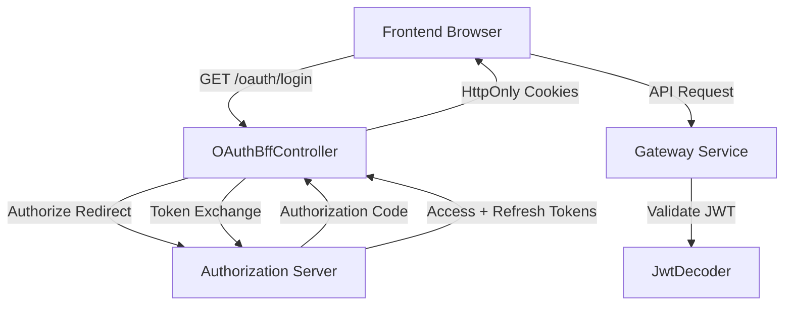
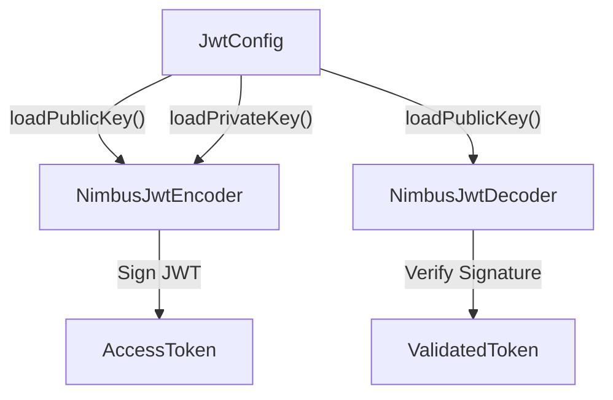
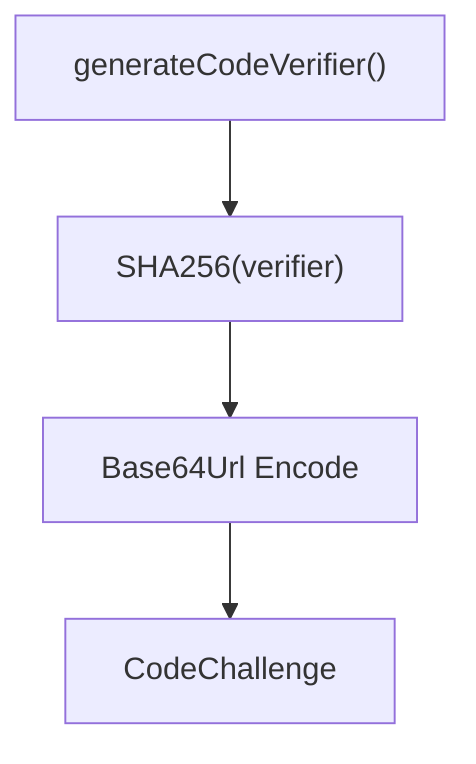
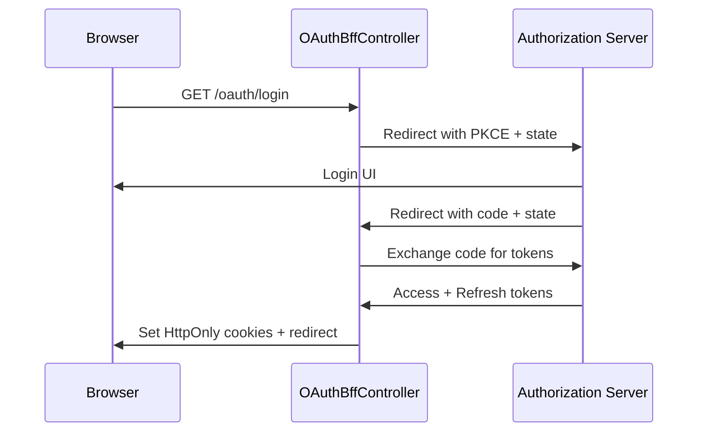
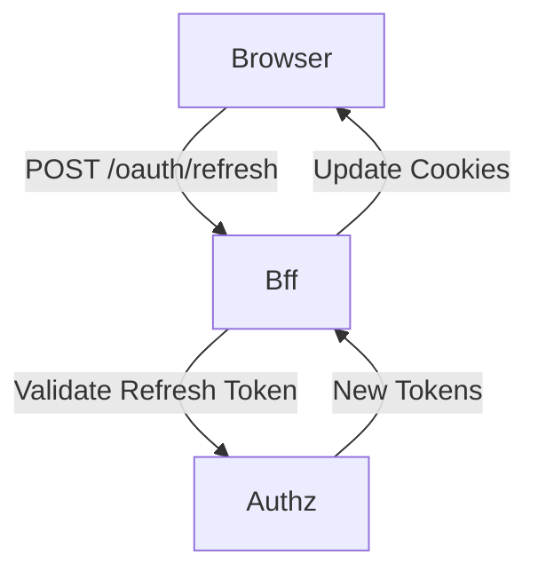
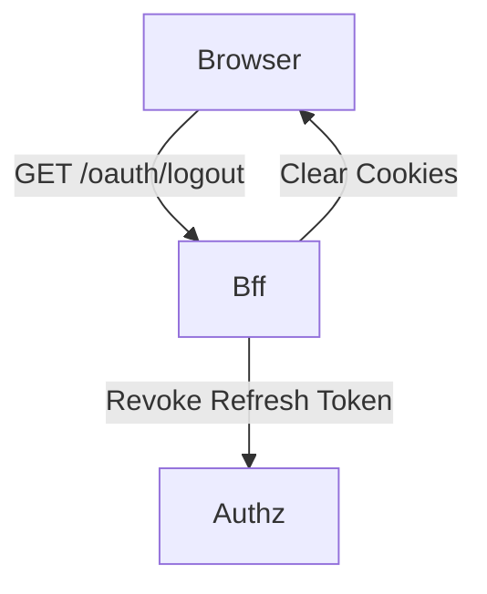
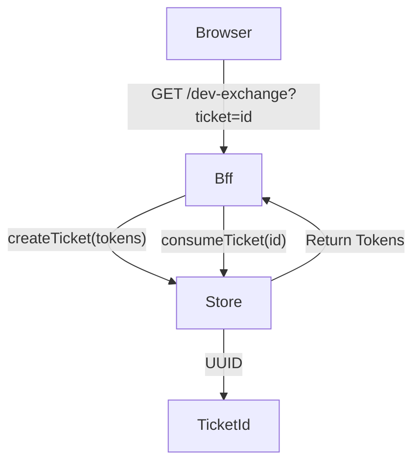
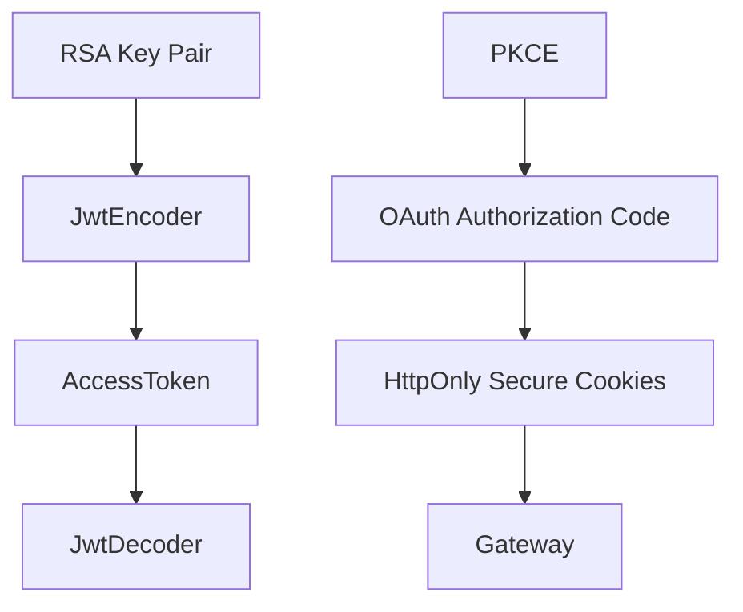

# Security Oauth Jwt Bff

## Overview

The **Security Oauth Jwt Bff** module provides the foundational security layer for the OpenFrame platform. It combines:

- ✅ JWT encoding and decoding infrastructure
- ✅ OAuth2 Authorization Code + PKCE support
- ✅ Backend-for-Frontend (BFF) authentication flow
- ✅ Secure cookie handling and token lifecycle management
- ✅ Development ticket exchange support

This module acts as the glue between:

- The **Authorization Server** (OAuth2 / OIDC provider)
- The **Gateway Service** (request entrypoint)
- The **Frontend applications**
- Downstream services that validate JWT access tokens

It ensures secure token issuance, validation, storage, refresh, and revocation across the platform.

---

## Architectural Context

Security Oauth Jwt Bff sits between frontend clients and the authorization server while also providing shared JWT infrastructure to other services.

### Key Responsibilities

| Concern | Responsibility |
|----------|---------------|
| Token Signing | RSA-based JWT encoder |
| Token Verification | Public key JWT decoder |
| OAuth Login | Authorization Code + PKCE |
| Token Storage | Secure HttpOnly cookies |
| Token Refresh | Refresh token rotation |
| Logout | Token revocation + cookie clearing |
| Dev Mode | Temporary token exchange tickets |

---

## Module Components

The module is composed of the following core parts:

### 1. JWT Infrastructure

- `JwtSecurityConfig`
- `JwtConfig`

These provide RSA-based JWT encoding and decoding.

### 2. OAuth Constants & Utilities

- `SecurityConstants`
- `PKCEUtils`

These standardize header names, cookie names, and PKCE generation logic.

### 3. OAuth BFF Layer

- `OAuthBffController`
- `InMemoryOAuthDevTicketStore`
- `DefaultRedirectTargetResolver`
- `NoopForwardedHeadersContributor`

This layer handles login, callback, refresh, logout, and optional development token exchange.

---

# JWT Infrastructure

## JwtSecurityConfig

Provides Spring beans for:

- `JwtEncoder`
- `JwtDecoder`

### How It Works

1. RSA public/private keys are loaded from configuration.
2. A JWKSet is built using Nimbus.
3. `JwtEncoder` signs tokens using the private key.
4. `JwtDecoder` verifies tokens using the public key.

This ensures:

- Asymmetric cryptography
- Stateless token validation
- Cross-service trust via shared public key

---

## JwtConfig

`JwtConfig` binds configuration properties under the `jwt.*` prefix.

It provides:

- `issuer`
- `audience`
- `publicKey`
- `privateKey`

Private keys are:

- Loaded from PEM format
- Stripped of headers
- Base64 decoded
- Converted to `RSAPrivateKey`

This abstraction allows flexible key management via environment variables, config server, or secrets.

---

# OAuth Constants & PKCE

## SecurityConstants

Defines standard constants used across OAuth flows:

- `ACCESS_TOKEN`
- `REFRESH_TOKEN`
- `ACCESS_TOKEN_HEADER`
- `REFRESH_TOKEN_HEADER`
- `AUTHORIZATION_QUERY_PARAM`

This ensures consistency across:

- Cookies
- HTTP headers
- Gateway filters

---

## PKCEUtils

Implements Proof Key for Code Exchange (PKCE).

### Functions

- `generateState()` → Prevents CSRF
- `generateCodeVerifier()` → Random secret
- `generateCodeChallenge()` → SHA-256 transformation
- `urlEncode()` → Safe redirect parameters

Security guarantees:

- 128-bit random state
- 256-bit code verifier
- SHA-256 challenge
- Base64 URL-safe encoding

---

# OAuth BFF Layer

The Backend-for-Frontend pattern prevents tokens from being exposed to JavaScript.

Tokens are stored in **HttpOnly secure cookies** instead of local storage.

## OAuthBffController

Primary REST controller mapped to `/oauth`.

### Endpoints

| Endpoint | Method | Purpose |
|-----------|--------|----------|
| `/login` | GET | Start OAuth flow |
| `/continue` | GET | Resume flow after SSO |
| `/callback` | GET | Handle authorization code |
| `/refresh` | POST | Refresh tokens |
| `/logout` | GET | Revoke and clear tokens |
| `/dev-exchange` | GET | Dev ticket exchange |

---

## Login Flow

Key behaviors:

- Clears previous session cookies
- Generates signed state JWT
- Stores state in secure cookie
- Exchanges code for tokens
- Sets authentication cookies

---

## Token Refresh Flow

Supports:

- Cookie-based refresh
- Header-based refresh
- Tenant-aware refresh
- Token lookup refresh

Returns `401` if refresh token is invalid.

---

## Logout Flow

Behavior:

- Clears access & refresh cookies
- Revokes refresh token
- Returns HTTP 204

---

## Development Ticket Store

### InMemoryOAuthDevTicketStore

Used only when development mode is enabled.

Flow:

Characteristics:

- Uses `ConcurrentHashMap`
- One-time token consumption
- Non-persistent
- Suitable for local development only

---

## Redirect Resolution

### DefaultRedirectTargetResolver

Determines safe redirect targets using:

1. Explicit `redirectTo` parameter
2. HTTP `Referer` header
3. Fallback `/`

This prevents invalid or missing redirect loops.

---

## Forwarded Headers

### NoopForwardedHeadersContributor

Default no-op implementation used when:

- No custom forwarded header contributor is configured

This allows extension for:

- Reverse proxies
- Load balancers
- Custom header propagation

---

# Security Model Summary

## Defense Layers

- ✅ RSA asymmetric signing
- ✅ PKCE protection
- ✅ CSRF state token
- ✅ HttpOnly cookies
- ✅ Refresh token rotation
- ✅ Tenant isolation support
- ✅ Optional development exchange isolation

---

# How It Fits the OpenFrame Platform

Security Oauth Jwt Bff integrates with:

- **Authorization Server** → token issuance
- **Gateway Service** → JWT validation & request routing
- **API Service** → protected business endpoints
- **Frontend Service** → login initiation and session handling

It provides:

- Centralized authentication flow
- Stateless token validation
- Secure browser session handling
- Multi-tenant OAuth support

---

# Conclusion

The **Security Oauth Jwt Bff** module is the cornerstone of authentication and authorization within OpenFrame.

It provides:

- A production-ready OAuth2 BFF implementation
- Strong JWT cryptographic guarantees
- Secure browser session handling
- Extensible redirect and header processing
- Development-friendly token exchange utilities

This module ensures secure, scalable, and multi-tenant authentication across the entire platform.
