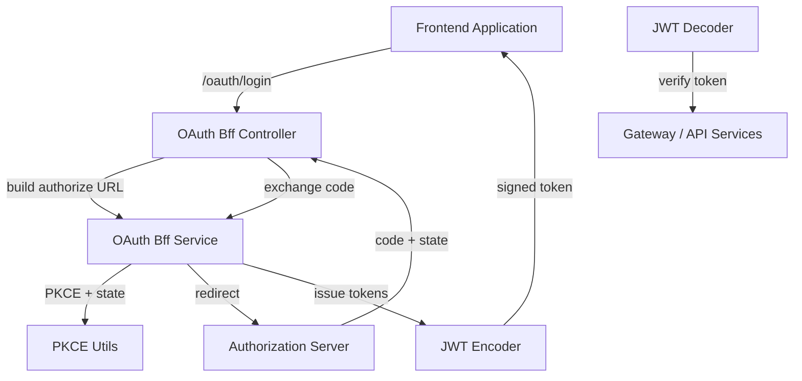
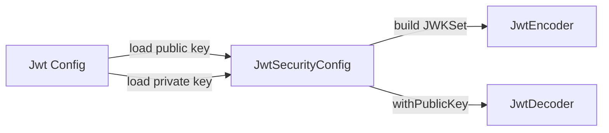
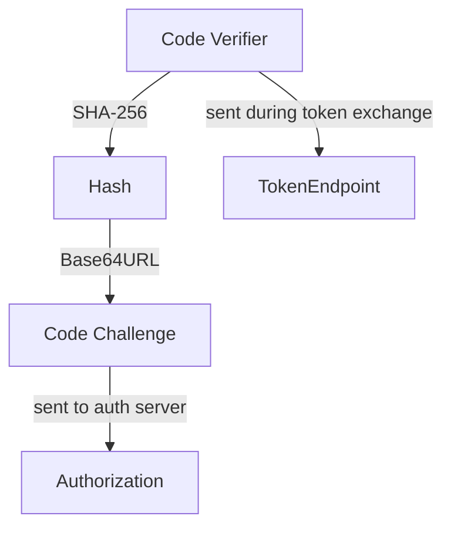
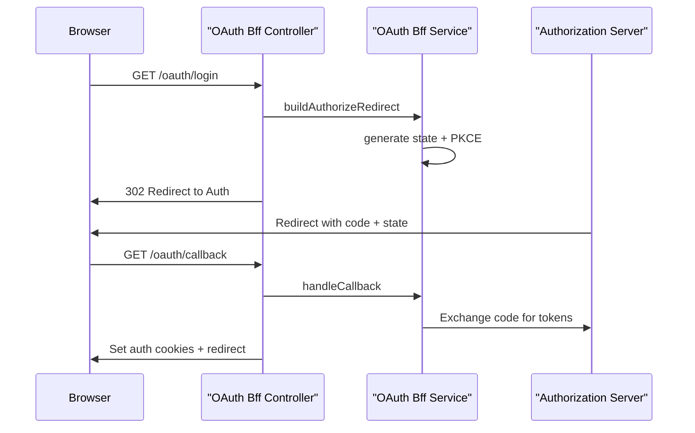
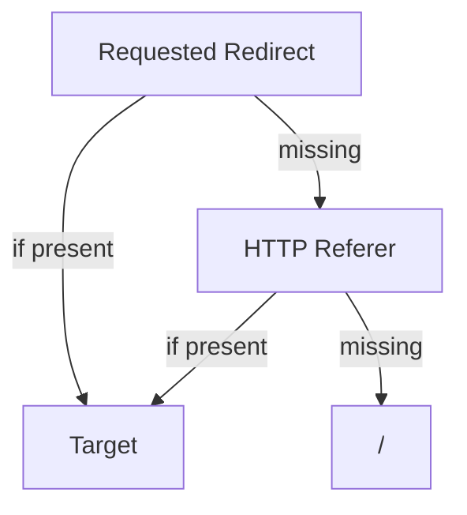
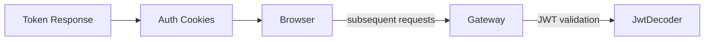

# Security Oauth Shared

## Overview

The **Security Oauth Shared** module provides the foundational building blocks for JWT handling, OAuth2 BFF (Backend-for-Frontend) flows, and PKCE-based authorization within the OpenFrame platform. It centralizes reusable security primitives that are consumed by the Gateway, Authorization Server, API services, and frontend integrations.

This module focuses on:

- RSA-based JWT encoding and decoding
- Configurable JWT key and issuer management
- OAuth2 BFF endpoints (login, callback, refresh, logout)
- PKCE (Proof Key for Code Exchange) utilities
- Standardized security constants for tokens and headers
- Default redirect resolution for OAuth flows

It is designed to be stateless, reusable, and compatible with multi-tenant deployments.

---

## High-Level Architecture

The module bridges three main concerns:

1. **JWT Infrastructure** – Signing and verifying tokens using RSA keys
2. **OAuth BFF Flow** – Managing browser-based OAuth interactions via cookies
3. **PKCE & Redirect Utilities** – Supporting secure OAuth2 Authorization Code flows



---

## Core Components

### 1. Jwt Security Config

**Class:** `JwtSecurityConfig`

Provides Spring beans for:

- `JwtEncoder` (RSA-based signing)
- `JwtDecoder` (RSA-based verification)

It uses Nimbus JOSE under the hood and constructs a JWK set from configured RSA keys.



Key characteristics:

- Uses RSA public/private key pair
- Private key used for signing
- Public key used for verification
- Compatible with Spring Security OAuth2 Resource Server

This configuration is consumed by services that issue or validate JWTs (e.g., Authorization Server and Gateway layers).

---

### 2. Jwt Config

**Class:** `JwtConfig`

Responsible for:

- Loading RSA public/private keys from configuration properties
- Parsing PEM-formatted private keys
- Exposing `issuer` and `audience` values

Configuration prefix:

```text
jwt.public-key
jwt.private-key
jwt.issuer
jwt.audience
```

Key responsibilities:

- Strip PEM headers and whitespace
- Base64 decode key content
- Build `RSAPrivateKey` using `KeyFactory`
- Delegate public key transformation to `KeyConfig`

This allows different environments (dev, staging, production) to provide their own key material without changing application code.

---

### 3. Security Constants

**Class:** `SecurityConstants`

Centralizes commonly used OAuth and token-related constants:

```text
AUTHORIZATION_QUERY_PARAM = "authorization"
ACCESS_TOKEN = "access_token"
REFRESH_TOKEN = "refresh_token"
ACCESS_TOKEN_HEADER = "Access-Token"
REFRESH_TOKEN_HEADER = "Refresh-Token"
```

Benefits:

- Eliminates string duplication
- Ensures consistent header/cookie naming
- Prevents subtle integration bugs

These constants are used across controllers, filters, and services in multiple modules.

---

### 4. PKCE Utils

**Class:** `PKCEUtils`

Utility class implementing RFC 7636 PKCE support.

Provides:

- `generateState()` – 128-bit CSRF protection token
- `generateCodeVerifier()` – 256-bit cryptographic random string
- `generateCodeChallenge()` – SHA-256 based challenge
- `urlEncode()` – Safe redirect parameter encoding

PKCE flow support:



Security properties:

- Uses `SecureRandom`
- Base64 URL encoding without padding
- SHA-256 hashing
- Prevents authorization code interception attacks

---

### 5. OAuth Bff Controller

**Class:** `OAuthBffController`

Exposes reactive endpoints under `/oauth` for browser-based authentication flows.

Enabled via property:

```text
openframe.gateway.oauth.enable=true
```

#### Endpoints

| Endpoint | Method | Purpose |
|-----------|--------|----------|
| `/oauth/login` | GET | Initiates OAuth2 login with PKCE + state |
| `/oauth/continue` | GET | Re-initializes flow without clearing session |
| `/oauth/callback` | GET | Exchanges authorization code for tokens |
| `/oauth/refresh` | POST | Refreshes access token using refresh token |
| `/oauth/logout` | GET | Revokes refresh token and clears cookies |
| `/oauth/dev-exchange` | GET | Development-only token header exchange |

#### Login Flow



Key responsibilities:

- Clears stale cookies before login
- Stores signed state JWT in cookie
- Exchanges authorization code for tokens
- Sets `access_token` and `refresh_token` cookies
- Handles error redirection gracefully
- Supports development ticket flow

The controller operates in a reactive style using `Mono`.

---

### 6. Default Redirect Target Resolver

**Class:** `DefaultRedirectTargetResolver`

Determines the final redirect destination after OAuth completion.

Resolution strategy:

1. Use `requestedRedirectTo` if provided
2. Otherwise fallback to HTTP `Referer` header
3. Otherwise default to `/`



It is conditionally loaded and can be overridden by providing a custom `RedirectTargetResolver` bean.

---

## Token & Cookie Strategy

The module follows a secure cookie-based session model:

- Access token stored in HTTP-only cookie
- Refresh token stored in HTTP-only cookie
- OAuth state stored temporarily with TTL
- Optional development headers for local testing



Security properties:

- Short-lived state cookies
- Explicit state clearing after callback
- Header fallback for refresh token
- Optional dev-only exposure of tokens

---

## Integration with the Platform

Security Oauth Shared is consumed by:

- Authorization Server (token issuance)
- Gateway (JWT validation and cookie handling)
- API services (resource protection)
- Frontend clients (OAuth login orchestration)

It ensures:

- Consistent JWT configuration across services
- Shared PKCE and state logic
- Unified token header/cookie naming
- Centralized redirect behavior

---

## Design Principles

1. **Separation of concerns** – JWT infrastructure, OAuth flow, and redirect logic are modular.
2. **Configuration-driven security** – RSA keys and issuer/audience defined via properties.
3. **Reactive-first design** – OAuth controller built using Spring WebFlux.
4. **Multi-tenant ready** – Designed to work with tenant-aware Authorization Server implementations.
5. **Override-friendly** – Default redirect resolver is replaceable via bean override.

---

## Summary

The **Security Oauth Shared** module provides the cryptographic, OAuth, and redirect primitives required for secure authentication in OpenFrame. By centralizing JWT configuration, PKCE utilities, and OAuth BFF handling, it ensures:

- Secure Authorization Code + PKCE flows
- Standardized token handling
- RSA-based JWT interoperability
- Clean separation between frontend, gateway, and authorization server concerns

It forms the foundation of authentication and token lifecycle management across the entire platform.
