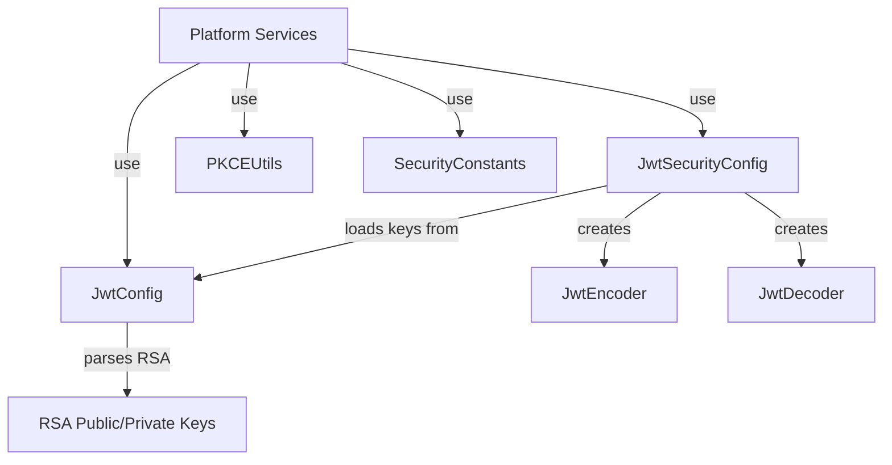
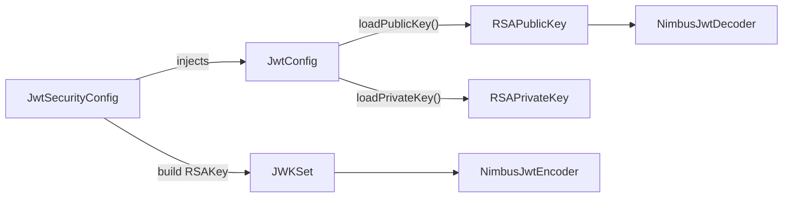
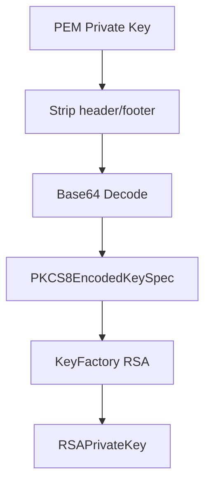
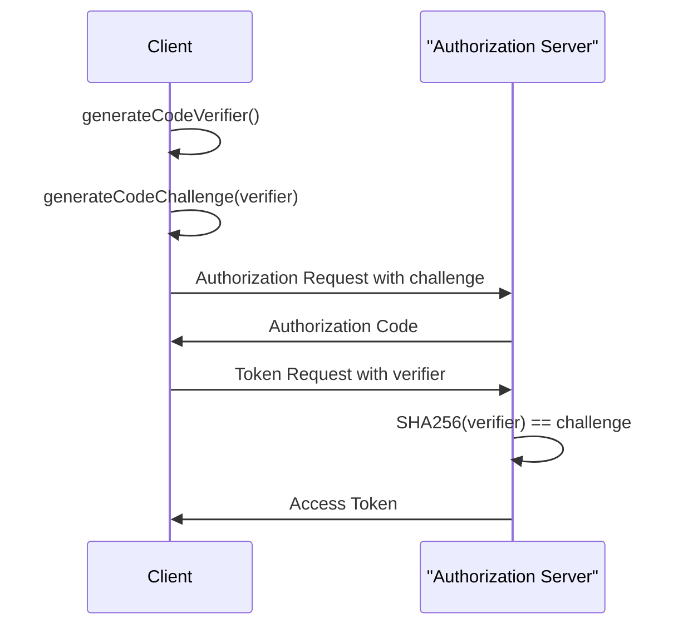
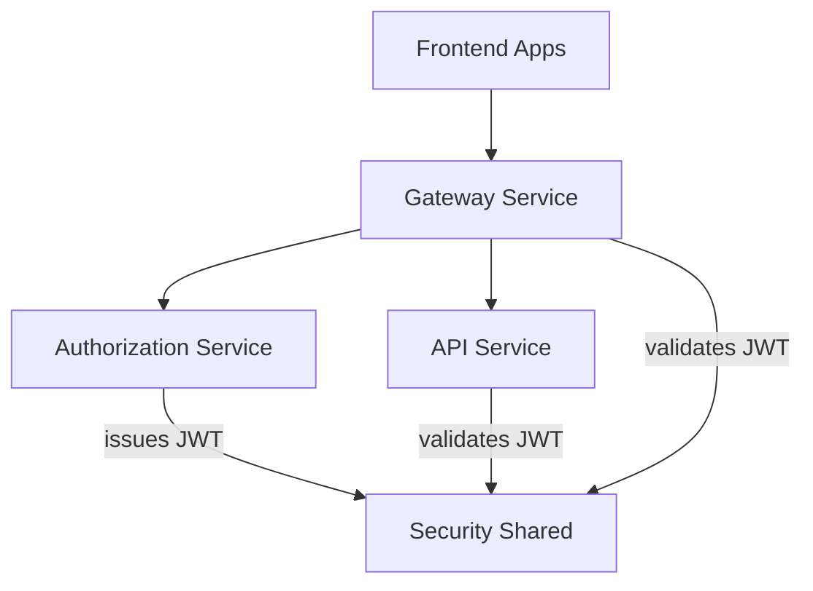

# Security Shared

The **Security Shared** module provides foundational cryptographic and token utilities used across the OpenFrame platform. It centralizes JWT configuration, RSA key management, OAuth-related constants, and PKCE (Proof Key for Code Exchange) helpers to ensure consistent security practices across services.

This module is intentionally lightweight and framework-agnostic where possible, enabling reuse by:

- API Service Core
- Authorization Service Core
- Gateway Service Core
- External API Service Core
- Client Service Core

It acts as the cryptographic backbone of the platform’s authentication and authorization model.

---

## Responsibilities

Security Shared focuses on four primary areas:

1. **JWT Encoding and Decoding Configuration**
2. **RSA Key Loading and Management**
3. **OAuth2 Token and Header Constants**
4. **PKCE Utilities for Secure Authorization Flows**

---

## High-Level Architecture



Security Shared does not expose REST endpoints or business logic. Instead, it provides Spring beans and static utilities that are injected into higher-level modules.

---

# Core Components

## JwtSecurityConfig

**Component:**  
`com.openframe.security.config.JwtSecurityConfig`

### Purpose

Configures Spring Security JWT infrastructure by exposing:

- `JwtEncoder`
- `JwtDecoder`

These beans are consumed by services such as the Authorization Server and Gateway to sign and validate tokens.

### Key Responsibilities

- Builds an RSA-backed `NimbusJwtEncoder`
- Creates a `NimbusJwtDecoder` using the public key
- Integrates with Spring’s dependency injection container

### Internal Flow



### Why RSA?

Using asymmetric RSA keys allows:

- Token signing with a private key
- Token verification using only the public key
- Secure cross-service validation without sharing secrets

---

## JwtConfig

**Component:**  
`com.openframe.security.jwt.JwtConfig`

### Purpose

Centralizes JWT-related configuration loaded from application properties.

Bound via:

```text
ConfigurationProperties prefix: jwt
```

### Configurable Properties

- `jwt.publicKey`
- `jwt.privateKey`
- `jwt.issuer`
- `jwt.audience`

### Key Responsibilities

1. Parse PEM-formatted RSA keys
2. Convert Base64-encoded key material into Java RSA key objects
3. Provide issuer and audience metadata

### RSA Key Loading Flow



### Security Considerations

- Private keys must be securely stored (e.g., environment variables or secret managers).
- Key rotation should be handled at deployment level.
- The module does not persist keys — it only loads them.

---

## SecurityConstants

**Component:**  
`com.openframe.security.oauth.SecurityConstants`

### Purpose

Defines shared OAuth2-related constant values to prevent duplication across modules.

### Defined Constants

```text
AUTHORIZATION_QUERY_PARAM = "authorization"
ACCESS_TOKEN = "access_token"
REFRESH_TOKEN = "refresh_token"
ACCESS_TOKEN_HEADER = "Access-Token"
REFRESH_TOKEN_HEADER = "Refresh-Token"
```

### Why Centralized Constants?

- Eliminates string duplication
- Prevents header name inconsistencies
- Simplifies cross-service token handling

These constants are typically used by:

- Gateway filters
- API controllers
- Authorization flows
- External API integrations

---

## PKCEUtils

**Component:**  
`com.openframe.security.pkce.PKCEUtils`

### Purpose

Implements PKCE utilities for secure OAuth2 authorization flows.

PKCE (Proof Key for Code Exchange) protects public clients (SPAs, mobile apps) from authorization code interception attacks.

### Supported Operations

- Generate secure state parameters
- Generate code verifiers
- Generate SHA-256-based code challenges
- URL encode values

### PKCE Flow Overview



### Cryptographic Details

- `generateState()` → 128-bit random value
- `generateCodeVerifier()` → 256-bit random value
- `generateCodeChallenge()` → SHA-256 hash of verifier
- Base64URL encoding without padding

### Security Guarantees

- Uses `SecureRandom`
- Prevents CSRF via state parameter
- Prevents authorization code interception
- Avoids predictable token exchange patterns

---

# How Security Shared Fits into the Platform

Security Shared underpins the platform’s layered security model.



### Typical Token Lifecycle

1. Client performs OAuth2 + PKCE flow.
2. Authorization Server signs JWT using `JwtEncoder`.
3. Gateway validates token via `JwtDecoder`.
4. Downstream services validate using the same public key.

This ensures:

- Stateless authentication
- Cross-service trust
- Centralized key handling
- Consistent token parsing

---

# Design Principles

Security Shared follows these design principles:

### 1. Single Responsibility
Only cryptographic and token infrastructure logic is included.

### 2. Reusability
No service-specific logic. Any module can import and reuse it.

### 3. Framework Alignment
Built to integrate cleanly with:

- Spring Security
- Spring Boot Configuration Properties
- Nimbus JOSE JWT

### 4. Security by Default
- Strong cryptographic primitives
- Secure randomness
- Base64URL encoding without padding
- Explicit key parsing

---

# Extension Guidelines

When extending Security Shared:

- Keep it free of business logic
- Avoid service-specific dependencies
- Add only generic security utilities
- Maintain compatibility with Spring Security standards

Potential future enhancements may include:

- Key rotation helpers
- JWK endpoint utilities
- Additional token validation strategies

---

# Summary

The **Security Shared** module provides the cryptographic core of the OpenFrame platform. It standardizes:

- JWT signing and validation
- RSA key management
- OAuth2 constant definitions
- PKCE utilities

By centralizing these concerns, the platform ensures consistent security practices across all services while keeping individual modules focused on their domain responsibilities.