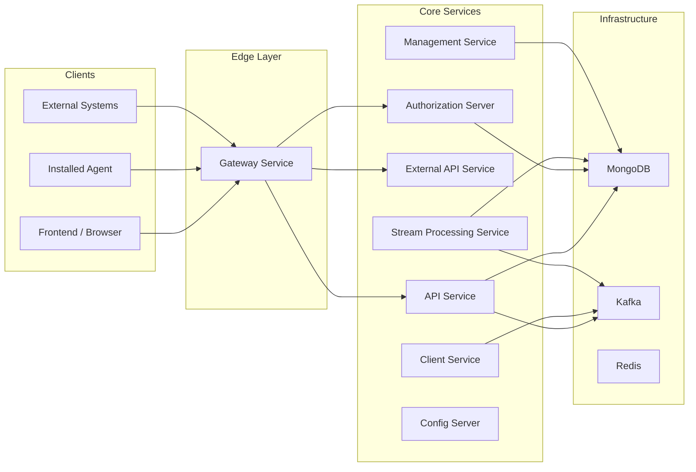
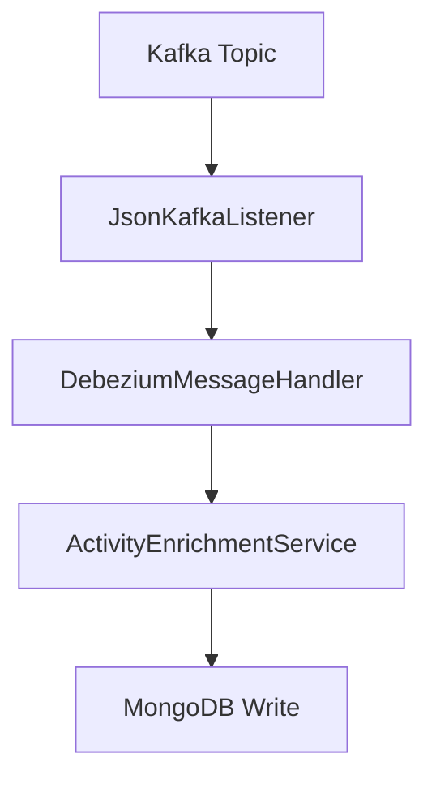
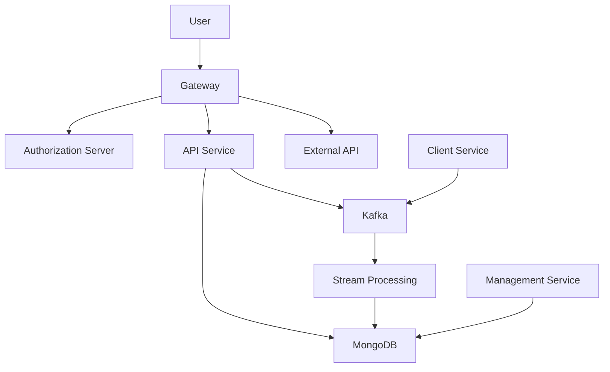

# Service Applications

The **Service Applications** module contains the runnable Spring Boot applications that compose the OpenFrame multi-service platform. Each application acts as a composition root, wiring together shared core libraries (API, Authorization, Data, Security, Kafka, etc.) into independently deployable services.

At a high level, this module transforms reusable domain and infrastructure libraries into concrete microservices such as:

- API Service
- Authorization Server
- Gateway
- External API
- Client Service
- Management Service
- Stream Processing Service
- Config Server

These applications are the operational backbone of the platform and define the runtime topology.

---

## Architectural Overview

The Service Applications layer sits at the top of the dependency graph. Each application bootstraps a Spring context and composes functionality from lower-level modules (API core, authorization core, data, security, stream processing, etc.).



Each application defines:

- A `@SpringBootApplication` entry point
- A `@ComponentScan` configuration defining which modules are wired
- Optional platform-specific annotations (e.g., `@EnableKafka`, `@EnableDiscoveryClient`)

---

## Application Catalog

### 1. API Service

**Entry Point:** `ApiApplication`

The API Service exposes the primary internal REST and GraphQL endpoints used by the frontend and other platform services.

```java
@SpringBootApplication
@ComponentScan(basePackages = {
    "com.openframe.api",
    "com.openframe.data",
    "com.openframe.core",
    "com.openframe.notification",
    "com.openframe.kafka"
})
```

#### Responsibilities

- REST and GraphQL endpoints
- Device, organization, event, and tool access
- User context (`/me`) operations
- Data loading and query orchestration
- Kafka event publishing

#### Key Characteristics

- Composes API Core + Data + Kafka modules
- Acts as the primary business-facing service
- Stateless and horizontally scalable

---

### 2. Authorization Server

**Entry Point:** `OpenFrameAuthorizationServerApplication`

The Authorization Server provides OAuth2 and OIDC capabilities, tenant-aware authentication, and SSO integrations.

```java
@SpringBootApplication
@EnableDiscoveryClient
@ComponentScan(basePackages = {
    "com.openframe.authz",
    "com.openframe.core",
    "com.openframe.data",
    "com.openframe.notification"
})
```

#### Responsibilities

- OAuth2 Authorization Server
- OIDC identity provider
- Tenant-aware login flows
- SSO (Google, Microsoft, etc.)
- Token issuance and validation

#### Notable Features

- Dynamic client registration
- Mongo-backed authorization storage
- Tenant key management
- Custom login and invitation flows

---

### 3. Gateway Service

**Entry Point:** `GatewayApplication`

The Gateway Service acts as the platform edge, routing requests and enforcing cross-cutting security concerns.

```java
@SpringBootApplication
@ComponentScan(basePackages = {
    "com.openframe.gateway",
    "com.openframe.core",
    "com.openframe.data",
    "com.openframe.security"
})
```

#### Responsibilities

- Request routing to backend services
- JWT validation
- API key authentication
- CORS enforcement
- WebSocket gateway configuration

#### Architectural Role

- Single public ingress point
- Enforces platform-wide security policies
- Adds authorization headers for downstream services

---

### 4. External API Service

**Entry Point:** `ExternalApiApplication`

Provides a stable, documented API surface for third-party integrations.

```java
@SpringBootApplication
@ComponentScan(basePackages = {
    "com.openframe.external",
    "com.openframe.data",
    "com.openframe.core",
    "com.openframe.api",
    "com.openframe.kafka"
})
```

#### Responsibilities

- Public-facing REST APIs
- Integration endpoints
- Event ingestion and retrieval
- Tool and organization exposure

#### Characteristics

- Includes OpenAPI configuration
- Proxies or reuses internal API logic
- Designed for versioning and backward compatibility

---

### 5. Client Service

**Entry Point:** `ClientApplication`

The Client Service manages installed agents and their lifecycle.

```java
@SpringBootApplication
@ComponentScan(basePackages = {
    "com.openframe.data",
    "com.openframe.client",
    "com.openframe.core",
    "com.openframe.security",
    "com.openframe.kafka.producer"
})
```

#### Responsibilities

- Agent authentication
- Agent registration
- Tool-agent asset management
- Heartbeat and connection tracking

#### Notes

- Excludes `CassandraHealthIndicator` from scanning
- Integrates with Kafka for event publishing

---

### 6. Stream Processing Service

**Entry Point:** `StreamApplication`

Consumes and processes Kafka events for enrichment and transformation.

```java
@SpringBootApplication
@EnableKafka
@ComponentScan(basePackages = {
    "com.openframe.stream",
    "com.openframe.data",
    "com.openframe.kafka.producer"
})
```

#### Responsibilities

- Kafka consumption
- Debezium message handling
- Event enrichment
- Tool data transformation
- Timestamp parsing and normalization

#### Processing Flow



---

### 7. Management Service

**Entry Point:** `ManagementApplication`

Handles operational and administrative workflows.

```java
@SpringBootApplication
@ComponentScan(basePackages = {
    "com.openframe.management",
    "com.openframe.data",
    "com.openframe.core"
})
```

#### Responsibilities

- Integrated tool lifecycle
- Release version management
- Debezium connector initialization
- Scheduled jobs (health checks, API key stats sync)
- Client version update publishing

---

### 8. Config Server

**Entry Point:** `ConfigServerApplication`

Provides centralized configuration management.

```java
@SpringBootApplication
public class ConfigServerApplication {
    public static void main(String[] args) {
        SpringApplication.run(ConfigServerApplication.class, args);
    }
}
```

#### Responsibilities

- Centralized configuration distribution
- Environment-based property management
- Service configuration bootstrap

---

## Service Interaction Model

The platform follows a layered microservice model:



### Key Principles

- **Separation of concerns**: Each service owns a bounded context.
- **Event-driven integration**: Kafka enables asynchronous workflows.
- **Stateless services**: Horizontal scalability by design.
- **Tenant isolation**: Authorization Server enforces tenant context.
- **Composable architecture**: Services are assembled from reusable core modules.

---

## Deployment Model

Each application:

- Is independently deployable
- Can scale horizontally
- Connects to shared infrastructure (MongoDB, Kafka, Redis)
- Can be registered in service discovery (where enabled)

Typical production deployment includes:

- 1+ Gateway instances
- 1+ Authorization Server instances
- Multiple API instances
- Dedicated Stream Processing instances
- Management service (singleton or HA pair)

---

## Summary

The **Service Applications** module defines the runtime entry points of the OpenFrame platform. While lower-level modules implement domain logic and infrastructure abstractions, this module composes them into fully operational microservices.

It represents the final assembly layer where:

- Core libraries become deployable services
- Security and authentication are enforced
- Data flows are orchestrated
- Event-driven processing is executed

Together, these applications form the complete distributed system powering OpenFrame.