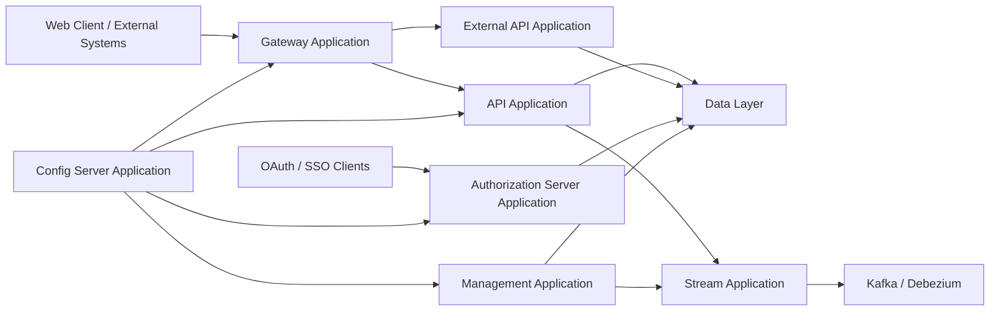
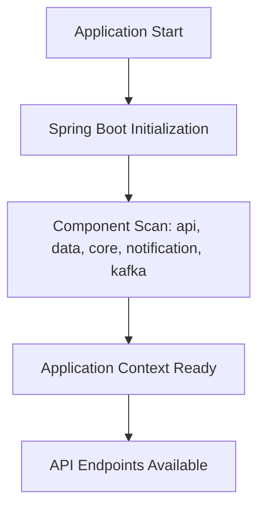
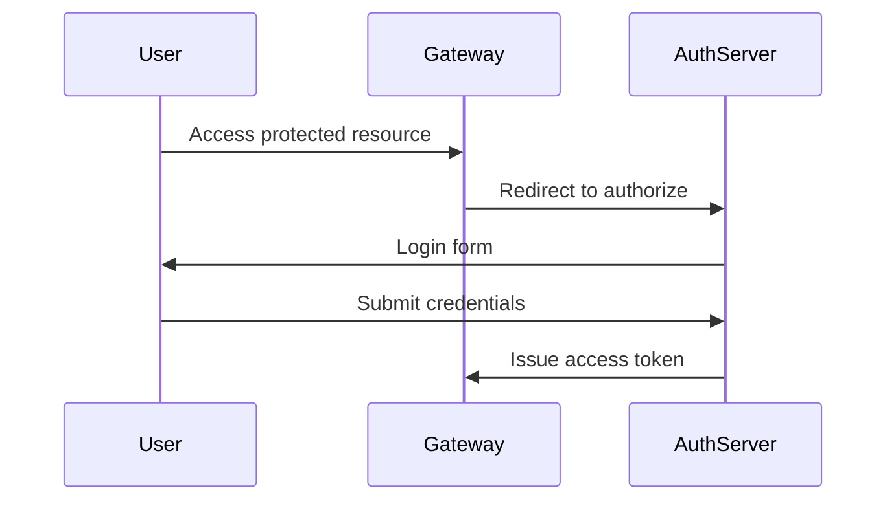
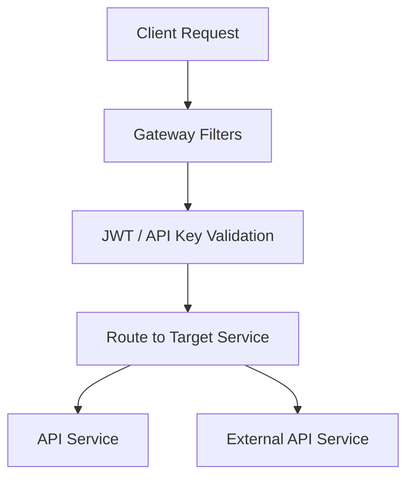
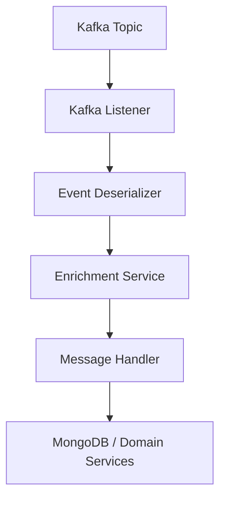
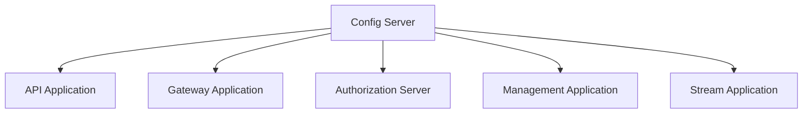
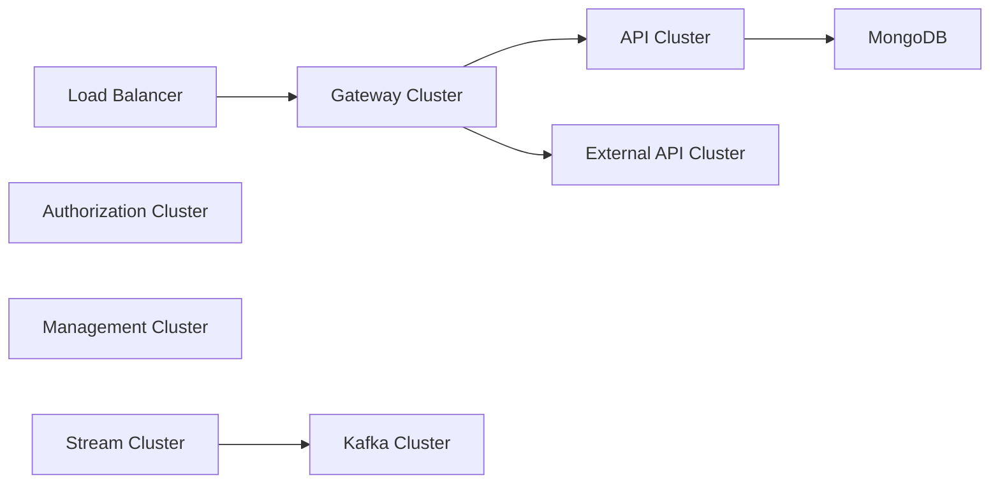

# Service Applications

## Overview

The **Service Applications** module defines the executable entry points for the OpenFrame platform. Each application is a Spring Boot service that composes lower-level core libraries (API, Gateway, Authorization, Data, Stream, Management, and others) into deployable microservices.

These applications represent the runtime layer of the system. They are responsible for:

- Bootstrapping Spring contexts
- Wiring shared modules via component scanning
- Enabling service-specific capabilities (Kafka, discovery, etc.)
- Acting as independently deployable units in a distributed architecture

This module does not implement domain logic directly. Instead, it assembles and activates functionality provided by the core service libraries.

---

## High-Level Architecture

The Service Applications layer sits at the top of the platform stack and orchestrates all underlying modules.

Each box in this diagram corresponds to a Spring Boot application defined in this module.

---

## Service Inventory

The Service Applications module contains the following runtime services:

1. API Application  
2. Authorization Server Application  
3. Gateway Application  
4. Management Application  
5. Stream Application  
6. External API Application  
7. Client Application  
8. Config Server Application  

Each service has a dedicated `main` class annotated with `@SpringBootApplication`.

---

## API Application

**Entry Point:** `ApiApplication`

The API Application provides the primary REST and GraphQL interfaces for internal and frontend clients.

### Component Scan Scope

It scans the following base packages:

- `com.openframe.api`
- `com.openframe.data`
- `com.openframe.core`
- `com.openframe.notification`
- `com.openframe.kafka`

### Responsibilities

- Exposes REST controllers and GraphQL endpoints
- Integrates domain services and data repositories
- Publishes events to Kafka
- Coordinates notification workflows

### Bootstrapping Flow

---

## Authorization Server Application

**Entry Point:** `OpenFrameAuthorizationServerApplication`

The Authorization Server Application handles authentication, OAuth2 flows, tenant registration, and SSO integration.

### Key Annotations

- `@SpringBootApplication`
- `@EnableDiscoveryClient`

### Component Scan Scope

- `com.openframe.authz`
- `com.openframe.core`
- `com.openframe.data`
- `com.openframe.notification`

### Responsibilities

- OAuth2 Authorization Server
- Dynamic client registration
- Tenant-aware authentication
- Invitation and SSO onboarding
- JWT issuance and validation

### Authentication Flow (Simplified)

---

## Gateway Application

**Entry Point:** `GatewayApplication`

The Gateway Application is the edge service of the platform. It routes requests to internal services and enforces security policies.

### Component Scan Scope

- `com.openframe.gateway`
- `com.openframe.core`
- `com.openframe.data`
- `com.openframe.security`

### Responsibilities

- API routing and proxying
- JWT validation
- API key authentication
- CORS handling
- WebSocket proxying for tool integrations
- Tenant-aware request processing

### Request Routing Flow

---

## Management Application

**Entry Point:** `ManagementApplication`

The Management Application handles operational and administrative processes.

### Component Scan Scope

- `com.openframe.management`
- `com.openframe.data`
- `com.openframe.core`

### Special Configuration

Excludes the Cassandra health indicator via component scan filtering.

### Responsibilities

- Scheduled jobs (heartbeat detection, version sync)
- Release version management
- Data migrations and backfills
- Tool and agent initialization
- System-level orchestration

---

## Stream Application

**Entry Point:** `StreamApplication`

The Stream Application processes event-driven workflows using Kafka.

### Key Annotations

- `@SpringBootApplication`
- `@EnableKafka`

### Component Scan Scope

- `com.openframe.stream`
- `com.openframe.data`
- `com.openframe.kafka.producer`

### Responsibilities

- Kafka listeners
- Debezium change data capture processing
- Event enrichment
- Multi-tenant event validation
- Stream-to-domain translation

### Event Processing Flow

---

## External API Application

**Entry Point:** `ExternalApiApplication`

The External API Application exposes a controlled API surface for third-party integrations.

### Component Scan Scope

- `com.openframe.external`
- `com.openframe.data`
- `com.openframe.core`
- `com.openframe.api`
- `com.openframe.kafka`

### Responsibilities

- Public-facing REST endpoints
- Integration-specific workflows
- Event publication for external systems
- Secure boundary between external clients and internal services

---

## Client Application

**Entry Point:** `ClientApplication`

The Client Application supports client-facing backend services and integration layers.

### Component Scan Scope

- `com.openframe.data`
- `com.openframe.client`
- `com.openframe.core`
- `com.openframe.security`
- `com.openframe.kafka.producer`

### Special Configuration

Excludes `CassandraHealthIndicator` from component scanning.

### Responsibilities

- Client-specific APIs
- Secure service-to-service communication
- Kafka message production
- Domain interaction without full API surface exposure

---

## Config Server Application

**Entry Point:** `ConfigServerApplication`

The Config Server Application provides centralized configuration management for all services.

### Responsibilities

- Centralized configuration distribution
- Environment-based property management
- Runtime configuration refresh support

### Configuration Topology

---

## Cross-Cutting Design Principles

### 1. Clear Separation of Concerns

Each application encapsulates a specific runtime concern:

- Edge routing → Gateway  
- Business API → API  
- Authentication → Authorization Server  
- Operations → Management  
- Event processing → Stream  
- External exposure → External API  
- Configuration → Config Server  

### 2. Shared Domain and Data Layer

All applications depend on shared:

- Core domain services
- Mongo repositories
- Kafka infrastructure
- Security components

This ensures consistent behavior across microservices.

### 3. Multi-Tenancy

Tenant-aware configurations are applied across services, especially in:

- Authorization Server
- Gateway
- Stream processing
- Data access layer

### 4. Event-Driven Architecture

The Stream Application and Kafka integrations enable:

- Decoupled services
- Real-time synchronization
- Change Data Capture via Debezium
- Asynchronous processing

---

## Deployment Model

Each application is designed to be deployed independently:

- Containerized (e.g., Docker)
- Scalable horizontally
- Configured via centralized configuration
- Integrated through service discovery

Typical production topology:

---

## Summary

The **Service Applications** module defines the executable backbone of the OpenFrame platform. It transforms reusable core libraries into independently deployable microservices, each with a focused responsibility:

- Gateway for routing and security
- API for business logic exposure
- Authorization Server for identity and access
- Management for operational orchestration
- Stream for event processing
- External API for partner integrations
- Client for internal backend operations
- Config Server for centralized configuration

Together, these services form a scalable, multi-tenant, event-driven architecture powering the OpenFrame ecosystem.
