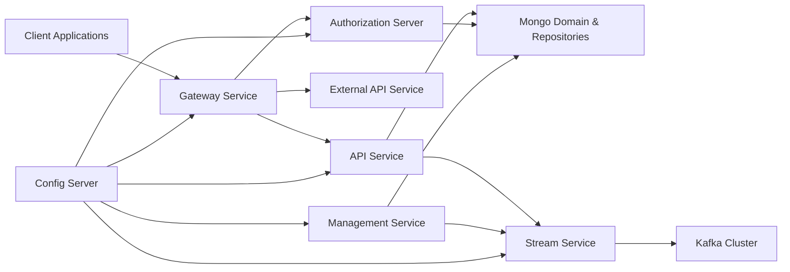
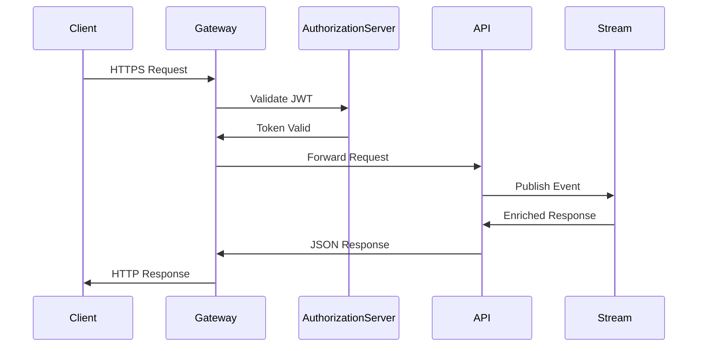
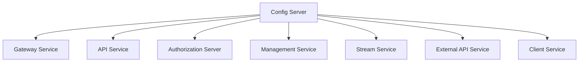

# Service Entrypoints

The **Service Entrypoints** module defines the executable entry points for all major OpenFrame microservices. Each entrypoint is a Spring Boot application responsible for bootstrapping a specific bounded context such as API, Gateway, Authorization, Stream Processing, or Management.

This module does not implement business logic directly. Instead, it wires together the underlying service cores, domain layers, security components, and infrastructure modules into runnable services.

---

## Purpose and Responsibilities

The Service Entrypoints module:

- Defines Spring Boot `main` classes for each deployable service
- Configures component scanning boundaries per service
- Enables service-specific infrastructure (Kafka, Discovery, etc.)
- Establishes runtime separation between microservices

Each entrypoint corresponds to a deployable artifact (container, pod, or VM process).

---

## High-Level Architecture

Each box above is bootstrapped by one entrypoint class in this module.

---

## Entrypoint Overview

### 1. API Service

**Entrypoint Class:**

- `ApiApplication`

Bootstraps the core API runtime.

**Component Scan Scope:**

- `com.openframe.api`
- `com.openframe.data`
- `com.openframe.core`
- `com.openframe.notification`
- `com.openframe.kafka`

This service exposes GraphQL/REST endpoints and connects domain, repositories, and messaging.

Related module:
- [API Service Core](../api-service-core/api-service-core.md)

---

### 2. Authorization Server

**Entrypoint Class:**

- `OpenFrameAuthorizationServerApplication`

**Key Features:**

- OAuth2 / OIDC provider
- Multi-tenant context handling
- Service discovery enabled

**Component Scan Scope:**

- `com.openframe.authz`
- `com.openframe.core`
- `com.openframe.data`
- `com.openframe.notification`

Related module:
- [Authorization Server Core](../authorization-server-core/authorization-server-core.md)

---

### 3. Gateway Service

**Entrypoint Class:**

- `GatewayApplication`

The Gateway acts as the system’s edge service.

**Responsibilities:**

- JWT validation
- API key authentication
- Request routing
- CORS and security filtering
- WebSocket proxying

**Component Scan Scope:**

- `com.openframe.gateway`
- `com.openframe.core`
- `com.openframe.data`
- `com.openframe.security`

Related module:
- [Gateway Service Core](../gateway-service-core/gateway-service-core.md)

---

### 4. Management Service

**Entrypoint Class:**

- `ManagementApplication`

The Management Service handles:

- Background schedulers
- Initializers and migrations
- Release management
- Administrative operations

It excludes `CassandraHealthIndicator` to isolate Cassandra health from this runtime.

Related module:
- [Management Service Core](../management-service-core/management-service-core.md)

---

### 5. Stream Service

**Entrypoint Class:**

- `StreamApplication`

**Enabled Features:**

- Kafka listeners
- Event enrichment
- Debezium message handling

**Component Scan Scope:**

- `com.openframe.stream`
- `com.openframe.data`
- `com.openframe.kafka.producer`

Related module:
- [Stream Processing Core](../stream-processing-core/stream-processing-core.md)

---

### 6. External API Service

**Entrypoint Class:**

- `ExternalApiApplication`

Provides external-facing API exposure with controlled scanning:

- `com.openframe.external`
- `com.openframe.data`
- `com.openframe.core`
- `com.openframe.api`
- `com.openframe.kafka`

This service enables third-party integrations without exposing internal surfaces.

---

### 7. Client Service

**Entrypoint Class:**

- `ClientApplication`

Used for internal client-facing operations and integrations.

**Component Scan Scope:**

- `com.openframe.data`
- `com.openframe.client`
- `com.openframe.core`
- `com.openframe.security`
- `com.openframe.kafka.producer`

Also excludes `CassandraHealthIndicator`.

Related module:
- [Chat Client Core](../chat-client-core/chat-client-core.md)

---

### 8. Config Server

**Entrypoint Class:**

- `ConfigServerApplication`

Bootstraps centralized configuration management.

All services depend on this service for externalized configuration.

---

## Service Interaction Model

This illustrates a typical request flow across entrypoint services.

---

## Deployment Model

Each entrypoint produces an independent deployable service:

Each service can be scaled independently and deployed as separate containers or Kubernetes pods.

---

## Design Principles

1. **Strict Bounded Contexts** – Each entrypoint defines clear component scan boundaries.
2. **Independent Scalability** – API, Stream, and Gateway scale differently.
3. **Security Isolation** – Authorization Server separated from API runtime.
4. **Operational Separation** – Management tasks do not interfere with request traffic.
5. **Event-Driven Backbone** – Stream Service handles asynchronous processing.

---

## How This Module Fits Into the Platform

The Service Entrypoints module is the top-level executable layer of OpenFrame.

It wires together:

- Domain and repositories from [Mongo Domain and Repositories](../mongo-domain-and-repositories/mongo-domain-and-repositories.md)
- Custom persistence logic from [Mongo Sync Custom Repositories](../mongo-sync-custom-repositories/mongo-sync-custom-repositories.md)
- DTOs and mappings from [API Contracts and Mapping](../api-contracts-and-mapping/api-contracts-and-mapping.md)
- Core business logic from [API Service Core](../api-service-core/api-service-core.md)
- Security from [Security and OAuth BFF](../security-and-oauth-bff/security-and-oauth-bff.md)
- Messaging from [Stream Processing Core](../stream-processing-core/stream-processing-core.md)

Without this module, the underlying cores remain libraries. With it, they become deployable services.

---

## Summary

The **Service Entrypoints** module defines the runtime boundary of the OpenFrame platform. It transforms modular service cores into independently deployable microservices, each responsible for a specific domain concern:

- Edge routing (Gateway)
- Identity and OAuth (Authorization Server)
- Business API (API Service)
- Event processing (Stream Service)
- Administration (Management Service)
- External integrations (External API)
- Client operations (Client Service)
- Central configuration (Config Server)

Together, these entrypoints form the operational backbone of the OpenFrame distributed architecture.
