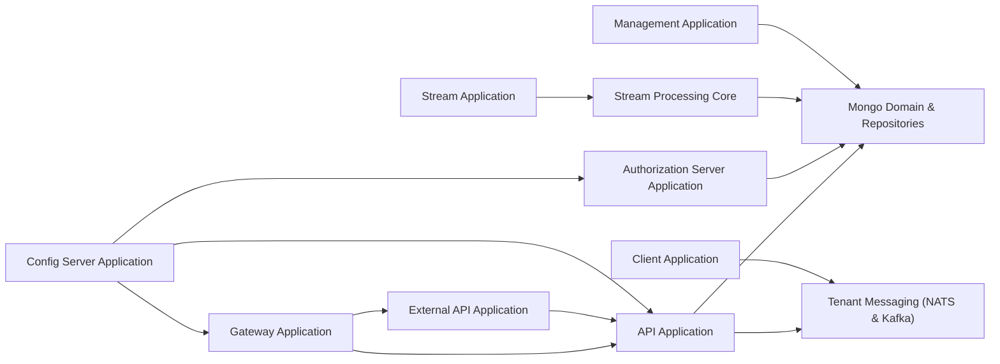
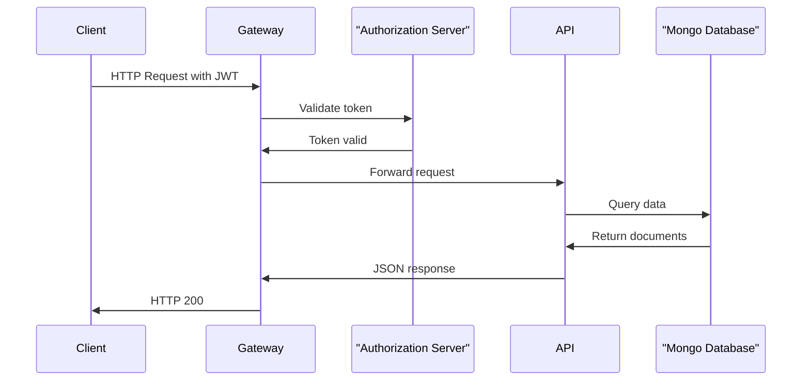
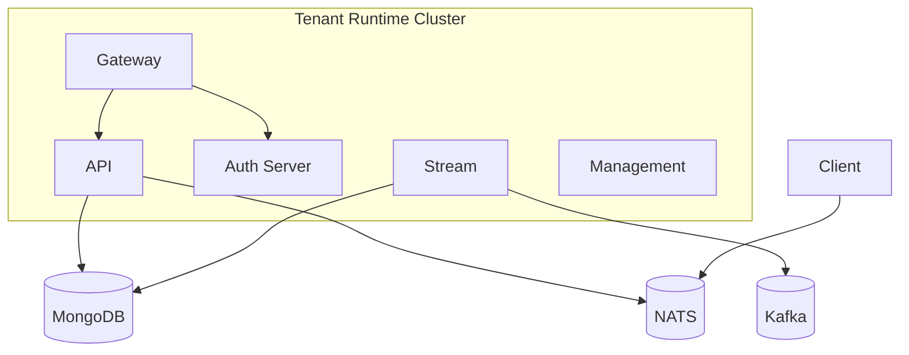

# Service Runtime Applications

## Overview

The **Service Runtime Applications** module defines the executable Spring Boot applications that compose the OpenFrame tenant runtime.  
Each application acts as a deployment unit that wires together reusable core libraries such as API services, authorization, gateway routing, stream processing, management tasks, and Mongo domain layers.

This module does not implement business logic directly. Instead, it:

- Bootstraps Spring Boot services
- Defines component scanning boundaries
- Enables infrastructure capabilities (Kafka, discovery, security, etc.)
- Assembles domain, data, and integration modules into runnable microservices

---

## High-Level Architecture

The runtime layer orchestrates multiple independently deployable services.

Each node above corresponds to a Spring Boot entry point defined in this module.

---

## Runtime Services

### 1. API Application

**Class:** `ApiApplication`  
Bootstraps the primary REST and GraphQL backend.

**Component Scan Includes:**
- `com.openframe.api`
- `com.openframe.data`
- `com.openframe.core`
- `com.openframe.notification`
- `com.openframe.kafka`

This application composes:

- API controllers and GraphQL data fetchers
- Domain services
- Mongo repositories
- Kafka producers
- Notification infrastructure

See:  
[API Service Core GraphQL and REST](../api-service-core-graphql-and-rest/api-service-core-graphql-and-rest.md)

---

### 2. Authorization Server Application

**Class:** `OpenFrameAuthorizationServerApplication`  
Enables OAuth2 / OIDC authentication and multi-tenant identity.

**Key Characteristics:**
- `@EnableDiscoveryClient`
- Dedicated security configuration
- Tenant-aware authorization

**Component Scan Includes:**
- `com.openframe.authz`
- `com.openframe.core`
- `com.openframe.data`
- `com.openframe.notification`

This service provides:

- Login flows
- Tenant discovery
- SSO (Google / Microsoft)
- Token issuance
- OAuth client registration

See:  
[Authorization Server Core](../authorization-server-core/authorization-server-core.md)

---

### 3. Gateway Application

**Class:** `GatewayApplication`  
Edge routing layer responsible for security, token validation, and upstream resolution.

**Component Scan Includes:**
- `com.openframe.gateway`
- `com.openframe.core`
- `com.openframe.data`
- `com.openframe.security`

Responsibilities:

- JWT validation
- API key authentication
- WebSocket proxying
- Rate limiting
- Upstream resolution (MeshCentral, Tactical RMM, tools)

See:  
[Gateway Service Core Routing and Security](../gateway-service-core-routing-and-security/gateway-service-core-routing-and-security.md)

---

### 4. External API Application

**Class:** `ExternalApiApplication`  
A restricted-scope API surface for integrations and third-party systems.

**Component Scan Includes:**
- `com.openframe.external`
- `com.openframe.data`
- `com.openframe.core`
- `com.openframe.api`
- `com.openframe.kafka`

Typical Use Cases:

- Partner integrations
- Tool-to-platform communication
- External system automation

---

### 5. Management Application

**Class:** `ManagementApplication`  
Handles initialization, migrations, schedulers, and operational orchestration.

**Component Scan Includes:**
- `com.openframe.management`
- `com.openframe.data`
- `com.openframe.core`

Excludes `CassandraHealthIndicator` to avoid unnecessary Cassandra wiring.

Responsibilities:

- System bootstrapping
- Tenant initializers
- Scheduled jobs
- Backfill migrations
- API key stats sync
- Device heartbeat detection

See:  
[Management Service Core Initialization and Scheduling](../management-service-core-initialization-and-scheduling/management-service-core-initialization-and-scheduling.md)

---

### 6. Stream Application

**Class:** `StreamApplication`  
Event-driven processing engine using Kafka.

**Annotations:**
- `@EnableKafka`

**Component Scan Includes:**
- `com.openframe.stream`
- `com.openframe.data`
- `com.openframe.kafka.producer`

Responsibilities:

- Kafka listeners
- Debezium change processing
- Event enrichment
- Tool event normalization
- Tenant-aware event validation

See:  
[Stream Processing Core](../stream-processing-core/stream-processing-core.md)

---

### 7. Client Application

**Class:** `ClientApplication`  
Runtime for OpenFrame client-side or agent-facing services.

**Component Scan Includes:**
- `com.openframe.data`
- `com.openframe.client`
- `com.openframe.core`
- `com.openframe.security`
- `com.openframe.kafka.producer`

Excludes `CassandraHealthIndicator`.

Responsibilities:

- Agent communication
- Security enforcement
- Kafka message production
- Client integration hooks

---

### 8. Config Server Application

**Class:** `ConfigServerApplication`  
Centralized configuration service.

Responsibilities:

- Externalized configuration management
- Environment-specific overrides
- Runtime property resolution

All other services depend on this for consistent configuration across environments.

---

## Service Interaction Flow

### Example: Authenticated API Request

---

## Deployment Model

Each application is:

- Independently deployable
- Independently scalable
- Backed by shared domain libraries
- Multi-tenant aware

---

## Design Principles

1. **Separation of Concerns**  
   Identity, routing, API, streaming, and management are isolated into distinct deployable services.

2. **Library-Driven Architecture**  
   Business logic lives in reusable modules. This layer only composes them.

3. **Tenant Awareness**  
   All services are designed for multi-tenant execution.

4. **Event-Driven Backbone**  
   Kafka and NATS provide asynchronous decoupling between services.

5. **Scalable Edge Routing**  
   Gateway centralizes cross-cutting concerns like security and rate limiting.

---

## Relationship to Other Modules

The Service Runtime Applications module acts as the executable layer for:

- [API Service Core GraphQL and REST](../api-service-core-graphql-and-rest/api-service-core-graphql-and-rest.md)
- [Authorization Server Core](../authorization-server-core/authorization-server-core.md)
- [Gateway Service Core Routing and Security](../gateway-service-core-routing-and-security/gateway-service-core-routing-and-security.md)
- [Stream Processing Core](../stream-processing-core/stream-processing-core.md)
- [Management Service Core Initialization and Scheduling](../management-service-core-initialization-and-scheduling/management-service-core-initialization-and-scheduling.md)
- [Data Mongo Domain and Repositories](../data-mongo-domain-and-repositories/data-mongo-domain-and-repositories.md)
- [Tenant Messaging NATS and Kafka](../tenant-messaging-nats-and-kafka/tenant-messaging-nats-and-kafka.md)

It is the final assembly layer that transforms reusable domain modules into running distributed services.

---

## Summary

The **Service Runtime Applications** module defines the operational backbone of OpenFrame’s tenant platform.  
It wires together API logic, identity, messaging, data access, streaming, and management into cohesive Spring Boot services that can be deployed in a cloud-native, horizontally scalable environment.

In short:

> Core modules define capabilities.  
> Service Runtime Applications turn those capabilities into running systems.
