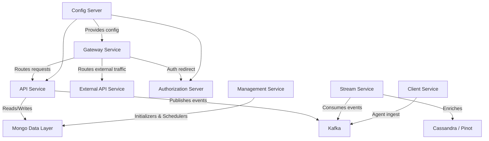
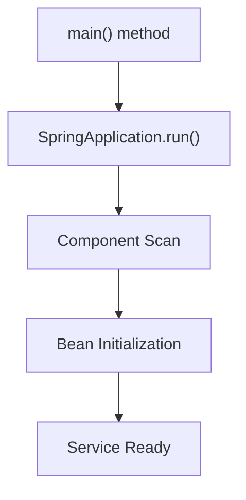

# Service Applications Entrypoints

## Overview

The **Service Applications Entrypoints** module defines the executable entrypoints for all OpenFrame microservices. Each entrypoint is a Spring Boot application responsible for bootstrapping a specific service domain such as API, Authorization, Gateway, Stream processing, Management, Client ingest, External API exposure, and Configuration.

These classes act as:

- ✅ Service bootstrappers (`@SpringBootApplication`)
- ✅ Component scan boundaries
- ✅ Integration points for shared modules (data, security, core, kafka)
- ✅ Deployment units for containerized environments

This module does not implement business logic directly. Instead, it wires together domain modules defined elsewhere in the system.

---

## Architecture Overview

The Service Applications Entrypoints module defines the runtime boundaries of the OpenFrame platform.



Each node in the diagram corresponds to one Spring Boot application defined in this module.

---

## Service Entrypoints

### 1. API Service

**Class:** `ApiApplication`

The API Service is the core REST and GraphQL backend for the OpenFrame platform.

**Component Scan:**

- `com.openframe.api`
- `com.openframe.data`
- `com.openframe.core`
- `com.openframe.notification`
- `com.openframe.kafka`

**Responsibilities:**

- REST and GraphQL endpoints
- Device, Organization, User, Tool APIs
- Event querying
- API key management
- Business service orchestration
- Publishing integration events

Bootstrapped via:

```java
@SpringBootApplication
@ComponentScan(basePackages = {
    "com.openframe.api",
    "com.openframe.data",
    "com.openframe.core",
    "com.openframe.notification",
    "com.openframe.kafka"
})
```

---

### 2. Authorization Server

**Class:** `OpenFrameAuthorizationServerApplication`

The Authorization Server handles:

- OAuth2 flows
- OIDC discovery
- SSO (Google, Microsoft)
- Tenant-aware authentication
- Token issuance

**Annotations:**

- `@SpringBootApplication`
- `@EnableDiscoveryClient`

**Component Scan:**

- `com.openframe.authz`
- `com.openframe.core`
- `com.openframe.data`
- `com.openframe.notification`

This service is responsible for identity, login, PKCE flows, and multi-tenant authentication boundaries.

---

### 3. Gateway Service

**Class:** `GatewayApplication`

The Gateway Service is the public edge of the platform.

**Responsibilities:**

- Request routing
- JWT validation
- API key authentication
- CORS handling
- WebSocket proxying
- Tenant-aware routing

**Component Scan:**

- `com.openframe.gateway`
- `com.openframe.core`
- `com.openframe.data`
- `com.openframe.security`

The gateway isolates backend services from direct public exposure.

---

### 4. External API Service

**Class:** `ExternalApiApplication`

The External API Service exposes a simplified REST surface for third-party integrations.

**Component Scan:**

- `com.openframe.external`
- `com.openframe.data`
- `com.openframe.core`
- `com.openframe.api`
- `com.openframe.kafka`

**Responsibilities:**

- Public REST APIs
- Integration endpoints
- Log, device, event access
- External automation workflows

---

### 5. Client Service

**Class:** `ClientApplication`

The Client Service handles agent ingestion and client interactions.

**Component Scan:**

- `com.openframe.data`
- `com.openframe.client`
- `com.openframe.core`
- `com.openframe.security`
- `com.openframe.kafka.producer`

**Special Configuration:**

- Excludes `CassandraHealthIndicator`

**Responsibilities:**

- Agent registration
- Agent authentication
- File delivery
- Metrics ingestion
- Machine heartbeat handling

---

### 6. Stream Service

**Class:** `StreamApplication`

The Stream Service processes asynchronous events.

**Annotations:**

- `@SpringBootApplication`
- `@EnableKafka`

**Component Scan:**

- `com.openframe.stream`
- `com.openframe.data`
- `com.openframe.kafka.producer`

**Responsibilities:**

- Kafka listeners
- Debezium message handling
- Event enrichment
- Activity transformation
- Pinot/Cassandra updates

---

### 7. Management Service

**Class:** `ManagementApplication`

The Management Service runs background processes.

**Component Scan:**

- `com.openframe.management`
- `com.openframe.data`
- `com.openframe.core`

**Special Configuration:**

- Excludes `CassandraHealthIndicator`

**Responsibilities:**

- Initializers
- Release version management
- Scheduled jobs
- Debezium health checks
- API key statistics sync

---

### 8. Config Server

**Class:** `ConfigServerApplication`

The Config Server centralizes configuration.

**Responsibilities:**

- Externalized configuration
- Environment-specific overrides
- Central configuration management

All services depend on this component for runtime configuration.

---

## Service Startup Model

Each service follows the same startup lifecycle:



This uniform structure ensures:

- Consistent dependency injection
- Modular service boundaries
- Independent deployability
- Horizontal scalability

---

## Deployment Perspective

Each entrypoint maps to:

- A separate container image
- A distinct Kubernetes Deployment
- Independent scaling configuration
- Independent health checks

The architecture enables:

- Multi-tenant isolation
- Zero-downtime rolling updates
- Independent release cycles
- Fault isolation between domains

---

## Key Design Principles

### 1. Explicit Service Boundaries

Each entrypoint defines a clear `@ComponentScan` boundary, preventing unintended cross-service coupling.

### 2. Shared Infrastructure Modules

Common packages such as:

- `com.openframe.data`
- `com.openframe.core`
- `com.openframe.security`
- `com.openframe.kafka`

are reused across services without duplicating logic.

### 3. Multi-Tenant Architecture

The Authorization Server and Gateway enforce tenant-aware request routing and token validation.

### 4. Event-Driven Integration

Kafka-based messaging enables decoupling between:

- API
- Client ingest
- Stream processing
- Management schedulers

---

## Summary

The **Service Applications Entrypoints** module defines the runtime backbone of the OpenFrame platform. Each Spring Boot application:

- Establishes a bounded service context
- Wires shared infrastructure modules
- Enables independent deployment and scaling
- Forms part of a cohesive microservices architecture

Together, these entrypoints compose a scalable, tenant-aware, event-driven system powering the OpenFrame platform.