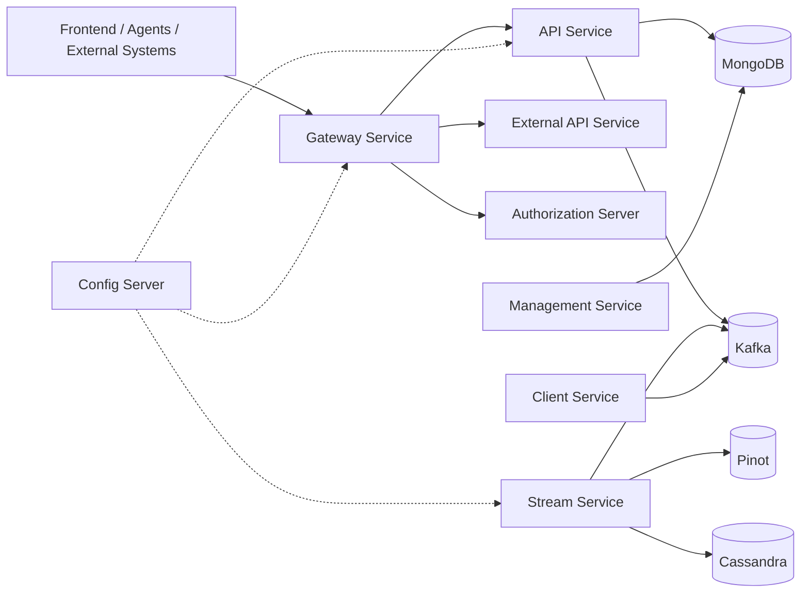
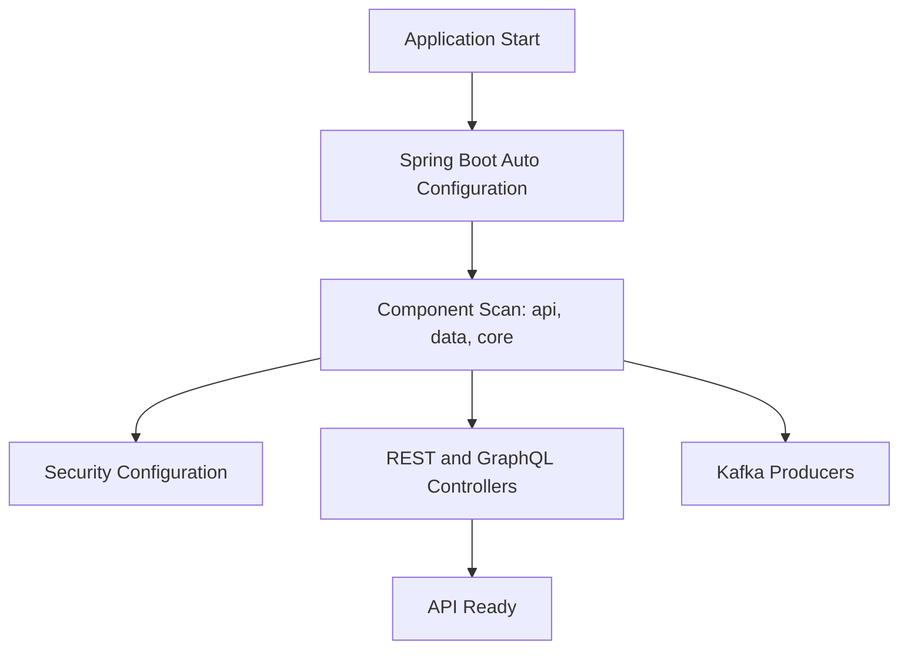
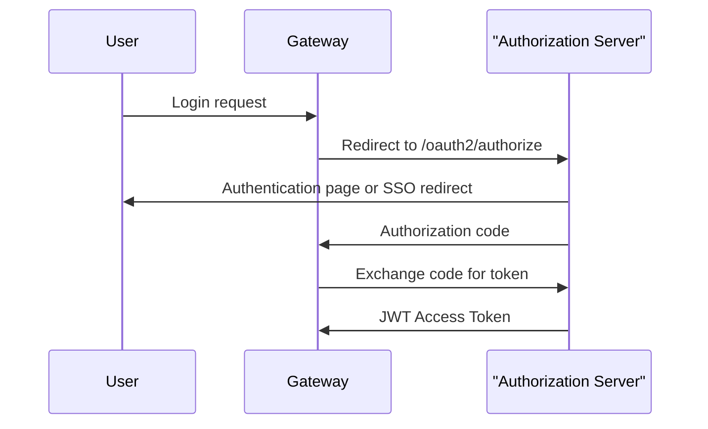
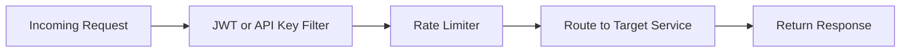
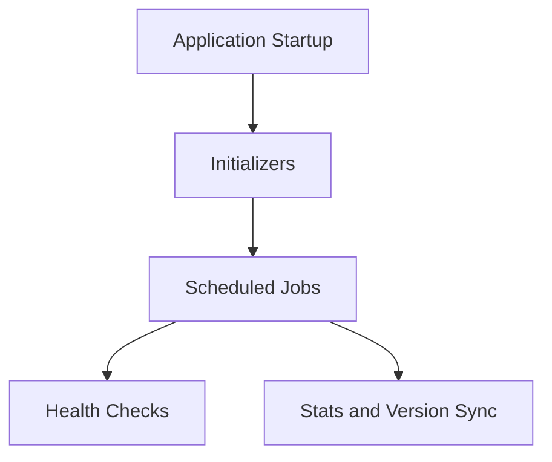
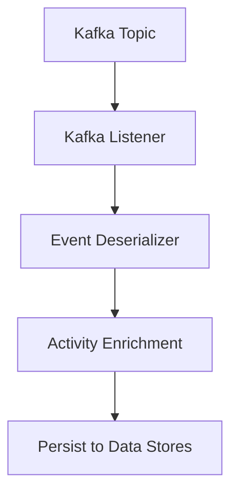
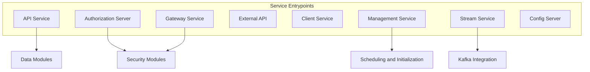

# Service Entrypoints

The **Service Entrypoints** module defines the executable entry points for all OpenFrame backend services. Each entry point is a Spring Boot application responsible for bootstrapping a specific bounded context within the platform.

These classes:

- Start individual microservices
- Define component scanning boundaries
- Enable service-specific infrastructure (Kafka, Discovery, Security)
- Act as the runtime boundary between modules

This module does **not** contain business logic. Instead, it wires together components from other core modules such as API, Authorization, Data, Stream Processing, Gateway, and Management.

---

## Architectural Role

Each entrypoint corresponds to a deployable unit in the OpenFrame architecture.

Each node above is started by a corresponding application class in this module.

---

# Service Entry Applications

## 1. API Service

**Entrypoint:** `ApiApplication`

### Responsibilities

- Bootstraps the core REST + GraphQL API layer
- Scans packages:
  - `com.openframe.api`
  - `com.openframe.data`
  - `com.openframe.core`
  - `com.openframe.notification`
  - `com.openframe.kafka`
- Exposes internal platform APIs for frontend and internal services

### Startup Flow

---

## 2. Authorization Server

**Entrypoint:** `OpenFrameAuthorizationServerApplication`

### Responsibilities

- OAuth2 / OIDC authorization server
- Tenant-aware authentication
- SSO (Google, Microsoft) integrations
- Dynamic client registration
- Service discovery enabled via `@EnableDiscoveryClient`

### Component Scan Scope

- `com.openframe.authz`
- `com.openframe.core`
- `com.openframe.data`
- `com.openframe.notification`

### Authentication Flow (High-Level)

---

## 3. Gateway Service

**Entrypoint:** `GatewayApplication`

### Responsibilities

- Entry layer for all HTTP traffic
- JWT validation
- API key authentication
- Rate limiting
- CORS configuration
- WebSocket proxying

### Component Scan Scope

- `com.openframe.gateway`
- `com.openframe.core`
- `com.openframe.data`
- `com.openframe.security`

### Request Flow

---

## 4. External API Service

**Entrypoint:** `ExternalApiApplication`

### Responsibilities

- Public-facing REST APIs
- OpenAPI documentation exposure
- Integration endpoints
- Proxy to internal services

### Component Scan Scope

- `com.openframe.external`
- `com.openframe.data`
- `com.openframe.core`
- `com.openframe.api`
- `com.openframe.kafka`

This service isolates public APIs from internal platform APIs.

---

## 5. Client Service

**Entrypoint:** `ClientApplication`

### Responsibilities

- Agent registration
- Machine heartbeat handling
- Tool agent communication
- Client-specific authentication

### Special Configuration

- Excludes `CassandraHealthIndicator`
- Scans:
  - `com.openframe.data`
  - `com.openframe.client`
  - `com.openframe.core`
  - `com.openframe.security`
  - `com.openframe.kafka.producer`

This service is optimized for lightweight agent interactions.

---

## 6. Management Service

**Entrypoint:** `ManagementApplication`

### Responsibilities

- Initialization logic
- Tool registration
- Release version management
- Scheduled jobs
- Stream configuration setup

### Special Configuration

- Excludes `CassandraHealthIndicator`
- Scans:
  - `com.openframe.management`
  - `com.openframe.data`
  - `com.openframe.core`

### Scheduling Model

---

## 7. Stream Processing Service

**Entrypoint:** `StreamApplication`

### Responsibilities

- Kafka consumers
- Debezium event handling
- Activity enrichment
- Cross-tool event normalization

### Infrastructure

- `@EnableKafka`
- Scans:
  - `com.openframe.stream`
  - `com.openframe.data`
  - `com.openframe.kafka.producer`

### Event Processing Flow

---

## 8. Config Server

**Entrypoint:** `ConfigServerApplication`

### Responsibilities

- Centralized configuration management
- Environment-specific property resolution
- Shared configuration across services

This service is foundational for multi-environment deployments and tenant-specific overrides.

---

# Cross-Service Relationships

The Service Entrypoints module ties together all core platform modules.

---

# Deployment Model

Each entrypoint is:

- Independently deployable
- Containerizable (Docker/Kubernetes)
- Horizontally scalable
- Configurable via environment variables and config server

Typical production deployment includes:

- 1× Gateway (scaled horizontally)
- 1× Authorization Server
- 1× API Service
- 1× External API Service
- 1× Stream Processing Service
- 1× Management Service
- 1× Config Server
- N× Client Services (depending on load)

---

# Design Principles

1. **Separation of Concerns** – Each service owns a bounded context.
2. **Explicit Component Boundaries** – Controlled via `@ComponentScan`.
3. **Infrastructure as Code** – Kafka, Mongo, Security integrated at bootstrap.
4. **Tenant Awareness** – Particularly in Authorization and Gateway layers.
5. **Scalability** – Stateless services where possible.

---

# Summary

The **Service Entrypoints** module defines the runtime boundaries of the OpenFrame platform. Each application class:

- Marks a deployable microservice
- Defines infrastructure dependencies
- Establishes scanning scope
- Enables specific platform capabilities (Kafka, Discovery, Security)

Together, these entrypoints form the operational backbone of the OpenFrame multi-service architecture.