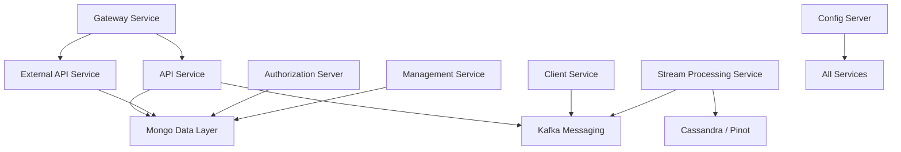
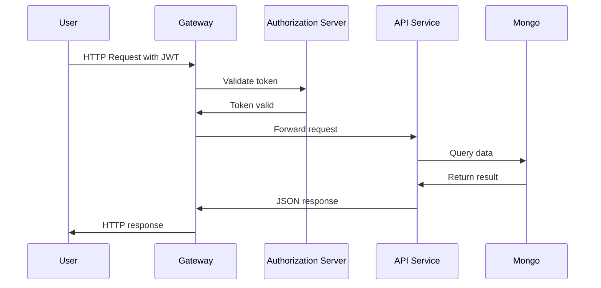

# Service Entrypoints

## Overview

The **Service Entrypoints** module defines the executable Spring Boot applications that bootstrap every major runtime component in the OpenFrame platform. Each class in this module represents a deployable microservice and serves as the root configuration boundary for its respective domain.

These entrypoints:

- Start the Spring Boot runtime
- Define `@ComponentScan` boundaries
- Enable specific infrastructure features (Kafka, Discovery, etc.)
- Isolate service responsibilities at deployment level

At a system level, this module is the **runtime composition layer** that wires together the functional modules such as API Service Core, Authorization Server Core, Gateway Service Core, Stream Processing Service Core, and others.

---

## High-Level Architecture

The following diagram shows how the service entrypoints map to logical platform layers.



Each box corresponds to a Spring Boot application defined in this module.

---

## Entrypoint Applications

### 1. API Service

**Class:** `ApiApplication`

**Purpose:**
Primary internal API surface for tenant operations including users, devices, organizations, tools, and system configuration.

**Key Characteristics:**
- `@SpringBootApplication`
- Component scanning:
  - `com.openframe.api`
  - `com.openframe.data`
  - `com.openframe.core`
  - `com.openframe.notification`
  - `com.openframe.kafka`
- Logs startup event

```java
@SpringBootApplication
@ComponentScan(basePackages = {
        "com.openframe.api",
        "com.openframe.data",
        "com.openframe.core",
        "com.openframe.notification",
        "com.openframe.kafka"
})
```

**Role in the System:**
- Serves internal UI and GraphQL/REST requests
- Orchestrates business logic
- Interacts with Mongo persistence and Kafka

---

### 2. Authorization Server

**Class:** `OpenFrameAuthorizationServerApplication`

**Purpose:**
Provides OAuth2 / OIDC authentication, SSO flows, tenant registration, and token issuance.

**Key Characteristics:**
- `@EnableDiscoveryClient`
- Dedicated component scanning for auth domain
- Isolated security configuration boundary

```java
@SpringBootApplication
@EnableDiscoveryClient
@ComponentScan(basePackages = {
    "com.openframe.authz",
    "com.openframe.core",
    "com.openframe.data",
    "com.openframe.notification"
})
```

**Role in the System:**
- Issues JWT access tokens
- Manages OAuth clients
- Handles password reset and SSO registration
- Integrates with Mongo for token and user storage

---

### 3. Gateway Service

**Class:** `GatewayApplication`

**Purpose:**
Acts as the edge routing layer for the platform.

**Key Characteristics:**
- Scans gateway + security packages
- Centralizes authentication filters
- Proxies traffic to internal services

```java
@SpringBootApplication
@ComponentScan(basePackages = {
        "com.openframe.gateway",
        "com.openframe.core",
        "com.openframe.data",
        "com.openframe.security"
})
```

**Role in the System:**
- API key validation
- JWT validation
- CORS enforcement
- WebSocket routing
- Rate limiting

---

### 4. External API Service

**Class:** `ExternalApiApplication`

**Purpose:**
Provides a public-facing REST API for integrations and external systems.

**Key Characteristics:**
- Scans external API controllers
- Reuses core data + API logic
- Integrates Kafka if needed

```java
@SpringBootApplication
@ComponentScan(basePackages = {
        "com.openframe.external",
        "com.openframe.data",
        "com.openframe.core",
        "com.openframe.api",
        "com.openframe.kafka"
})
```

**Role in the System:**
- Structured REST responses
- Pagination and filtering support
- Public integration surface

---

### 5. Client Service

**Class:** `ClientApplication`

**Purpose:**
Handles agent authentication, tool agent communication, and client-side integration logic.

**Key Characteristics:**
- Excludes `CassandraHealthIndicator`
- Includes Kafka producer support
- Scans client and security modules

```java
@ComponentScan(
    basePackages = {
        "com.openframe.data",
        "com.openframe.client",
        "com.openframe.core",
        "com.openframe.security",
        "com.openframe.kafka.producer",
    }
)
```

**Role in the System:**
- Agent registration
- Tool file management
- Client-side metrics handling
- Kafka event publishing

---

### 6. Management Service

**Class:** `ManagementApplication`

**Purpose:**
Handles administrative operations, schedulers, release management, and initialization tasks.

**Key Characteristics:**
- Excludes `CassandraHealthIndicator`
- Focused on operational orchestration

**Role in the System:**
- Scheduled jobs
- Tool initialization
- API key statistics sync
- Version publishing

---

### 7. Stream Processing Service

**Class:** `StreamApplication`

**Purpose:**
Consumes and processes Kafka streams for event enrichment and transformation.

**Key Characteristics:**
- `@EnableKafka`
- Scans stream + Kafka producer packages

```java
@SpringBootApplication
@EnableKafka
@ComponentScan(basePackages = {
        "com.openframe.stream",
        "com.openframe.data",
        "com.openframe.kafka.producer"
})
```

**Role in the System:**
- Consumes Debezium events
- Enriches activity streams
- Publishes transformed events
- Feeds analytics storage (Cassandra / Pinot)

---

### 8. Config Server

**Class:** `ConfigServerApplication`

**Purpose:**
Central configuration server for all OpenFrame services.

```java
@SpringBootApplication
public class ConfigServerApplication
```

**Role in the System:**
- Centralized property management
- Environment-based configuration
- Enables distributed configuration consistency

---

## Service Interaction Flow

The following sequence illustrates a typical authenticated API request.



---

## Design Principles

### 1. Service Isolation
Each entrypoint defines a strict component scanning boundary. This ensures:

- Clean modularity
- Independent deployment
- Reduced accidental bean coupling

### 2. Infrastructure Segmentation
Different services enable different infrastructure features:

- Kafka only where required
- Discovery only for Authorization Server
- Health indicators excluded where unnecessary

### 3. Microservice Deployment Model
Each entrypoint maps 1:1 with a deployable container or runtime unit.

```text
openframe-api
openframe-authorization-server
openframe-gateway
openframe-external-api
openframe-client
openframe-management
openframe-stream
openframe-config
```

---

## Operational Considerations

- Services can scale independently
- Gateway typically horizontally scales first
- Stream service scales with Kafka throughput
- Management service often runs as singleton
- Config server must be highly available

---

## Summary

The **Service Entrypoints** module is the executable backbone of the OpenFrame platform. While most business logic resides in domain-specific core modules, this module defines:

- Where services start
- What they load
- Which infrastructure capabilities they enable
- How they are isolated at runtime

It forms the boundary between platform architecture and deployment topology, making it a critical module for DevOps, SRE, and platform engineers.