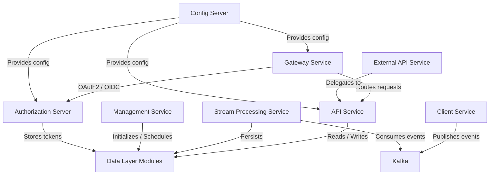
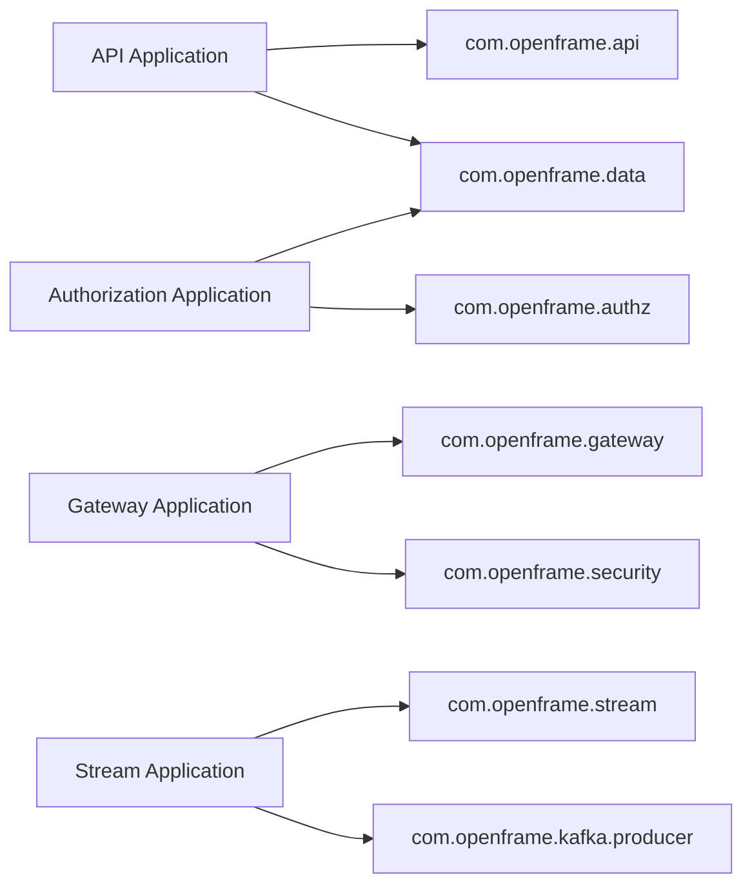
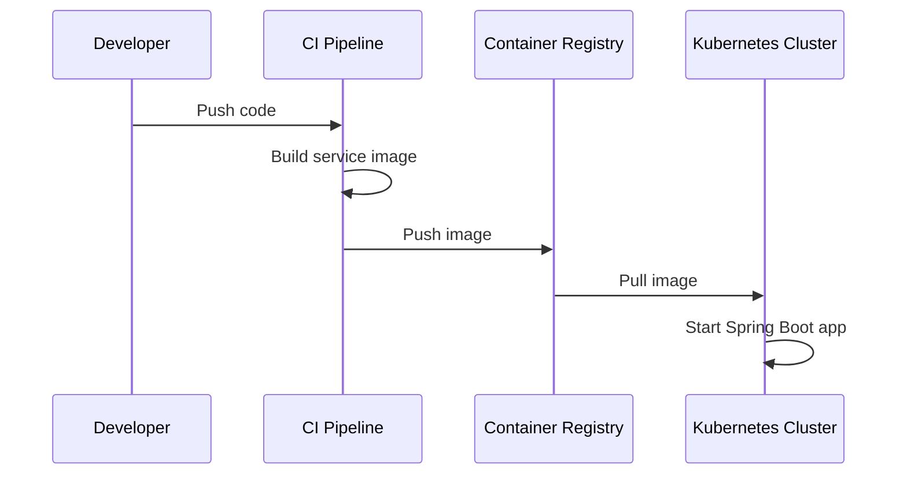

# Service Entrypoints

## Overview

The **Service Entrypoints** module defines the executable entry points for all major backend services in the OpenFrame tenant platform. Each entry point is implemented as a Spring Boot application class and represents a deployable microservice within the overall architecture.

These entry classes are responsible for:

- Bootstrapping Spring Boot applications
- Defining component scan boundaries
- Enabling service-specific infrastructure (e.g., Kafka, Discovery Client)
- Establishing the runtime boundary for each service

While most business logic resides in core service modules (API, Authorization, Gateway, Stream, etc.), the Service Entrypoints module determines how those modules are composed and launched.

---

## Architectural Context

At runtime, each application class in this module becomes an independently deployable service.



Each node above corresponds to a Spring Boot application defined in this module.

---

## Service Entry Applications

### 1. API Application

**Class:** `ApiApplication`

```java
@SpringBootApplication
@ComponentScan(basePackages = {
    "com.openframe.api",
    "com.openframe.data",
    "com.openframe.core",
    "com.openframe.notification",
    "com.openframe.kafka"
})
```

**Responsibilities:**

- Hosts REST and GraphQL controllers
- Exposes internal APIs consumed by frontend and gateway
- Integrates data, notification, and Kafka modules

**Key Characteristics:**

- Central business API layer
- Includes data and core modules
- Logs startup events

---

### 2. Authorization Server Application

**Class:** `OpenFrameAuthorizationServerApplication`

```java
@SpringBootApplication
@EnableDiscoveryClient
@ComponentScan(basePackages = {
    "com.openframe.authz",
    "com.openframe.core",
    "com.openframe.data",
    "com.openframe.notification"
})
```

**Responsibilities:**

- OAuth2 Authorization Server
- OIDC provider
- Tenant-aware authentication
- Dynamic client registration

**Key Characteristics:**

- Discovery-enabled
- Integrates with data and notification modules
- Manages tokens and client credentials

---

### 3. Gateway Application

**Class:** `GatewayApplication`

```java
@SpringBootApplication
@ComponentScan(basePackages = {
    "com.openframe.gateway",
    "com.openframe.core",
    "com.openframe.data",
    "com.openframe.security"
})
```

**Responsibilities:**

- API routing and request forwarding
- JWT validation and security enforcement
- CORS and origin sanitization
- WebSocket proxying

The Gateway is the primary entry point for external HTTP traffic.

---

### 4. External API Application

**Class:** `ExternalApiApplication`

```java
@SpringBootApplication
@ComponentScan(basePackages = {
    "com.openframe.external",
    "com.openframe.data",
    "com.openframe.core",
    "com.openframe.api",
    "com.openframe.kafka"
})
```

**Responsibilities:**

- Public-facing API for integrations
- Device, event, log, and tool endpoints
- Proxies internal API functionality

This service isolates external consumers from internal API complexity.

---

### 5. Client Application

**Class:** `ClientApplication`

```java
@SpringBootApplication
@ComponentScan(
    basePackages = {
        "com.openframe.data",
        "com.openframe.client",
        "com.openframe.core",
        "com.openframe.security",
        "com.openframe.kafka.producer"
    }
)
```

**Responsibilities:**

- Agent registration
- Tool agent file handling
- Machine heartbeat processing
- Kafka event publishing

**Special Note:**

- Excludes `CassandraHealthIndicator` from scanning
- Optimized for agent and device interactions

---

### 6. Management Application

**Class:** `ManagementApplication`

```java
@SpringBootApplication
@ComponentScan(
    basePackages = {
        "com.openframe.management",
        "com.openframe.data",
        "com.openframe.core"
    }
)
```

**Responsibilities:**

- Integrated tool initialization
- Secret initialization
- Scheduled background jobs
- Release management logic

This service supports operational workflows rather than direct user traffic.

---

### 7. Stream Processing Application

**Class:** `StreamApplication`

```java
@SpringBootApplication
@EnableKafka
@ComponentScan(basePackages = {
    "com.openframe.stream",
    "com.openframe.data",
    "com.openframe.kafka.producer"
})
```

**Responsibilities:**

- Kafka consumers
- Debezium message handling
- Activity enrichment
- Event transformation and persistence

This service is event-driven and processes asynchronous data flows.

---

### 8. Config Server Application

**Class:** `ConfigServerApplication`

```java
@SpringBootApplication
```

**Responsibilities:**

- Centralized configuration distribution
- Environment-specific property management
- Externalized configuration for all services

This service ensures consistent configuration across the platform.

---

## Component Scan Strategy

Each entrypoint explicitly defines its `@ComponentScan` boundaries. This creates:

- Clear modular isolation
- Reduced accidental bean collisions
- Controlled dependency injection scope



This approach enforces service-level architectural boundaries.

---

## Deployment Model

Each class in this module:

- Contains a `public static void main(String[] args)` method
- Boots a Spring Application Context
- Can be packaged as a standalone JAR
- Is deployable as an independent container



---

## Design Principles

### 1. Service Isolation
Each entrypoint owns its dependency boundary.

### 2. Clear Infrastructure Activation
- `@EnableKafka` activates Kafka listeners
- `@EnableDiscoveryClient` enables service discovery
- Explicit component scans define runtime scope

### 3. Modular Composition
The entrypoints compose functionality from:

- Data layer modules
- Security shared modules
- Kafka infrastructure
- Core domain modules

The Service Entrypoints module does not contain business logic; it orchestrates and boots it.

---

## Summary

The **Service Entrypoints** module defines the runtime boundaries of the OpenFrame platform. Each Spring Boot application class:

- Establishes a deployable microservice
- Defines scanning scope
- Activates required infrastructure
- Connects domain modules into a cohesive runtime

Understanding this module is essential for:

- Deployment architecture
- Scaling strategies
- Service isolation
- Infrastructure troubleshooting

It represents the final composition layer of the OpenFrame backend system.