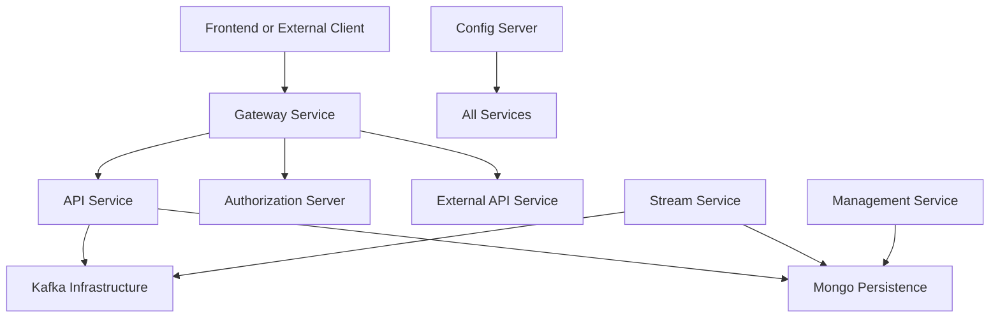
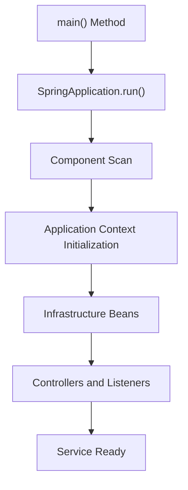
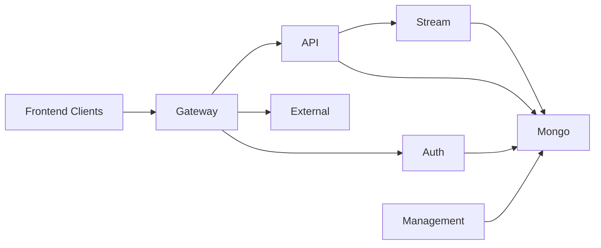

# Service Entrypoints

## Overview

The **Service Entrypoints** module defines the executable entry points for all major OpenFrame backend services. Each entry point is a Spring Boot application responsible for bootstrapping a specific bounded context of the platform.

These classes:

- Initialize Spring Boot runtime environments
- Configure component scanning boundaries
- Enable infrastructure features (Kafka, service discovery, etc.)
- Define the runtime composition of each microservice

At runtime, this module represents the **top-level service layer** of the OpenFrame architecture.

---

## Architectural Role in the Platform

The Service Entrypoints module sits at the outermost boundary of the system. It wires together lower-level modules such as:

- API Service Core
- Authorization Server Core
- Gateway Service Core
- External API Service Core
- Management Service Core
- Stream Processing Core
- Data Persistence Mongo
- Data Infrastructure Kafka
- Platform Security and OAuth

Each service entry point composes a subset of these modules using Spring's `@ComponentScan` configuration.

### High-Level Service Topology



This diagram illustrates how each executable service connects to shared infrastructure components.

---

# Service Entry Applications

Each of the following classes represents a deployable Spring Boot microservice.

---

## API Application

**Class:** `ApiApplication`

### Responsibilities

- Bootstraps the core API service
- Exposes REST and GraphQL endpoints
- Integrates data, Kafka, notification, and core modules
- Serves as the primary internal business API

### Component Scan Scope

```text
com.openframe.api
com.openframe.data
com.openframe.core
com.openframe.notification
com.openframe.kafka
```

### Architectural Role

The API Application is the main business interface of the platform. It handles:

- Device management
- Organization management
- User operations
- Event and log queries
- GraphQL data fetching

It depends heavily on:

- Data Persistence Mongo
- API Contracts and Mapping
- Kafka infrastructure

---

## Authorization Server Application

**Class:** `OpenFrameAuthorizationServerApplication`

### Responsibilities

- Hosts the OAuth2 and OIDC authorization server
- Manages tenant-aware authentication
- Handles login, password reset, SSO, and dynamic client registration
- Issues JWT tokens

### Key Features

- `@EnableDiscoveryClient` for service discovery
- Multi-tenant support
- Token issuance and key management

### Component Scan Scope

```text
com.openframe.authz
com.openframe.core
com.openframe.data
com.openframe.notification
```

### Architectural Role

This service is the identity provider of the platform and integrates closely with:

- Platform Security and OAuth
- Data Persistence Mongo
- Tenant key management services

---

## Gateway Application

**Class:** `GatewayApplication`

### Responsibilities

- Serves as the edge gateway
- Performs JWT validation
- Applies CORS and security filters
- Proxies HTTP and WebSocket traffic

### Component Scan Scope

```text
com.openframe.gateway
com.openframe.core
com.openframe.data
com.openframe.security
```

### Architectural Role

The Gateway Service is the external entry point into the backend system. It:

- Validates access tokens
- Routes requests to internal services
- Applies API key authentication where required

---

## External API Application

**Class:** `ExternalApiApplication`

### Responsibilities

- Exposes public REST endpoints for integrations
- Acts as a façade over internal API services
- Integrates Kafka and core data modules

### Component Scan Scope

```text
com.openframe.external
com.openframe.data
com.openframe.core
com.openframe.api
com.openframe.kafka
```

### Architectural Role

The External API Service provides integration endpoints for third-party systems while maintaining separation from internal APIs.

---

## Management Application

**Class:** `ManagementApplication`

### Responsibilities

- Runs administrative and initialization processes
- Initializes agents, tools, and secrets
- Manages background maintenance operations

### Component Scan Scope

```text
com.openframe.management
com.openframe.data
com.openframe.core
```

### Notable Behavior

Excludes `CassandraHealthIndicator`, indicating selective infrastructure health handling.

### Architectural Role

The Management Service orchestrates:

- System initialization
- Tool agent registration
- Scheduled maintenance logic

---

## Stream Application

**Class:** `StreamApplication`

### Responsibilities

- Enables Kafka consumption
- Processes Debezium and event streams
- Performs enrichment and transformation

### Key Annotation

```text
@EnableKafka
```

### Component Scan Scope

```text
com.openframe.stream
com.openframe.data
com.openframe.kafka.producer
```

### Architectural Role

The Stream Service is responsible for event-driven processing:

- Consumes change data capture streams
- Enriches events
- Publishes derived events
- Supports activity tracking and analytics

---

## Client Application

**Class:** `ClientApplication`

### Responsibilities

- Hosts client-facing backend logic
- Integrates data and security modules
- Publishes Kafka messages

### Component Scan Scope

```text
com.openframe.data
com.openframe.client
com.openframe.core
com.openframe.security
com.openframe.kafka.producer
```

### Notable Behavior

Excludes `CassandraHealthIndicator`, similar to Management Service.

### Architectural Role

Provides a dedicated service boundary for client-side orchestration and interactions.

---

## Config Server Application

**Class:** `ConfigServerApplication`

### Responsibilities

- Central configuration server
- Provides externalized configuration for all services

### Architectural Role

The Config Server ensures:

- Environment-based configuration management
- Centralized property control
- Consistent configuration across microservices

---

# Service Boot Lifecycle

All services follow the same lifecycle pattern:



Each entry point:

1. Starts the JVM process
2. Bootstraps Spring Boot
3. Scans defined packages
4. Builds the dependency injection context
5. Registers controllers, listeners, repositories, and processors
6. Begins accepting traffic or processing events

---

# Multi-Service Interaction Model



This illustrates:

- Gateway as the primary ingress
- Authorization Server as the identity authority
- API as business logic core
- Stream as asynchronous processing engine
- Mongo as persistent backbone

---

# Design Principles

The Service Entrypoints module reflects several architectural principles:

### 1. Explicit Service Boundaries
Each Spring Boot application defines a bounded context.

### 2. Controlled Component Visibility
`@ComponentScan` defines which modules are included per service.

### 3. Infrastructure as Shared Modules
Data, Kafka, security, and core modules are reused across services.

### 4. Independent Deployability
Each application can be:

- Built independently
- Containerized independently
- Scaled independently

---

# Summary

The **Service Entrypoints** module is the runtime foundation of the OpenFrame platform. It:

- Defines every executable backend service
- Connects platform modules into deployable microservices
- Establishes system boundaries
- Enables scalable, distributed architecture

Without this module, the underlying core libraries would not be executable. It is the layer that transforms shared modules into running services.