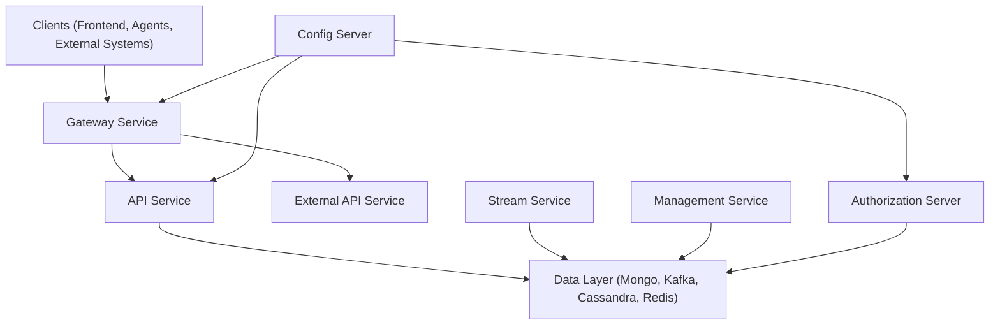
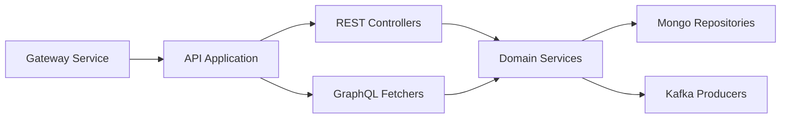
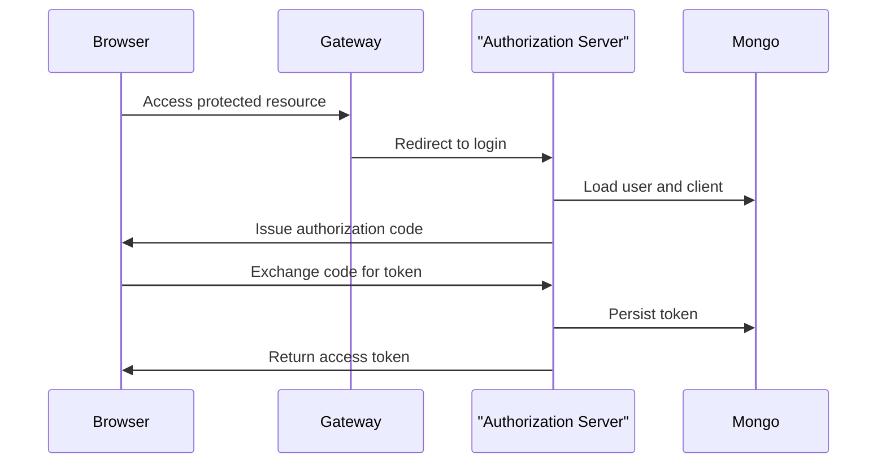
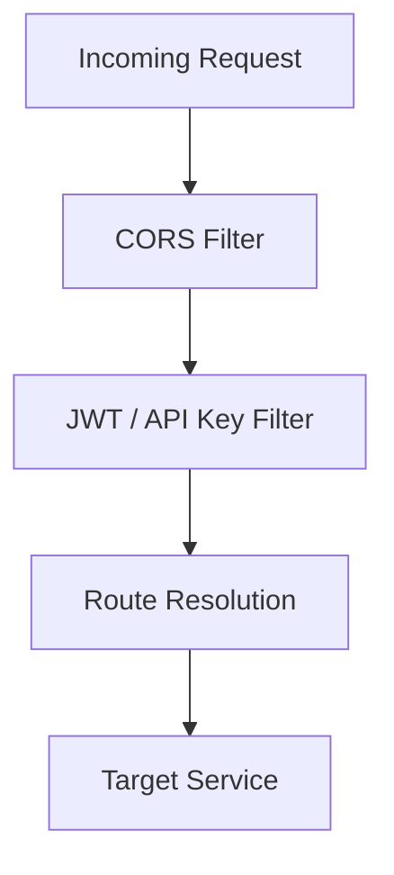
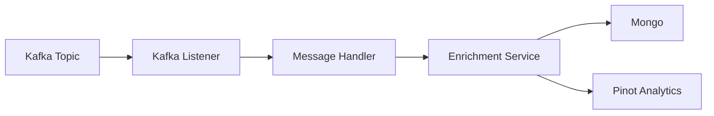
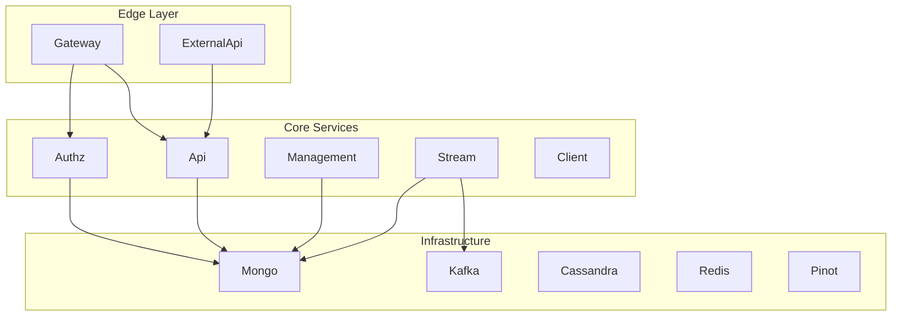

# Service Entrypoints Applications

## Overview

The **Service Entrypoints Applications** module defines the executable Spring Boot applications that bootstrap the entire OpenFrame platform. Each application class serves as a runtime entrypoint for a distinct microservice, wiring together configuration, component scanning, and infrastructure dependencies.

This module does not contain domain logic itself. Instead, it:

- Boots individual microservices
- Defines component scanning boundaries
- Activates infrastructure capabilities (Kafka, Discovery, etc.)
- Establishes the runtime composition of the platform

Every other module in the system is ultimately activated through one of these application entrypoints.

---

## Architectural Role in the Platform

At a high level, Service Entrypoints Applications sit at the outermost runtime layer of the system.



Each node above corresponds to a Spring Boot application defined in this module.

---

## Application Inventory

The Service Entrypoints Applications module contains the following runtime services:

1. API Application
2. Authorization Server Application
3. Client Application
4. Config Server Application
5. External API Application
6. Gateway Application
7. Management Application
8. Stream Application

Each of these is described below.

---

## API Application

**Class:** `ApiApplication`

### Purpose

The API Application is the primary internal backend service. It exposes REST and GraphQL endpoints used by:

- Frontend applications
- Gateway service
- Internal integrations

### Component Scanning

```java
@ComponentScan(basePackages = {
    "com.openframe.api",
    "com.openframe.data",
    "com.openframe.core",
    "com.openframe.notification",
    "com.openframe.kafka"
})
```

### Responsibilities

- Loads REST controllers and GraphQL fetchers
- Connects to Mongo and other datastores
- Publishes/consumes Kafka events
- Integrates notification services

### Runtime Flow



---

## Authorization Server Application

**Class:** `OpenFrameAuthorizationServerApplication`

### Purpose

Implements OAuth2 / OIDC authentication and tenant-aware authorization.

### Key Features

- OAuth2 authorization flows
- SSO (Google, Microsoft)
- Dynamic client registration
- Tenant-aware security context
- Discovery client enabled

### Component Scanning

```java
@ComponentScan(basePackages = {
    "com.openframe.authz",
    "com.openframe.core",
    "com.openframe.data",
    "com.openframe.notification"
})
```

### Authentication Flow



---

## Gateway Application

**Class:** `GatewayApplication`

### Purpose

Acts as the edge service for the platform.

### Responsibilities

- JWT validation
- API key authentication
- CORS enforcement
- WebSocket proxying
- Rate limiting
- Routing to backend services

### Component Scanning

```java
@ComponentScan(basePackages = {
    "com.openframe.gateway",
    "com.openframe.core",
    "com.openframe.data",
    "com.openframe.security"
})
```

### Request Processing Pipeline



---

## External API Application

**Class:** `ExternalApiApplication`

### Purpose

Provides public-facing REST endpoints intended for external integrations and partners.

### Component Scanning

```java
@ComponentScan(basePackages = {
    "com.openframe.external",
    "com.openframe.data",
    "com.openframe.core",
    "com.openframe.api",
    "com.openframe.kafka"
})
```

### Characteristics

- Clean REST surface
- OpenAPI documentation support
- Delegates to internal API and services
- Publishes integration events

---

## Stream Application

**Class:** `StreamApplication`

### Purpose

Handles real-time event processing and stream enrichment.

### Infrastructure

- Kafka consumers
- Kafka Streams processing
- Event deserializers
- Enrichment services

### Activation

```java
@EnableKafka
@ComponentScan(basePackages = {
    "com.openframe.stream",
    "com.openframe.data",
    "com.openframe.kafka.producer"
})
```

### Event Processing Flow



---

## Management Application

**Class:** `ManagementApplication`

### Purpose

Operational control plane for:

- Tool initialization
- Version management
- Debezium monitoring
- Scheduled tasks

### Notable Design Detail

Excludes `CassandraHealthIndicator` to avoid unnecessary health checks in this runtime.

### Responsibilities

- Schedulers
- Initializers
- Administrative controllers
- Integration lifecycle management

---

## Client Application

**Class:** `ClientApplication`

### Purpose

Provides agent-facing APIs and communication endpoints.

### Responsibilities

- Agent authentication
- Agent registration
- Tool file delivery
- Metrics ingestion
- Kafka producer integration

### Design Note

Excludes `CassandraHealthIndicator` to minimize runtime coupling.

---

## Config Server Application

**Class:** `ConfigServerApplication`

### Purpose

Centralized configuration service for all microservices.

### Role in the System

- Supplies environment-specific configuration
- Enables consistent multi-service configuration management
- Simplifies distributed deployments

---

## Cross-Service Dependency Model

The entrypoints compose a layered microservice architecture.



---

## Design Principles

1. **Separation of Concerns** – Each application has a clearly defined runtime responsibility.
2. **Composable Architecture** – Services share core modules via component scanning.
3. **Tenant-Aware Security** – Authorization server integrates tenant context.
4. **Event-Driven Backbone** – Kafka and stream processing are first-class.
5. **Infrastructure Modularity** – Datastores are abstracted through shared data modules.

---

## Summary

The Service Entrypoints Applications module defines the executable boundary of the OpenFrame platform. It transforms shared libraries and domain modules into independently deployable microservices.

Without this module, the system would consist only of reusable components. With it, the platform becomes:

- Deployable
- Discoverable
- Secure
- Event-driven
- Operationally manageable

These application entrypoints form the foundation upon which the entire OpenFrame runtime operates.