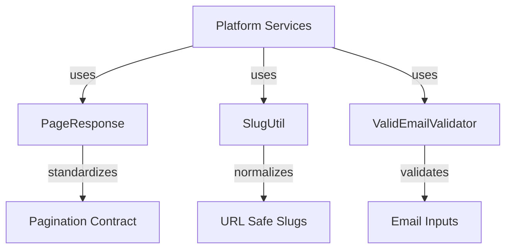
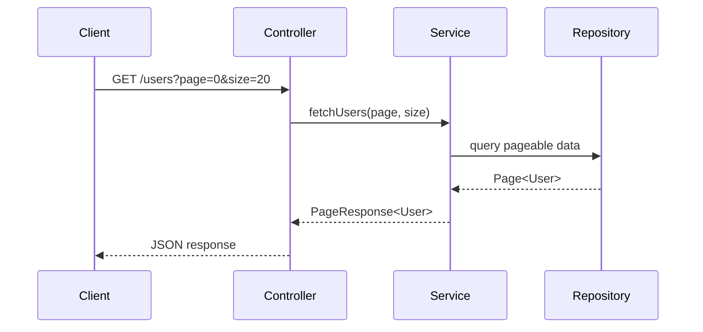
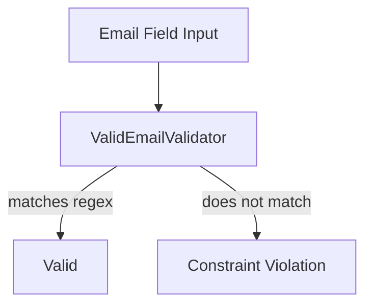
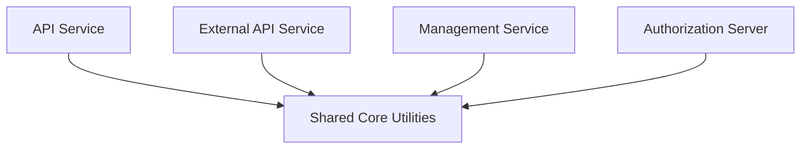

# Shared Core Utilities

The **Shared Core Utilities** module provides foundational building blocks used across the OpenFrame platform. It contains lightweight, framework-agnostic utilities and DTOs that standardize pagination, string normalization, and validation logic.

Although small in size, this module plays a critical role in ensuring consistency across services such as the API Service, External API Service, Management Service, and Authorization Server.

---

## Purpose and Design Principles

The Shared Core Utilities module is designed around three principles:

1. **Reusability** – Provide common abstractions used by multiple services.
2. **Minimal Dependencies** – Avoid coupling to specific service logic or infrastructure.
3. **Consistency** – Standardize patterns such as pagination and validation across the platform.

Core responsibilities:

- Generic pagination response modeling
- Slug generation and normalization
- Email validation logic compatible with Jakarta Bean Validation

---

## High-Level Architecture



### Where It Is Used

The Shared Core Utilities module is consumed by:

- API Service (REST & GraphQL layers)
- External API Service
- Management Service
- Authorization Server
- Any module exposing pageable endpoints or validating email input

Because it contains no service-specific logic, it acts as a shared dependency for multiple higher-level modules.

---

# Core Components

## PageResponse

**Component:**  
`deps.openframe-oss-lib.openframe-core.src.main.java.com.openframe.core.dto.PageResponse.PageResponse`

### Overview

`PageResponse<T>` is a generic DTO used to standardize paginated responses across the platform.

It ensures all pageable endpoints return consistent metadata, regardless of the underlying service implementation.

### Structure

```java
@Data
@SuperBuilder
@NoArgsConstructor
@AllArgsConstructor
public class PageResponse<T> {
    private List<T> items;
    private int page;
    private int size;
    private long totalElements;
    private int totalPages;
    private boolean hasNext;
}
```

### Responsibilities

- Wrap paginated data (`items`)
- Expose pagination metadata:
  - `page` – current page index
  - `size` – page size
  - `totalElements` – total number of records
  - `totalPages` – total number of pages
  - `hasNext` – indicates if additional pages exist

### Typical Usage Pattern



### Benefits

- Enforces a uniform response contract
- Simplifies frontend integration
- Decouples internal pagination framework (e.g., Spring Data) from public API

---

## SlugUtil

**Component:**  
`deps.openframe-oss-lib.openframe-core.src.main.java.com.openframe.core.util.SlugUtil.SlugUtil`

### Overview

`SlugUtil` provides a centralized utility for generating URL-safe slugs from arbitrary strings.

It wraps the `Slugify` library with a predefined configuration to ensure consistent behavior across services.

### Implementation

```java
public final class SlugUtil {

    private static final Slugify SLUGIFY = Slugify.builder()
            .lowerCase(true)
            .underscoreSeparator(false)
            .build();

    private SlugUtil() {}

    public static String toSlug(String input) {
        String base = (input == null ? "org" : input);
        return SLUGIFY.slugify(base);
    }
}
```

### Behavior

- Converts text to lowercase
- Replaces spaces with hyphens
- Removes special characters
- Falls back to `"org"` when input is `null`

### Example

```text
Input:  "Acme Corporation Ltd"
Output: "acme-corporation-ltd"
```

### Common Use Cases

- Organization identifiers
- Tenant slugs
- Public URLs
- Resource identifiers in multi-tenant contexts

---

## ValidEmailValidator

**Component:**  
`deps.openframe-oss-lib.openframe-core.src.main.java.com.openframe.core.validation.ValidEmailValidator.ValidEmailValidator`

### Overview

`ValidEmailValidator` integrates with Jakarta Bean Validation to validate email fields using a configurable regular expression.

It is typically paired with a custom `@ValidEmail` annotation.

### Implementation

```java
public class ValidEmailValidator implements ConstraintValidator<ValidEmail, String> {

    private Pattern pattern;

    @Override
    public void initialize(ValidEmail constraintAnnotation) {
        this.pattern = Pattern.compile(constraintAnnotation.regex());
    }

    @Override
    public boolean isValid(String value, ConstraintValidatorContext context) {
        if (value == null) {
            return false;
        }
        return pattern.matcher(value).matches();
    }
}
```

### Validation Flow



### Characteristics

- Regex-driven validation (defined in annotation)
- Explicitly rejects `null` values
- Integrates with Spring Boot validation pipeline
- Enables consistent validation rules across services

---

# Cross-Module Role in the Platform

The Shared Core Utilities module sits at the bottom of the dependency graph.



## Why This Matters

By centralizing:

- Pagination response modeling
- Slug normalization logic
- Email validation rules

The platform avoids:

- Duplicate implementations
- Inconsistent API contracts
- Diverging validation logic

This keeps services smaller, cleaner, and easier to maintain.

---

# Summary

The **Shared Core Utilities** module is a foundational library that provides:

- ✅ Generic pagination via `PageResponse<T>`
- ✅ Consistent slug generation via `SlugUtil`
- ✅ Centralized email validation via `ValidEmailValidator`

Though minimal in scope, it enables consistency and reuse across the entire OpenFrame microservices ecosystem.