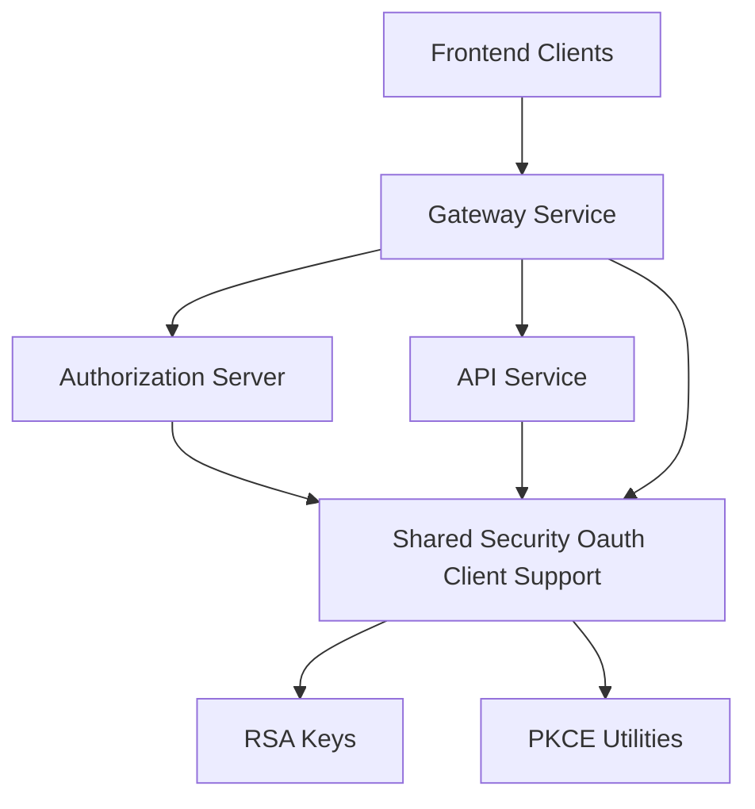
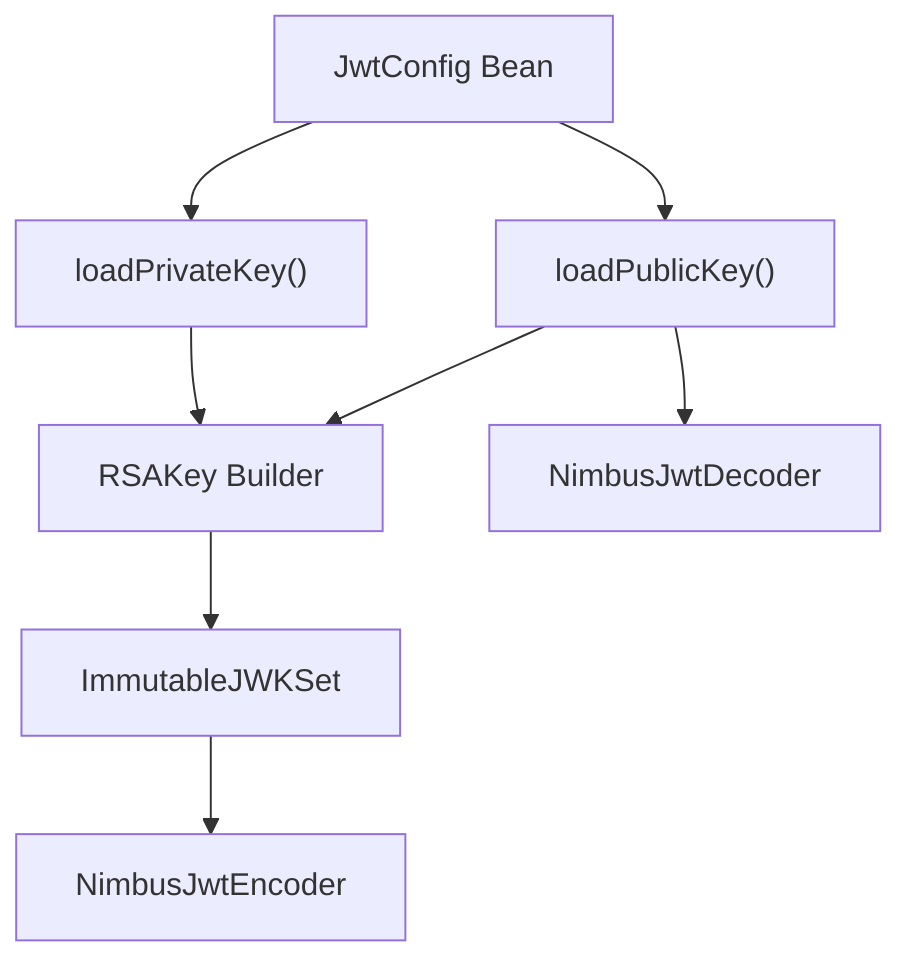
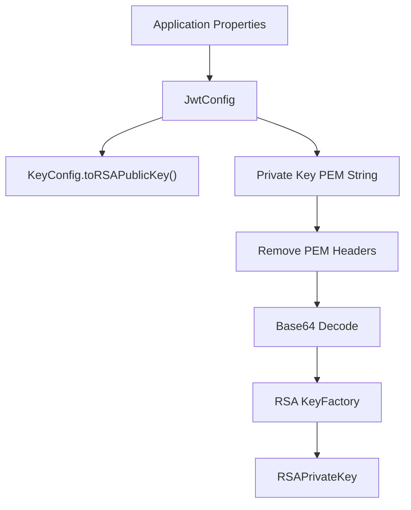
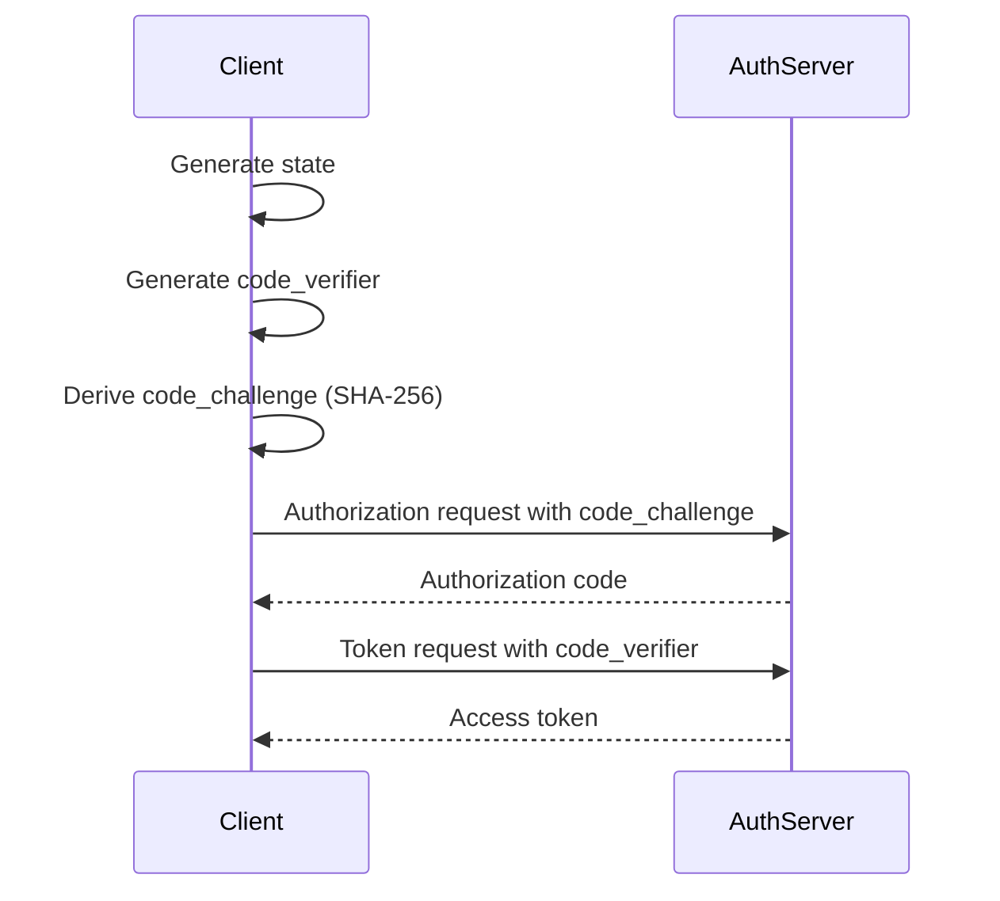
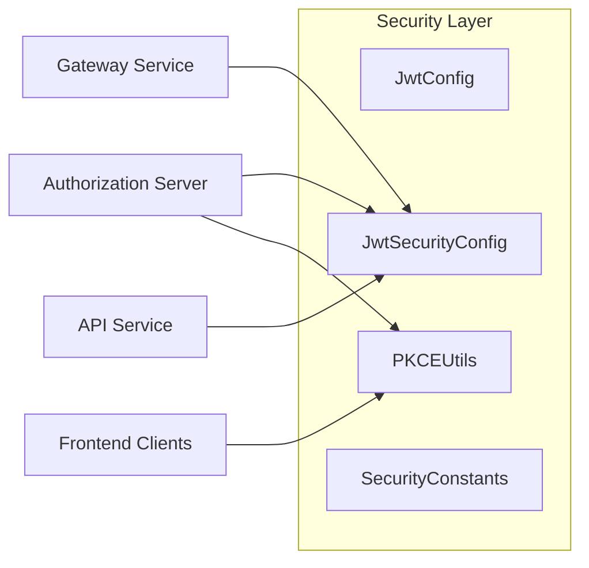

# Shared Security Oauth Client Support

## Overview

The **Shared Security Oauth Client Support** module provides the foundational building blocks for JWT-based security and OAuth2 PKCE flows across the OpenFrame platform. It centralizes:

- JWT encoding and decoding configuration
- RSA key loading and management
- OAuth-related constants
- PKCE (Proof Key for Code Exchange) utilities

This module is designed to be reused by higher-level services such as the Authorization Server, Gateway, API services, and client-facing applications. It ensures consistent cryptographic behavior, token validation, and OAuth flow handling across the entire system.

---

## Architectural Context

The Shared Security Oauth Client Support module sits at the core of the platform’s security stack and is consumed by multiple service layers.



### Responsibilities in the Platform

- **Authorization Server**: Issues signed JWTs using the configured encoder.
- **Gateway Service**: Validates inbound JWTs using the configured decoder.
- **API Services**: Enforce authentication and validate token claims.
- **OAuth Clients**: Use PKCE utilities for secure authorization code flows.

---

## Core Components

This module consists of four primary components:

1. **JwtSecurityConfig** – Spring configuration for JWT encoder/decoder beans  
2. **JwtConfig** – Configuration properties and RSA key loading logic  
3. **SecurityConstants** – Standardized OAuth and token header constants  
4. **PKCEUtils** – Utility methods for PKCE and OAuth state handling  

Each component is intentionally minimal and focused to keep the security surface small and auditable.

---

# Component Details

## JwtSecurityConfig

**Class:** `JwtSecurityConfig`  
**Package:** `com.openframe.security.config`

### Purpose

Provides Spring beans for:

- `JwtEncoder`
- `JwtDecoder`

These beans are used by services that issue and validate JWT tokens.

### Internal Flow



### Key Behavior

- Uses RSA public/private key pair.
- Builds a JWK (JSON Web Key) representation.
- Configures:
  - `NimbusJwtEncoder` for signing tokens.
  - `NimbusJwtDecoder` for verifying signatures.

This ensures consistent cryptographic standards across all services.

---

## JwtConfig

**Class:** `JwtConfig`  
**Package:** `com.openframe.security.jwt`

### Purpose

Provides configuration-driven RSA key loading and JWT metadata such as:

- Issuer
- Audience
- Public key
- Private key

It is bound to Spring Boot configuration properties using:

```text
prefix: jwt
```

### Key Loading Flow



### Important Details

- Private key is expected in **PKCS#8** format.
- PEM headers are stripped before Base64 decoding.
- RSA keys are generated via `KeyFactory`.

This abstraction ensures:

- Key format consistency
- Separation of configuration from security logic
- Centralized key handling for all services

---

## SecurityConstants

**Class:** `SecurityConstants`  
**Package:** `com.openframe.security.oauth`

### Purpose

Defines shared OAuth-related constant values to avoid string duplication across services.

### Defined Constants

```text
AUTHORIZATION_QUERY_PARAM = "authorization"
ACCESS_TOKEN = "access_token"
REFRESH_TOKEN = "refresh_token"
ACCESS_TOKEN_HEADER = "Access-Token"
REFRESH_TOKEN_HEADER = "Refresh-Token"
```

### Why This Matters

- Prevents inconsistencies in header naming.
- Standardizes query parameter usage.
- Reduces risk of subtle security bugs caused by typos.

---

## PKCEUtils

**Class:** `PKCEUtils`  
**Package:** `com.openframe.security.pkce`

### Purpose

Provides utility methods required for OAuth2 Authorization Code Flow with PKCE.

Supported features:

- Secure state generation
- Code verifier generation
- Code challenge derivation (SHA-256)
- Base64URL encoding

---

### PKCE Flow Overview



### Cryptographic Properties

- Uses `SecureRandom` for entropy.
- State: 16 bytes (128 bits).
- Code verifier: 32 bytes (256 bits).
- Code challenge: SHA-256 hash of verifier.
- Base64URL encoding without padding.

This ensures compliance with OAuth2 PKCE (RFC 7636).

---

## Security Design Principles

The Shared Security Oauth Client Support module follows these principles:

### 1. Centralized Cryptography
All RSA and JWT logic is defined once and reused everywhere.

### 2. Configuration-Driven Security
Keys and metadata are externalized via application properties.

### 3. Minimal Surface Area
No business logic is embedded in this module.
It strictly handles:

- Token cryptography
- OAuth utility support
- Shared constants

### 4. Multi-Service Compatibility
Works seamlessly with:

- Authorization Server
- Gateway Service
- API Service Core
- External API
- Client Applications

---

## How It Fits Into the System



### Runtime Responsibilities

| Layer | Responsibility |
|-------|----------------|
| Authorization Server | Issues signed JWT tokens |
| Gateway | Validates JWT and enforces authentication |
| API Services | Authorize based on claims |
| Clients | Secure OAuth2 authorization with PKCE |

---

## Summary

The **Shared Security Oauth Client Support** module is the cryptographic backbone of the OpenFrame platform.

It provides:

- RSA-based JWT signing and validation
- Standardized OAuth token constants
- Secure PKCE utilities
- Centralized key management

By isolating these responsibilities in a shared module, the platform ensures:

- Consistency
- Security correctness
- Maintainability
- Reusability across all services

This module is foundational and should remain small, auditable, and strictly security-focused.