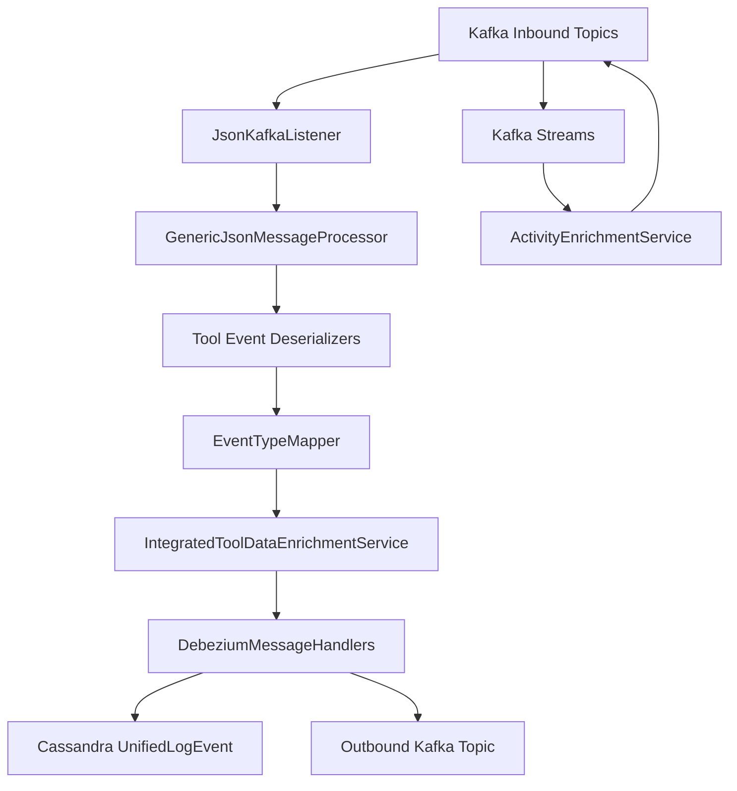
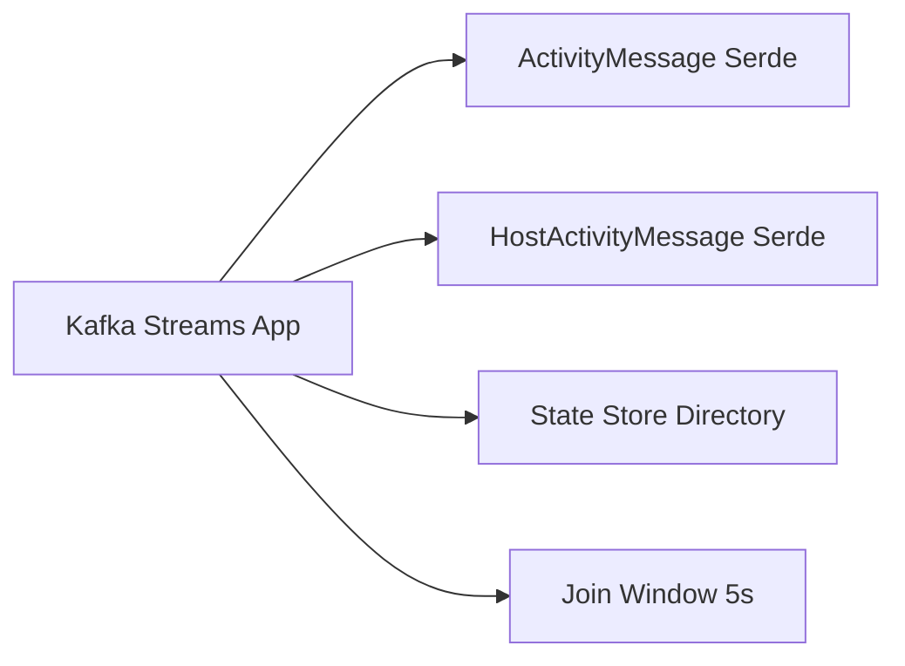
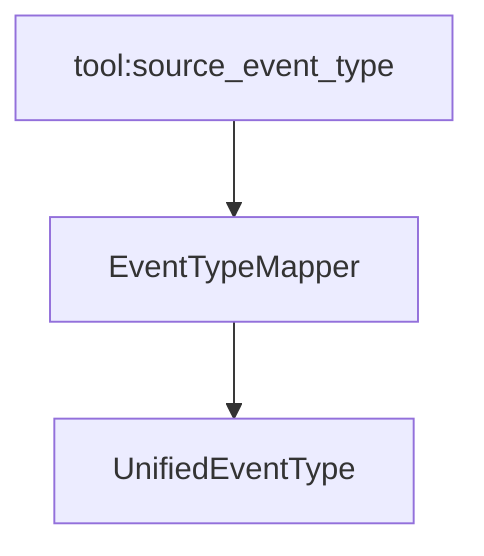
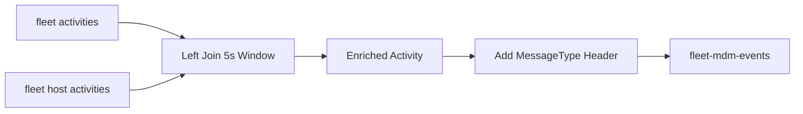
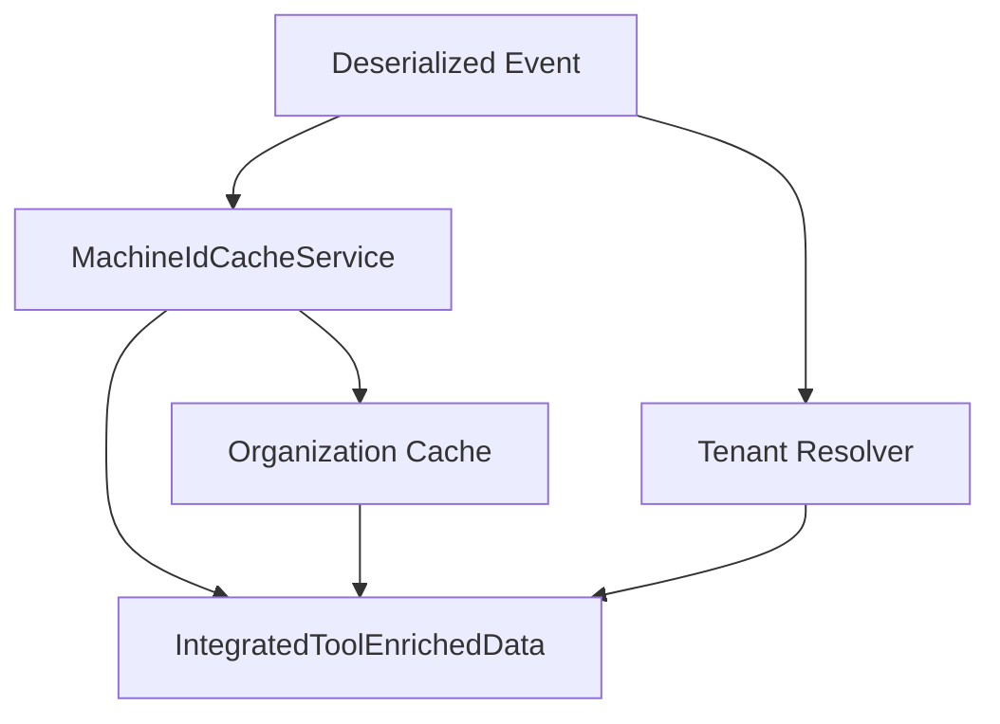
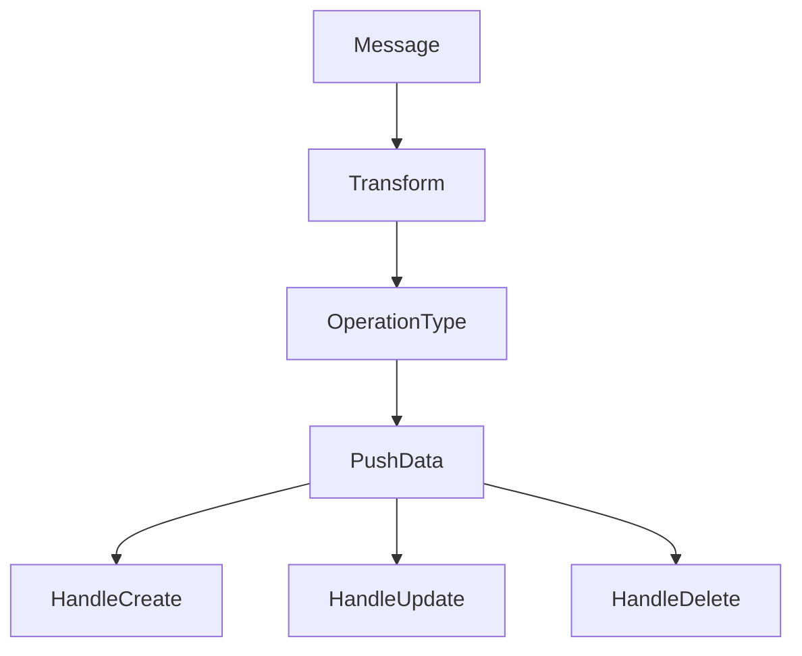
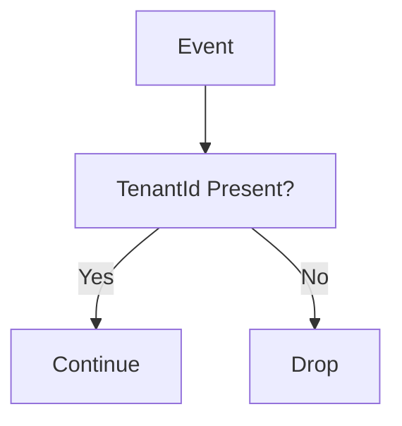
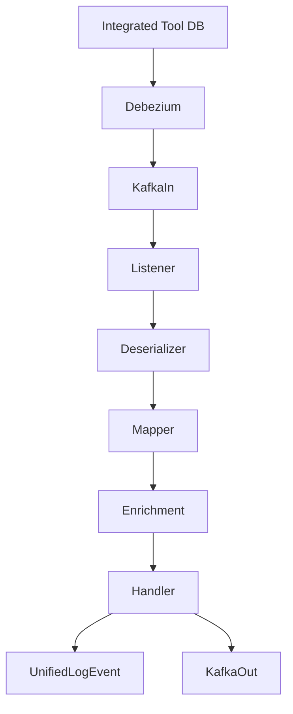

# Stream Processing Core

The **Stream Processing Core** module is responsible for ingesting, normalizing, enriching, and routing real-time events from integrated tools (MeshCentral, Tactical RMM, Fleet MDM) into the OpenFrame platform.

It acts as the event backbone of the system, converting heterogeneous CDC (Change Data Capture) streams into a unified event model that can be persisted, queried, and analyzed across tenants.

---

## 1. Purpose and Responsibilities

The Stream Processing Core provides:

- ✅ Kafka-based ingestion of Debezium CDC events
- ✅ Tool-specific deserialization and normalization
- ✅ Unified event type mapping
- ✅ Tenant-aware enrichment
- ✅ Kafka Streams joins and transformations
- ✅ Cassandra persistence for unified logs
- ✅ Tenant-safe routing to outbound Kafka topics

This module integrates closely with:

- Data persistence (Mongo, Cassandra)
- Tenant messaging (Kafka / NATS)
- Integrated tool services (Fleet, Tactical, MeshCentral)

---

## 2. High-Level Architecture

### Flow Summary

1. Debezium publishes CDC events to Kafka.
2. `JsonKafkaListener` consumes events.
3. Tool-specific deserializers normalize payloads.
4. `EventTypeMapper` maps source types → unified event types.
5. `IntegratedToolDataEnrichmentService` enriches tenant and machine metadata.
6. Handlers route to Cassandra and/or outbound Kafka.
7. Kafka Streams joins Fleet activity and host activity events.

---

## 3. Kafka Configuration Layer

### KafkaConfig

Provides infrastructure beans such as:

- `Converter<byte[], MessageType>`

This allows Kafka headers to map raw byte headers to the platform's `MessageType` enum safely.

---

### KafkaStreamsConfig

Enables Kafka Streams processing:

- Configures `StreamsConfig`
- Defines Serdes for:
  - `ActivityMessage`
  - `HostActivityMessage`
- Sets processing guarantees (AT_LEAST_ONCE)
- Namespaces `application.id` using cluster ID

---

## 4. Event Deserialization Layer

Each integrated tool has its own deserializer extending `IntegratedToolEventDeserializer`.

### Supported Tools

- MeshCentral
- Tactical RMM
- Fleet MDM

### Example Deserializers

| Tool | Deserializer | MessageType |
|------|--------------|------------|
| Fleet | FleetEventDeserializer | FLEET_MDM_EVENT |
| Fleet | FleetPolicyActivityDeserializer | FLEET_MDM_POLICY_ACTIVITY_EVENT |
| Fleet | FleetQueryResultEventDeserializer | FLEET_MDM_QUERY_RESULT_EVENT |
| Tactical | TrmmAuditEventDeserializer | TACTICAL_RMM_AUDIT_EVENT |
| Tactical | TrmmTaskResultEventDeserializer | TACTICAL_RMM_TASK_RESULT_EVENT |
| MeshCentral | MeshCentralEventDeserializer | MESHCENTRAL_EVENT |

Each deserializer extracts:

- Agent ID
- Event ID
- Source Event Type
- Timestamp
- Message
- Result / Error
- Tenant identifier

---

## 5. Unified Event Mapping

### EventTypeMapper

Maps tool-specific event types to a platform-wide `UnifiedEventType`.

Example mapping:

- `meshcentral:user.login` → `LOGIN`
- `tactical:task_result.failing` → `TASK_FAILED`
- `fleet:policy_membership_pass` → `POLICY_APPLIED`

If no mapping exists, the event becomes `UNKNOWN`.

---

## 6. Kafka Streams Activity Enrichment

### ActivityEnrichmentService

Fleet MDM produces two separate topics:

- activities
- host_activities

The Stream Processing Core joins them.

Key behavior:

- Left join with 5-second window
- Injects hostId into Activity
- Adds `MESSAGE_TYPE_HEADER`
- Outputs enriched events back into Kafka

---

## 7. Data Enrichment Layer

### IntegratedToolDataEnrichmentService

Adds:

- Machine ID
- Hostname
- Organization ID
- Organization Name
- Tenant ID

Tenant resolution logic:

- Tenant cluster → `TenantIdProvider`
- Shared cluster → `ClusterTenantIdResolver`

---

## 8. Message Handling Layer

### GenericMessageHandler

Defines a template pipeline:

### DebeziumMessageHandler

Adds:

- Debezium operation mapping
- CREATE / READ / UPDATE / DELETE routing

### DebeziumCassandraMessageHandler

Persists unified events into Cassandra:

- Builds `UnifiedLogEvent`
- Creates compound key
- Stores enriched metadata

### TenantDebeziumKafkaMessageHandler

Routes normalized events to outbound Kafka topic:

- Topic defined by tenant configuration
- Uses retrying Kafka producer
- Validates tenant presence

---

## 9. Tenant Safety

### TenantIdRequiredDebeziumEventValidator

Ensures:

- Events without tenantId are dropped
- Prevents cross-tenant leakage

---

## 10. Data Models

### ActivityMessage

Typed wrapper around `DebeziumMessage<Activity>`.

### HostActivityMessage

Typed wrapper around `DebeziumMessage<HostActivity>`.

### PolicyMembership

Represents Fleet MDM policy membership evaluation results.

These models enable type-safe Kafka Streams processing.

---

## 11. Timestamp Handling

### TimestampParser

Utility for ISO 8601 parsing:

- Converts Debezium string timestamps
- Outputs epoch milliseconds
- Logs safely on parse failures

---

## 12. End-to-End Event Lifecycle

---

# Conclusion

The **Stream Processing Core** module is the real-time normalization and enrichment engine of OpenFrame.

It:

- Transforms heterogeneous CDC streams
- Enforces tenant isolation
- Standardizes event types
- Enriches with contextual metadata
- Persists unified logs
- Publishes normalized events downstream

This module is central to observability, compliance tracking, automation workflows, and cross-tool event intelligence within the OpenFrame platform.
