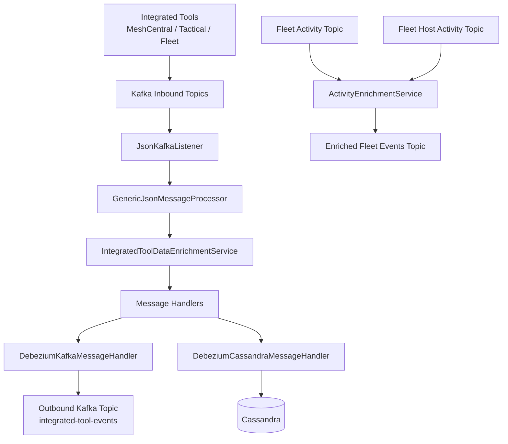
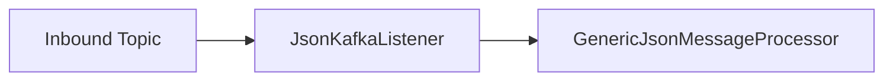
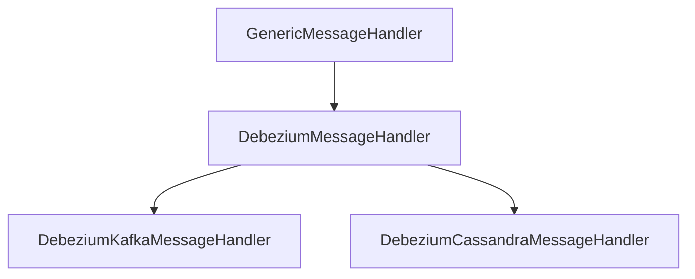
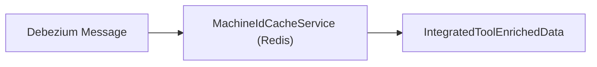
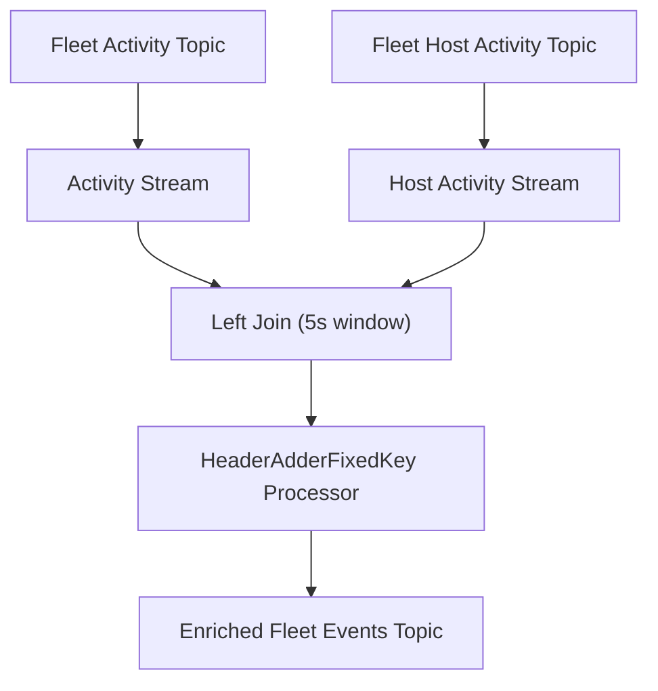

# Stream Processing Core

The **Stream Processing Core** module is the real-time event processing engine of the OpenFrame platform. It consumes change data capture (CDC) events from integrated tools via Kafka, enriches and normalizes them, and routes them to downstream destinations such as Kafka topics or Cassandra for analytics and auditing.

This module is deployed as the Stream application (see `StreamApplication` in service applications) and acts as the backbone for event-driven automation, monitoring, and unified activity tracking across tenants.

---

## Responsibilities

The Stream Processing Core module is responsible for:

- Consuming Debezium-based CDC messages from integrated tools (MeshCentral, Tactical RMM, Fleet MDM)
- Mapping source-specific event types to unified event types
- Enriching events with machine and organization context
- Processing Kafka Streams joins for Fleet activity enrichment
- Routing transformed events to:
  - Kafka (for further event-driven workflows)
  - Cassandra (for durable audit/event storage)

---

## High-Level Architecture



The architecture follows a **pipeline model**:

1. **Ingestion** – Kafka listeners receive Debezium messages.
2. **Normalization** – Event types are mapped to unified types.
3. **Enrichment** – Machine and organization context is added.
4. **Routing** – Events are pushed to Kafka or Cassandra depending on destination.
5. **Stream Joins** – Fleet activity events are joined with host activity data.

---

## Core Components Overview

### 1. Kafka Configuration

#### `KafkaConfig`
Provides infrastructure configuration for Kafka consumers and message type conversion:

- Defines a `Converter<byte[], MessageType>`
- Converts Kafka header bytes into strongly typed `MessageType`
- Ensures safe fallback for unknown values

#### `KafkaStreamsConfig`
Configures Kafka Streams processing:

- Defines application ID (namespaced by cluster ID)
- Configures:
  - At-least-once processing
  - Single stream thread
  - State directory (`/tmp/kafka-streams`)
- Registers JSON SerDes for:
  - `ActivityMessage`
  - `HostActivityMessage`

Application ID generation logic:

```text
If clusterId is empty:
    application.id = spring.application.name
Else:
    application.id = spring.application.name + "-" + clusterId
```

This ensures tenant isolation in SaaS deployments.

---

### 2. Kafka Listener Layer

#### `JsonKafkaListener`

Consumes inbound Debezium events from multiple integrated tool topics:

- MeshCentral
- Tactical RMM
- Fleet MDM
- Fleet Query Results



The listener extracts:

- `CommonDebeziumMessage` payload
- `MessageType` from Kafka headers

And delegates processing to the message processor.

---

### 3. Generic Message Handling Framework

At the heart of the module is a **template-based message handling framework**.



#### `GenericMessageHandler<T, U, V>`

Defines the processing template:

1. Validate message
2. Transform message
3. Determine operation type (CREATE/READ/UPDATE/DELETE)
4. Route to correct handler method

Core flow:

```text
handle(message, extraParams)
  → transform()
  → getOperationType()
  → pushData()
      → handleCreate()
      → handleUpdate()
      → handleDelete()
```

#### `DebeziumMessageHandler`

Adds:

- Debezium operation parsing (`c`, `r`, `u`, `d`)
- Unified operation mapping to `OperationType`

This clean separation allows new destinations to be added easily.

---

### 4. Destination Handlers

#### `DebeziumKafkaMessageHandler`

Publishes normalized events to outbound Kafka topics.

Key behaviors:

- Filters invisible messages (`isValidMessage` override)
- Builds `IntegratedToolEvent`
- Publishes via `OssTenantRetryingKafkaProducer`
- Builds partition key using:

```text
If deviceId present:
    deviceId-toolType
Else if userId present:
    userId-toolType
Else:
    toolType
```

Destination: `integrated-tool-events` topic.

---

#### `DebeziumCassandraMessageHandler`

Persists unified log events to Cassandra.

Transforms Debezium message into `UnifiedLogEvent`:

- Composite key includes:
  - ingestDay
  - toolType
  - eventType
  - eventTimestamp
  - toolEventId
- Stores enriched metadata:
  - userId
  - deviceId
  - hostname
  - organization
  - severity

This supports audit logging and long-term querying.

---

### 5. Event Type Normalization

#### `EventTypeMapper`

Maps tool-specific event names to `UnifiedEventType`.

Example mapping logic:

```text
Key format:
    toolDbName:sourceEventType

Example:
    meshcentral:user.login → LOGIN
    tactical:agent.add → DEVICE_REGISTERED
    fleet:user_logged_in → LOGIN
```

If no mapping exists:

```text
Fallback → UnifiedEventType.UNKNOWN
```

`SourceEventTypes` provides centralized constants for:

- MeshCentral
- Tactical RMM
- Fleet MDM

This ensures:

- Strong typing
- Easier maintenance
- Clear traceability of event semantics

---

### 6. Data Enrichment Layer

#### `IntegratedToolDataEnrichmentService`

Adds machine and organization context to events.



Steps:

1. Extract `agentId` from message
2. Look up machine in Redis cache
3. Fetch organization info
4. Populate:
   - machineId
   - hostname
   - organizationId
   - organizationName

If no cache hit:

- Event proceeds without enrichment
- Warning logged

This design avoids synchronous database calls in the stream pipeline.

---

### 7. Fleet Activity Enrichment (Kafka Streams)

#### `ActivityEnrichmentService`

Implements a Kafka Streams topology to join:

- Fleet `ActivityMessage`
- Fleet `HostActivityMessage`



Key details:

- Join window: 5 seconds
- Left join ensures activity is not dropped
- Adds Kafka headers:
  - `MESSAGE_TYPE_HEADER`
  - `__TypeId__`
- Publishes enriched activity to Fleet events topic

This enables consistent downstream handling of Fleet events through the same processing pipeline.

---

### 8. Timestamp Handling

#### `TimestampParser`

Utility for parsing ISO 8601 timestamps (as emitted by Debezium).

```text
Input:  2024-01-01T12:00:00Z
Output: Epoch milliseconds (Long)
```

Returns `Optional<Long>` to avoid runtime parsing failures.

---

## Operational Characteristics

### Processing Guarantees

- Kafka Streams: **At-least-once**
- Partition-based ordering
- Stateless + stateful joins

### Tenant Isolation

- Application ID includes cluster/tenant ID
- Topics namespaced per tenant
- Producers use tenant-aware retrying Kafka producer

### Extensibility Model

To add a new destination:

1. Extend `DebeziumMessageHandler`
2. Implement:
   - `transform()`
   - `handleCreate()`
   - `handleUpdate()`
3. Register as Spring component

To add new event mappings:

- Update `EventTypeMapper.initializeDefaultMappings()`
- Add constant in `SourceEventTypes`

---

## How It Fits in the Overall System

Within the broader OpenFrame architecture:

- Integrated tools emit events → captured via Debezium
- Stream Processing Core normalizes and enriches them
- API services query Cassandra for unified logs
- Downstream services consume normalized Kafka events
- Management and automation services react to unified event types

The module acts as the **event normalization and enrichment boundary** between raw tool data and platform-wide event semantics.

---

## Summary

The Stream Processing Core module provides:

- Real-time CDC ingestion
- Unified event normalization
- Redis-based enrichment
- Kafka Streams joins for Fleet activity
- Multi-destination routing (Kafka + Cassandra)
- Extensible message handling framework

It is a critical component enabling OpenFrame’s unified monitoring, automation, and auditing capabilities across all integrated MSP tools.
