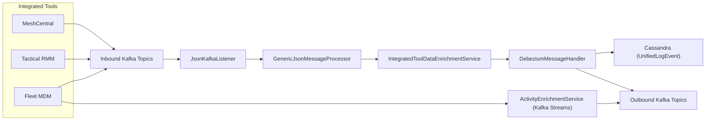
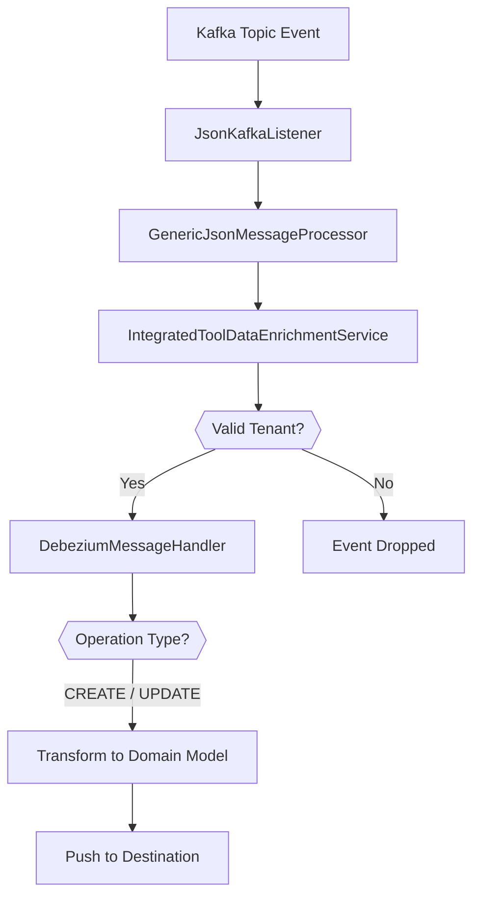
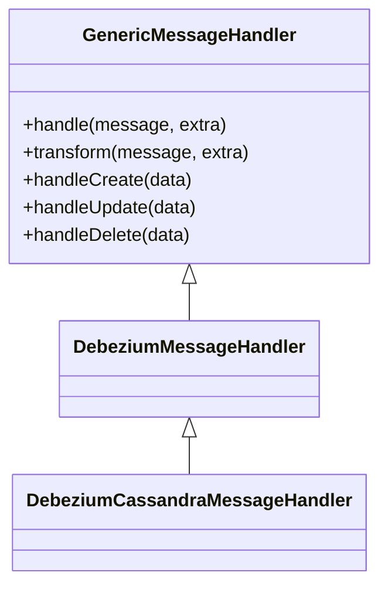
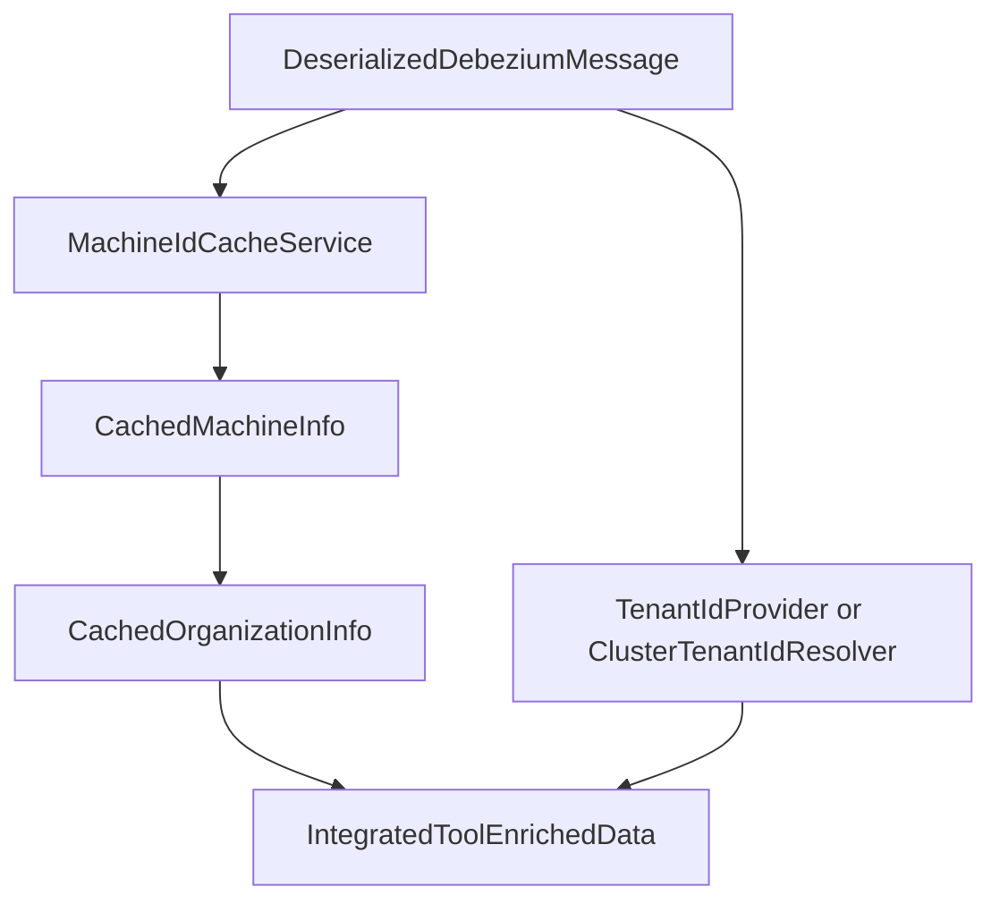
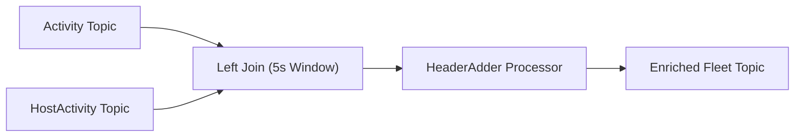

# Stream Processing Core

The **Stream Processing Core** module is the real-time event ingestion and enrichment engine of the OpenFrame platform. It consumes CDC (Change Data Capture) and activity events from integrated tools (MeshCentral, Tactical RMM, Fleet MDM), enriches them with tenant and device context, normalizes event types, and routes them to downstream systems such as Cassandra, Kafka topics, and higher-level services.

This module is deployed as the `StreamApplication` entry point and operates as a Kafka-based streaming microservice within the OpenFrame architecture.

---

## 1. Architectural Overview

The Stream Processing Core sits between external tool event streams and internal data/storage layers.



### Responsibilities

The Stream Processing Core is responsible for:

- Consuming Debezium CDC events from integrated tools
- Validating and resolving tenant identity
- Enriching events with machine and organization metadata
- Mapping tool-specific event types to unified platform types
- Persisting normalized log events to Cassandra
- Republishing enriched events to Kafka
- Performing stream joins for Fleet activity enrichment

---

## 2. High-Level Processing Flow

### 2.1 Debezium Event Pipeline



### Key Concepts

- **DebeziumMessageHandler** interprets CDC operations (`c`, `u`, `d`, `r`) into platform `OperationType`.
- **GenericMessageHandler** provides the lifecycle hooks:
  - `handleCreate`
  - `handleRead`
  - `handleUpdate`
  - `handleDelete`
- Destination handling is implemented in concrete subclasses.

---

## 3. Kafka Configuration Layer

### 3.1 KafkaConfig

`KafkaConfig` defines low-level Kafka integration components.

Primary responsibility:

- Provides a `Converter<byte[], MessageType>` to deserialize Kafka headers into `MessageType` enums.

This enables header-driven routing and downstream processing decisions.

---

### 3.2 KafkaStreamsConfig

`KafkaStreamsConfig` configures Kafka Streams for real-time enrichment pipelines.

Key characteristics:

- Dynamically builds `application.id` using:
  - `spring.application.name`
  - `openframe.cluster-id`
- Uses **AT_LEAST_ONCE** processing guarantee
- Single stream thread (deterministic processing)
- Custom JSON SerDes for:
  - `ActivityMessage`
  - `HostActivityMessage`
- Stream idle configuration for proper window closing

This configuration supports tenant-isolated stream processing in both SaaS and OSS cluster modes.

---

## 4. Event Handling Abstractions

### 4.1 GenericMessageHandler

Base abstraction for all stream message handlers.



Responsibilities:

- JSON deserialization configuration
- Operation routing
- Template method pattern for persistence actions

---

### 4.2 DebeziumMessageHandler

Adds CDC-specific logic:

- Converts Debezium operation codes (`c`, `u`, `d`, `r`) to `OperationType`
- Delegates transformation to subclasses

---

### 4.3 DebeziumCassandraMessageHandler

Concrete implementation that writes unified log events to Cassandra.

Transforms:

- `DeserializedDebeziumMessage`
- `IntegratedToolEnrichedData`

Into:

- `UnifiedLogEvent`

Key fields populated:

- Tenant ID
- Organization ID / Name
- Machine ID
- Hostname
- Severity
- Unified event type
- Tool event ID

CREATE, READ, and UPDATE all result in `repository.save(...)`.

---

### 4.4 TenantDebeziumKafkaMessageHandler

Publishes validated and enriched Debezium events back to Kafka.

- Activated only when `OssTenantRetryingKafkaProducer` exists
- Topic resolved via configuration property
- Supports tenant-specific outbound event topics

---

### 4.5 TenantIdRequiredDebeziumEventValidator

Primary event validation layer.

If `tenantId` is missing:

- Event is rejected
- Error logged
- Event not processed further

This enforces strict tenant isolation guarantees.

---

## 5. Event Normalization Layer

### EventTypeMapper

Maps tool-specific source event types into a unified platform taxonomy (`UnifiedEventType`).

Supported tools:

- MeshCentral
- Tactical RMM
- Fleet MDM

Example normalization logic:

```text
MeshCentral:user.login  -> LOGIN
Tactical:agent_add      -> DEVICE_REGISTERED
Fleet:created_policy    -> POLICY_APPLIED
```

If no mapping is found:

- Returns `UnifiedEventType.UNKNOWN`
- Logs at debug level

This layer ensures downstream services operate on a consistent semantic model.

---

## 6. Data Enrichment Layer

### 6.1 IntegratedToolDataEnrichmentService

Enriches Debezium events with:

- Machine ID
- Hostname
- Organization ID
- Organization Name
- Canonical Tenant ID



### Tenant Resolution Modes

| Deployment Mode | Tenant Resolution Strategy |
|-----------------|----------------------------|
| Tenant Cluster  | `TenantIdProvider` (single tenant per cluster) |
| Shared Cluster  | `ClusterTenantIdResolver` (maps domain → tenant) |

This enables both OSS single-tenant and SaaS multi-tenant deployments.

---

## 7. Kafka Streams Enrichment (Fleet Activities)

### ActivityEnrichmentService

Performs real-time joining of:

- `ActivityMessage`
- `HostActivityMessage`

Using a 5-second join window.



### Join Behavior

- Key: `activityId`
- Join Type: Left Join
- Window: 5 seconds
- Grace: None

If host activity exists:

- `hostId` injected
- `agentId` updated

---

### Header Enrichment

Adds Kafka headers:

- `MESSAGE_TYPE_HEADER`
- `__TypeId__`

Special handling:

- Policy activity types produce `FLEET_MDM_POLICY_ACTIVITY_EVENT`
- Other activities produce `FLEET_MDM_EVENT`

---

## 8. Multi-Tenant & Deployment Model

The Stream Processing Core supports:

- OSS Tenant clusters (isolated Kafka per tenant)
- Shared SaaS clusters (multi-tenant routing)

Isolation mechanisms:

- Cluster-scoped Kafka bootstrap servers
- Namespaced `application.id`
- Strict tenant ID validation
- Tenant-aware topic resolution

---

## 9. Storage Targets

Primary storage target:

- **Cassandra** (`UnifiedLogEvent`)

Used for:

- High-volume audit logs
- Time-series event storage
- Cross-tool unified event querying

Secondary targets:

- Outbound Kafka topics
- Downstream consumers (API services, analytics, notifications)

---

## 10. Integration with Other Modules

The Stream Processing Core integrates with:

- Mongo domain and repositories (device/org context)
- Redis cache services (machine lookup)
- Authorization and tenant resolution layers
- Management service (tool registration & initialization)
- Gateway service (real-time streaming to clients)

It acts as the **real-time backbone** of the OpenFrame event architecture.

---

# Summary

The **Stream Processing Core** module is the event normalization, enrichment, and routing engine of the OpenFrame platform.

It provides:

- CDC ingestion
- Multi-tenant validation
- Device & organization enrichment
- Unified event taxonomy
- Cassandra persistence
- Kafka Streams join pipelines
- Tenant-aware outbound event routing

By centralizing stream logic in a dedicated service, the platform achieves:

- Consistent event semantics
- Horizontal scalability
- Strong tenant isolation
- Extensible handler architecture
- Real-time observability across integrated tools
