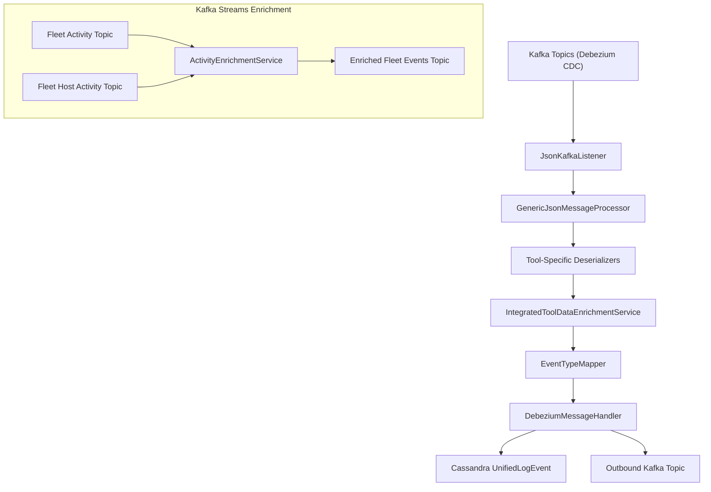
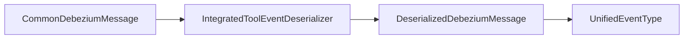
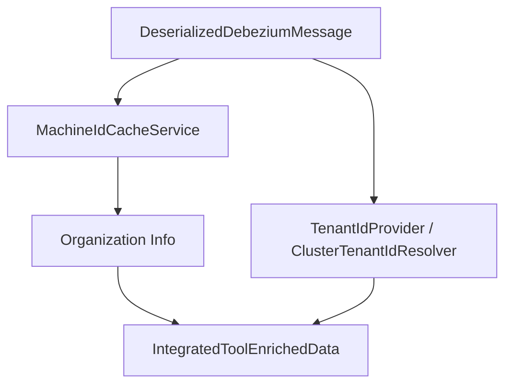
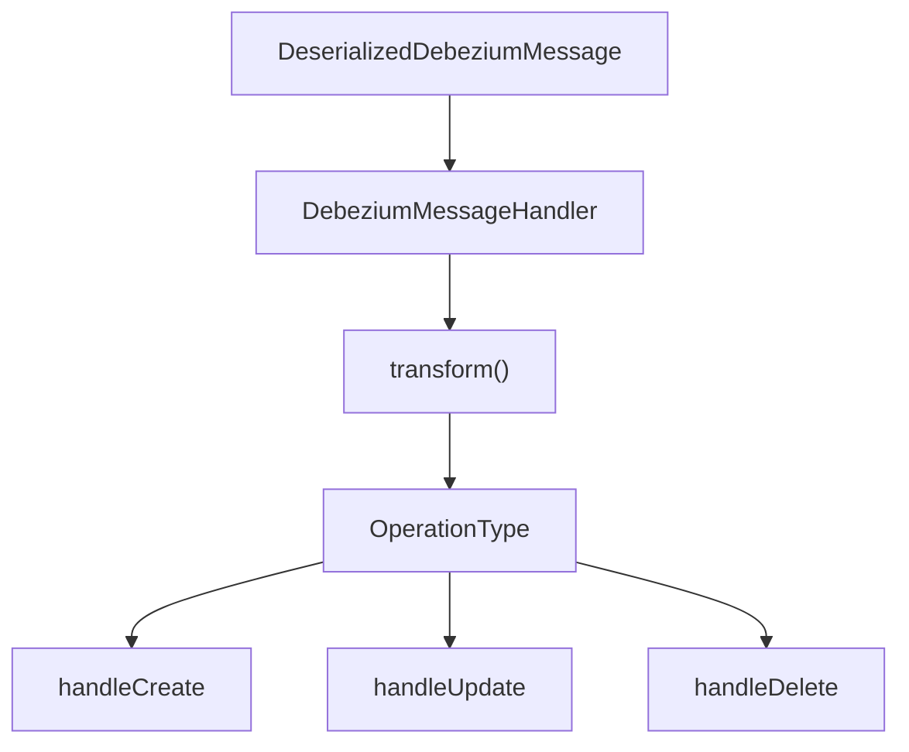
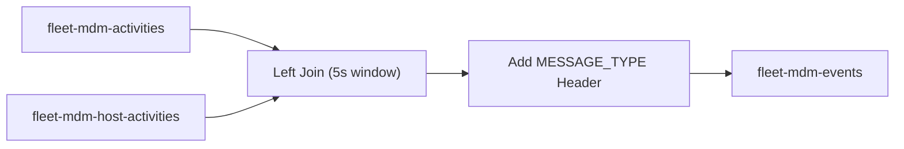

# Stream Service Core

## Overview

The **Stream Service Core** module is the real-time event processing backbone of the OpenFrame platform.  
It ingests change data capture (CDC) events from integrated tools (MeshCentral, Tactical RMM, Fleet MDM), enriches them with tenant and device metadata, maps them into unified event types, and routes them to downstream systems such as Cassandra or outbound Kafka topics.

This module is responsible for:

- Consuming Debezium-based Kafka topics
- Deserializing tool-specific payloads
- Enriching events with tenant, organization, and device context
- Mapping tool-specific event types to unified event types
- Persisting or forwarding transformed events
- Performing Kafka Streams-based joins for Fleet MDM enrichment

It integrates closely with:

- Data Kafka and Debezium (Kafka infrastructure and CDC models)
- Data Mongo Domain and Repositories (domain models)
- Data Mongo Sync Configuration and Custom Repositories (sync layer)
- Data Cassandra (unified log persistence)

---

## High-Level Architecture



The Stream Service Core operates in two main modes:

1. **Event Processing Mode (Kafka Listener + Handlers)**  
2. **Stream Processing Mode (Kafka Streams joins for Fleet MDM)**

---

## Core Processing Flow

### 1. Kafka Consumption

`JsonKafkaListener` subscribes to integrated-tool inbound topics:

- MeshCentral events  
- Tactical RMM events  
- Tactical RMM task results  
- Fleet MDM events  
- Fleet query results  
- Fleet policy membership events

Each message includes a `MessageType` header which determines how it is processed.

---

### 2. Tool-Specific Deserialization

Each tool has its own deserializer extending `IntegratedToolEventDeserializer`.

Examples:

- `MeshCentralEventDeserializer`
- `TrmmAuditEventDeserializer`
- `TrmmAgentHistoryEventDeserializer`
- `TrmmTaskResultEventDeserializer`
- `FleetEventDeserializer`
- `FleetPolicyActivityDeserializer`
- `FleetPolicyMembershipEventDeserializer`
- `FleetQueryResultEventDeserializer`

Responsibilities:

- Extract agent/device identifiers
- Extract source event type
- Parse timestamps (via `TimestampParser`)
- Build normalized message, result, error, and details fields
- Assign a `MessageType`



---

### 3. Event Type Mapping

`EventTypeMapper` maps:

- `IntegratedToolType` + `sourceEventType`
→ `UnifiedEventType`

If no mapping exists, `UnifiedEventType.UNKNOWN` is used.

Mappings cover:

- Authentication events
- Device lifecycle events
- Script & task execution
- Policy & compliance
- Software management
- Fleet MDM activities

This ensures consistent downstream analytics regardless of tool origin.

---

### 4. Data Enrichment

`IntegratedToolDataEnrichmentService` enriches each event with:

- Machine ID (from `MachineIdCacheService`)
- Hostname
- Organization ID and name
- Canonical tenant ID

Tenant resolution supports:

- Dedicated tenant clusters (via `TenantIdProvider`)
- Shared clusters (via `ClusterTenantIdResolver`)



---

### 5. Message Handling

All handlers extend the generic abstraction chain:

```text
GenericMessageHandler
    └── DebeziumMessageHandler
            └── Concrete Handler
```

#### GenericMessageHandler

- Validates messages
- Determines operation type (CREATE, UPDATE, DELETE, READ)
- Dispatches to lifecycle methods

#### DebeziumMessageHandler

- Interprets Debezium operation codes:
  - `c` → CREATE
  - `r` → READ
  - `u` → UPDATE
  - `d` → DELETE

#### Concrete Implementations

- `DebeziumCassandraMessageHandler`  
  Persists events into Cassandra as `UnifiedLogEvent`.

- `TenantDebeziumKafkaMessageHandler`  
  Publishes transformed events to outbound Kafka topics.

- `TenantIdRequiredDebeziumEventValidator`  
  Drops events missing tenant ID to ensure isolation.



---

## Kafka Streams: Fleet Activity Enrichment

`ActivityEnrichmentService` performs a time-windowed left join between:

- Fleet activities topic
- Fleet host_activities topic

Purpose:

- Attach `hostId` to activity events
- Convert them into enriched activity messages
- Set correct `MessageType` header
- Forward to enriched events topic



Configuration is controlled by:

- `kafka.stream.enabled`
- `spring.application.name`
- `openframe.cluster-id`

`KafkaStreamsConfig` defines:

- Application ID strategy (tenant-aware)
- At-least-once processing guarantee
- State store directory
- SerDes for `ActivityMessage` and `HostActivityMessage`

---

## Configuration Components

### KafkaConfig

- Provides a `Converter<byte[], MessageType>` for resolving message type headers.

### KafkaStreamsConfig

- Enables Kafka Streams
- Defines SerDes
- Builds tenant-aware `application.id`
- Configures producer/consumer tuning

---

## Data Model Overview

Key models:

- `ActivityMessage` (DebeziumMessage<Activity>)
- `HostActivityMessage` (DebeziumMessage<HostActivity>)
- `PolicyMembership`
- `DeserializedDebeziumMessage`
- `IntegratedToolEnrichedData`

Persistence target:

- `UnifiedLogEvent` (Cassandra)

---

## Multi-Tenant Isolation Model

Tenant isolation is enforced at multiple layers:

1. Kafka topic separation (tenant cluster mode)
2. Tenant ID enrichment
3. `TenantIdRequiredDebeziumEventValidator`
4. Partitioned Cassandra keys
5. Tenant-aware Kafka Streams application IDs

This ensures:

- No cross-tenant data leakage
- Horizontal scaling per tenant cluster
- Clear traceability of event origin

---

## Summary

The **Stream Service Core** module transforms raw CDC events into enriched, normalized, multi-tenant-aware unified events.

It provides:

- Reliable ingestion (Kafka + Debezium)
- Flexible deserialization per tool
- Strong enrichment and mapping logic
- Unified event taxonomy
- Cassandra persistence
- Kafka Streams-based correlation
- Strict tenant isolation

It acts as the real-time event backbone of OpenFrame, powering auditing, monitoring, automation, and analytics across integrated tools.
