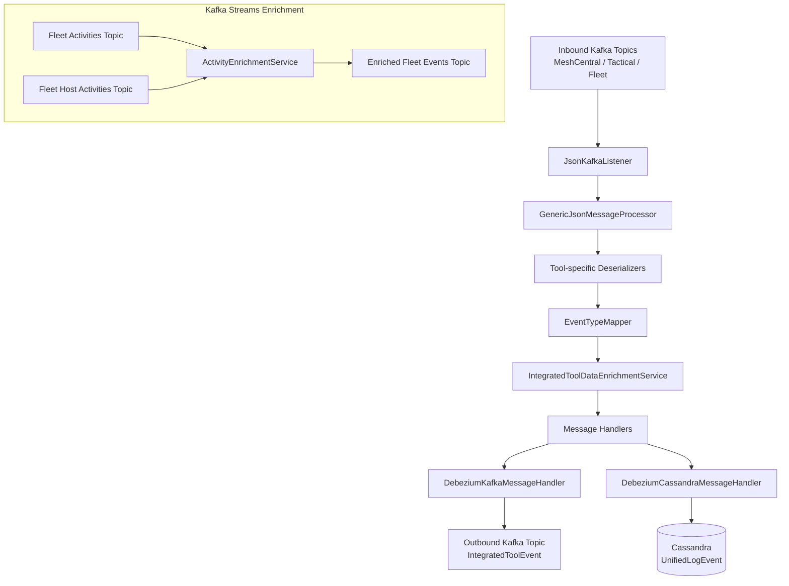
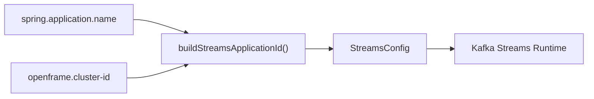
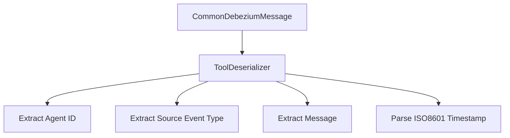
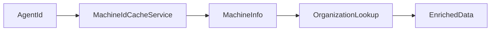
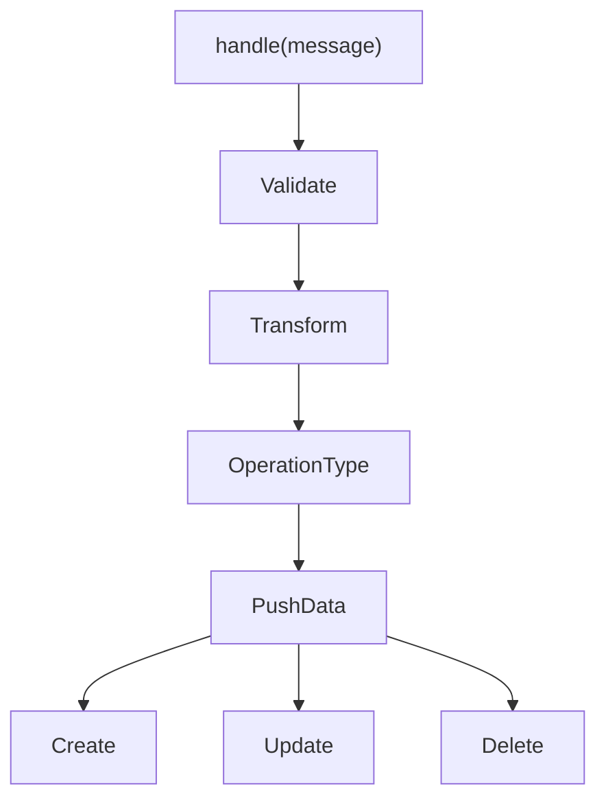
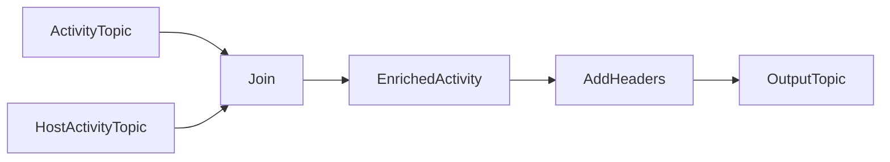
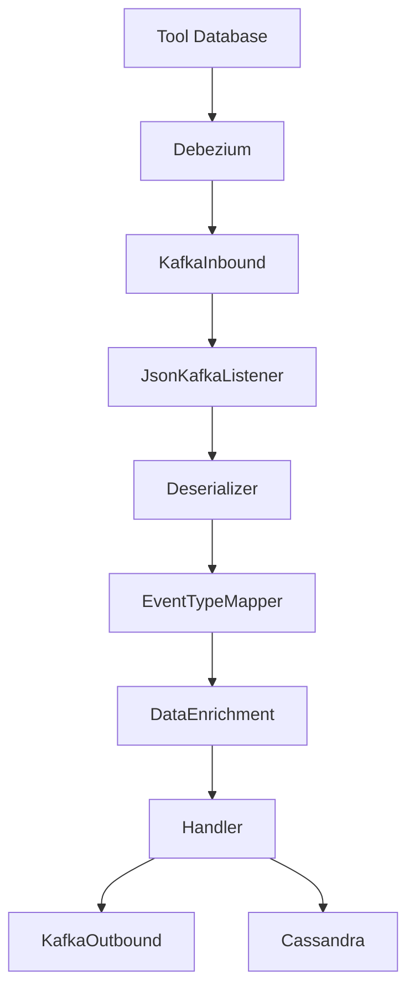

# Stream Service Core

The **Stream Service Core** module is the real-time event processing backbone of the OpenFrame platform. It ingests change data capture (CDC) events from integrated tools (MeshCentral, Tactical RMM, Fleet MDM), normalizes them into a unified event model, enriches them with tenant and device metadata, and routes them to downstream destinations such as Kafka and Cassandra.

This module is part of the event-driven layer that powers observability, audit logging, automation triggers, and analytics across the platform.

---

## 1. Purpose and Responsibilities

Stream Service Core is responsible for:

- Consuming Debezium CDC messages from Kafka
- Deserializing tool-specific payloads
- Mapping tool-specific event types to a unified event taxonomy
- Enriching events with device and organization metadata
- Persisting unified log events to Cassandra
- Publishing normalized events to outbound Kafka topics
- Running Kafka Streams topologies for activity enrichment

At a high level, it transforms raw tool data into platform-native, multi-tenant, enriched events.

---

## 2. High-Level Architecture



---

## 3. Kafka Integration Layer

### 3.1 KafkaConfig

`KafkaConfig` provides foundational Kafka configuration components.

Key responsibility:

- Defines a `Converter<byte[], MessageType>` that extracts and normalizes the `MessageType` from Kafka headers.
- Ensures message routing logic can rely on a strongly typed enum instead of raw string values.

This is critical because different integrated tools publish to different inbound topics with a `MESSAGE_TYPE_HEADER`.

---

### 3.2 KafkaStreamsConfig

`KafkaStreamsConfig` configures the Kafka Streams runtime for enrichment pipelines.

Key responsibilities:

- Builds tenant-aware `application.id` using `clusterId`.
- Configures:
  - `AT_LEAST_ONCE` processing guarantee
  - Custom JSON SerDes for `ActivityMessage` and `HostActivityMessage`
  - Stream thread count and state directory
  - Consumer and producer tuning
- Provides custom SerDes for outgoing messages without type metadata.



This ensures isolation between tenants in SaaS deployments.

---

## 4. Inbound Message Processing

### 4.1 JsonKafkaListener

`JsonKafkaListener` is the entry point for all integrated tool events.

It listens to:

- MeshCentral events
- Tactical RMM events
- Fleet MDM events
- Fleet MDM query result events

Each message includes:

- `CommonDebeziumMessage` payload
- `MessageType` header

The listener delegates to `GenericJsonMessageProcessor`, which orchestrates deserialization and routing.

---

## 5. Tool-Specific Deserializers

All tool deserializers extend a common abstraction (via `IntegratedToolEventDeserializer`).

Implemented deserializers:

- `FleetEventDeserializer`
- `FleetQueryResultEventDeserializer`
- `MeshCentralEventDeserializer`
- `TrmmAgentHistoryEventDeserializer`
- `TrmmAuditEventDeserializer`

### Responsibilities

Each deserializer extracts:

- Agent ID
- Source event type
- Tool event ID
- Human-readable message
- Timestamp
- Optional result/error payload

Example flow:



Special logic examples:

- Fleet query results use `FleetMdmCacheService` to resolve query names.
- Tactical RMM agent history resolves script names via `TacticalRmmCacheService`.
- MeshCentral events parse embedded JSON strings before field extraction.

---

## 6. Event Type Normalization

### 6.1 SourceEventTypes

Defines canonical constants for:

- MeshCentral event names
- Tactical RMM event names
- Fleet MDM activity types

This prevents hard-coded string usage across the pipeline.

### 6.2 EventTypeMapper

`EventTypeMapper` maps:

```text
IntegratedToolType + SourceEventType -> UnifiedEventType
```

If no mapping is found:

- Falls back to `UnifiedEventType.UNKNOWN`
- Logs debug-level trace

This ensures platform-wide consistency for audit logs, alerts, and analytics.

---

## 7. Data Enrichment Layer

### 7.1 IntegratedToolDataEnrichmentService

Enriches events using Redis-backed caches.

Input:

- `DeserializedDebeziumMessage` with agentId

Lookup:

- Machine metadata via `MachineIdCacheService`
- Organization metadata via cached organization info

Output:

- `IntegratedToolEnrichedData` containing:
  - Machine ID
  - Hostname
  - Organization ID
  - Organization Name



This step converts tool-level identifiers into platform-level multi-tenant identifiers.

---

## 8. Message Handling Layer

All handlers extend:

- `GenericMessageHandler`
- `DebeziumMessageHandler`

### 8.1 GenericMessageHandler

Core responsibilities:

- Validate message
- Transform to target model
- Determine operation type (CREATE / READ / UPDATE / DELETE)
- Dispatch to appropriate handler method



---

### 8.2 DebeziumKafkaMessageHandler

Destination: Kafka

Transforms into `IntegratedToolEvent` and publishes to outbound topic.

Features:

- Tenant-aware Kafka producer
- Key strategy based on deviceId or userId
- Filters out invisible events

---

### 8.3 DebeziumCassandraMessageHandler

Destination: Cassandra

Transforms into `UnifiedLogEvent`.

Creates composite key using:

- Ingest day
- Tool type
- Unified event type
- Event timestamp
- Tool event ID

Persists to Cassandra using `CassandraRepository`.

---

## 9. Kafka Streams: Activity Enrichment

### ActivityEnrichmentService

Joins:

- Fleet activities topic
- Fleet host activities topic

Uses:

- Left join with 5-second window
- Custom SerDes
- Header injection using Processor API



Key behaviors:

- Enriches Activity with hostId
- Sets agentId from hostId
- Adds `MESSAGE_TYPE_HEADER`
- Publishes to enriched Fleet topic

This enables downstream services to treat Fleet activities as standard integrated tool events.

---

## 10. Timestamp Handling

### TimestampParser

Utility class that:

- Parses ISO 8601 timestamps
- Converts to epoch milliseconds
- Logs warnings on parsing failures

Ensures consistent time representation across all tools.

---

## 11. End-to-End Event Lifecycle



---

## 12. How It Fits into the Platform

Stream Service Core integrates with:

- Kafka infrastructure
- Cassandra for unified logging
- Redis caches for enrichment
- Downstream services consuming `IntegratedToolEvent`

It acts as the canonical transformation layer between external integrated tools and the internal OpenFrame event model.

Without this module:

- Event types would remain tool-specific
- No unified audit log would exist
- Multi-tenant enrichment would not be applied
- Cross-tool analytics would not be possible

---

# Summary

The **Stream Service Core** module is the real-time normalization and enrichment engine of the platform. It:

- Consumes tool-generated CDC events
- Standardizes them into unified event types
- Enriches them with tenant and device metadata
- Persists to Cassandra
- Publishes normalized events to Kafka
- Runs Kafka Streams topologies for advanced enrichment

It is the central nervous system for operational intelligence across integrated tools in OpenFrame.