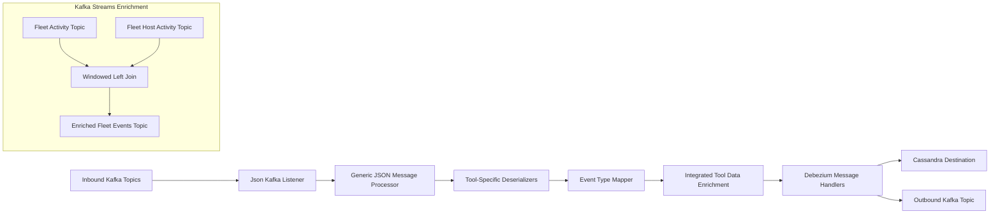
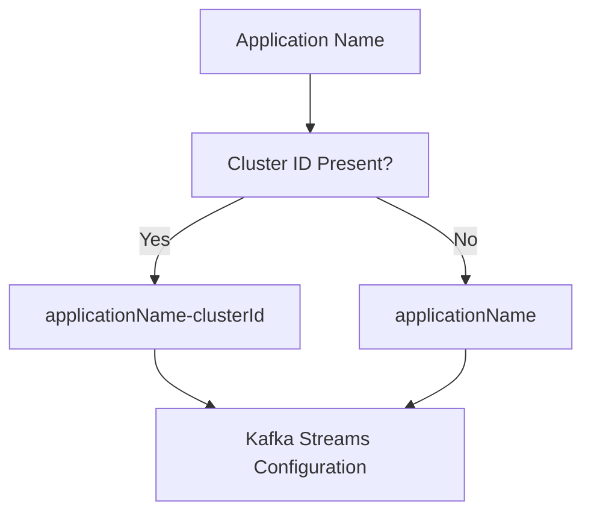
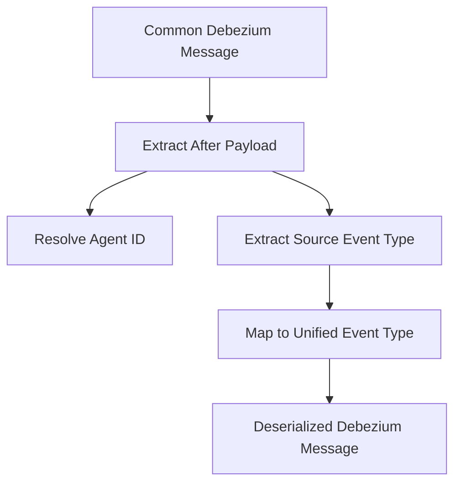
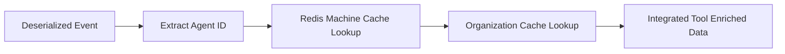
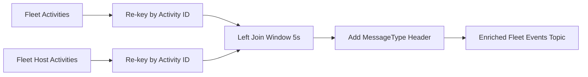
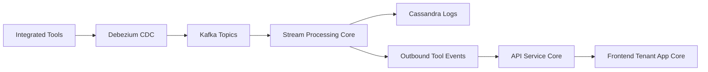

# Stream Processing Core

## Overview

The **Stream Processing Core** module is responsible for real-time ingestion, normalization, enrichment, and distribution of event streams coming from integrated tools such as MeshCentral, Tactical RMM, and Fleet MDM.

It acts as the event backbone of the OpenFrame platform, transforming raw Change Data Capture (CDC) and tool-generated events into unified, enriched, and destination-ready messages for:

- Kafka downstream consumers
- Cassandra log storage
- Analytics and monitoring systems

This module integrates closely with:

- [Data Layer Kafka](../data_layer_kafka/data_layer_kafka.md)
- [Data Layer Mongo](../data_layer_mongo/data_layer_mongo.md)
- [Data Layer Core Services](../data_layer_core_services/data_layer_core_services.md)
- [Management Service Core](../management_service_core/management_service_core.md)

---

## High-Level Architecture



The module has two main processing paths:

1. **Debezium-based event processing pipeline**
2. **Kafka Streams-based activity enrichment pipeline**

---

# 1. Kafka Configuration Layer

## KafkaConfig

Configures message conversion for Kafka consumers.

### Responsibilities

- Provides a `Converter<byte[], MessageType>` bean
- Converts Kafka header values into `MessageType` enums
- Safely handles invalid enum values

This enables dynamic routing of incoming messages based on tool-specific message types.

---

## KafkaStreamsConfig

Enables and configures Kafka Streams processing.

### Key Responsibilities

- Defines `Serde` for:
  - `ActivityMessage`
  - `HostActivityMessage`
- Configures Kafka Streams properties:
  - `application.id` (namespaced by cluster ID)
  - At-least-once processing
  - State directory
  - Consumer and producer tuning
- Enables multi-tenant isolation via cluster-specific application IDs

### Streams Configuration Flow



---

# 2. Inbound Event Processing Pipeline

## JsonKafkaListener

The entry point for integrated tool events.

### Listens To Topics

- MeshCentral events
- Tactical RMM events
- Fleet MDM events
- Fleet MDM query result events

Each message includes a `MessageType` header which determines which deserializer will process it.

---

## Tool-Specific Deserializers

All tool deserializers extend a shared base (`IntegratedToolEventDeserializer`) and extract:

- Agent ID
- Source event type
- Tool event ID
- Message
- Timestamp
- Optional result/error details

### Implementations

- **FleetEventDeserializer**
- **FleetQueryResultEventDeserializer**
- **MeshCentralEventDeserializer**
- **TrmmAgentHistoryEventDeserializer**
- **TrmmAuditEventDeserializer**

### Deserialization Flow



### Timestamp Handling

All timestamps are normalized using:

- `TimestampParser.parseIso8601()`

This ensures consistent millisecond precision across integrated tools.

---

# 3. Event Type Normalization

## EventTypeMapper

Maps tool-specific event types to platform-wide `UnifiedEventType`.

### Mapping Strategy

Key format:

```text
toolDbName:sourceEventType
```

Example:

```text
meshcentral:user.login
```

If no mapping exists, the event defaults to:

```text
UnifiedEventType.UNKNOWN
```

This ensures system stability even when new tool events are introduced.

---

## SourceEventTypes

Provides strongly-typed constants for:

- MeshCentral
- Tactical RMM
- Fleet MDM

This avoids string-based errors across the pipeline.

---

## FleetActivityTypeMapping

Maps Fleet activity types to human-readable summaries.

Used primarily by:

- `FleetEventDeserializer`

Fallback behavior:

- If no mapping exists → use `details` field

---

# 4. Data Enrichment Layer

## IntegratedToolDataEnrichmentService

Enriches events with cached metadata.

### Enrichment Sources

- Machine ID
- Hostname
- Organization ID
- Organization name

Uses:

- `MachineIdCacheService` (Redis-backed cache)

### Enrichment Flow



If cache lookup fails, the event continues without enrichment.

---

# 5. Message Handling Layer

## GenericMessageHandler

Base abstraction for processing transformed events.

### Responsibilities

- Validates message
- Determines `OperationType` (CREATE, READ, UPDATE, DELETE)
- Routes to correct handler method

---

## DebeziumMessageHandler

Extends `GenericMessageHandler` and:

- Converts Debezium operation codes (`c`, `r`, `u`, `d`)
- Applies unified transformation logic

---

## Destination Handlers

### DebeziumCassandraMessageHandler

Destination: `CASSANDRA`

Transforms enriched message into `UnifiedLogEvent`.

Key fields:

- Ingest day
- Tool type
- Unified event type
- Timestamp
- Device ID
- Organization
- Severity

Used for long-term log storage and querying.

---

### DebeziumKafkaMessageHandler

Destination: `KAFKA`

Publishes `IntegratedToolEvent` to outbound topic.

Features:

- Tenant-aware producer
- Retry support
- Dynamic key building:
  - `deviceId-toolType`
  - `userId-toolType`

Only publishes events marked as visible.

---

# 6. Kafka Streams Activity Enrichment

## ActivityEnrichmentService

Handles Fleet MDM activity + host activity correlation.

### Processing Steps

1. Read activity topic
2. Read host activity topic
3. Re-key by activity ID
4. Perform windowed left join
5. Inject headers
6. Publish enriched result

### Join Configuration

- Join window: 5 seconds
- No grace period
- At-least-once processing

### Stream Topology



The header injector ensures downstream consumers receive proper `MessageType` and `__TypeId__` metadata.

---

# 7. Operational Guarantees

- **Processing Guarantee**: At-least-once
- **Multi-tenant isolation** via cluster-based application ID
- **Graceful handling of unknown mappings**
- **Cache-miss tolerant enrichment**
- **Idempotent handling of Debezium operations**

---

# 8. How Stream Processing Core Fits into OpenFrame



### Role in the Platform

The Stream Processing Core:

- Normalizes heterogeneous tool events
- Enriches events with platform metadata
- Ensures consistent event taxonomy
- Publishes unified events for:
  - APIs
  - Analytics
  - Monitoring
  - Audit trails

It is the central real-time processing engine connecting ingestion to persistence and external consumption.

---

# 9. Extension Points

To support a new integrated tool:

1. Implement a new tool-specific deserializer
2. Add mappings in `EventTypeMapper`
3. Register inbound Kafka topic
4. Optionally extend enrichment logic
5. Add new destination handler if required

The architecture is intentionally modular and open for extension without modifying core abstractions.

---

# Summary

The **Stream Processing Core** module provides:

- Real-time ingestion from Kafka
- Tool-specific deserialization
- Unified event normalization
- Metadata enrichment
- Multi-destination publishing (Kafka + Cassandra)
- Kafka Streams correlation logic

It serves as the event transformation backbone of the OpenFrame platform, ensuring all integrated tool data is standardized, enriched, and ready for downstream services.