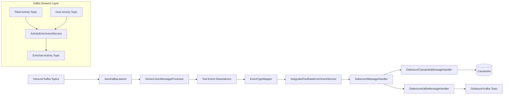
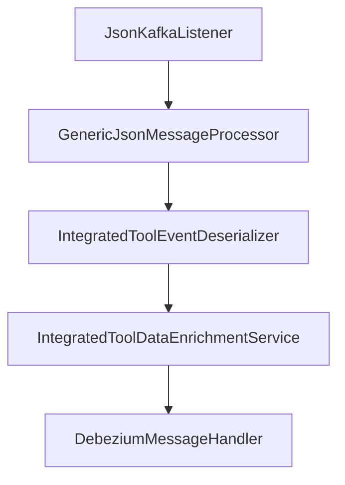
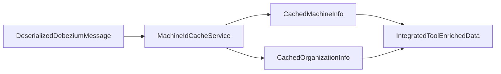
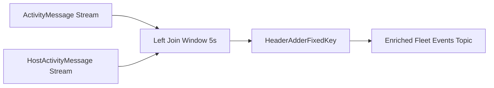
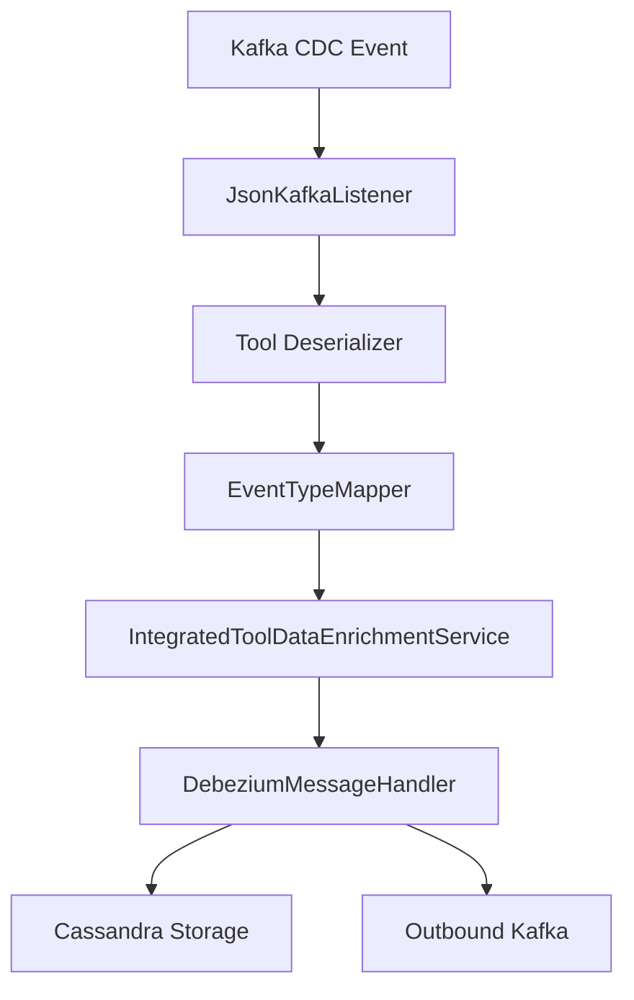

# Stream Processing Core

The **Stream Processing Core** module is responsible for ingesting, normalizing, enriching, and distributing real-time events from integrated tools such as Fleet MDM, Tactical RMM, and MeshCentral.

It acts as the event backbone of the OpenFrame platform, transforming raw Debezium CDC messages into unified, enriched events that can be persisted (Cassandra), re-published (Kafka), or further processed by downstream services.

---

## 1. Purpose and Responsibilities

The Stream Processing Core performs the following high-level functions:

- ✅ Consume raw Debezium CDC events from Kafka
- ✅ Deserialize tool-specific payloads
- ✅ Map source event types to unified event types
- ✅ Enrich events with machine and organization metadata
- ✅ Persist normalized events to Cassandra
- ✅ Publish enriched events to outbound Kafka topics
- ✅ Join and enrich Fleet activity streams using Kafka Streams

This module is deployed via the `StreamApplication` entry point in the platform.

---

## 2. High-Level Architecture



The architecture is split into two major pipelines:

1. **Debezium Event Pipeline** (CDC → Normalize → Enrich → Persist/Publish)
2. **Kafka Streams Activity Enrichment Pipeline** (Fleet Activity Join)

---

## 3. Kafka Integration and Configuration

### 3.1 KafkaConfig

`KafkaConfig` defines shared Kafka infrastructure components such as:

- `Converter<byte[], MessageType>` to interpret Kafka headers
- Integration with Spring Kafka listener container factory

This allows the system to route messages dynamically based on the `MessageType` header.

---

### 3.2 KafkaStreamsConfig

`KafkaStreamsConfig` configures the Kafka Streams runtime:

- Application ID namespaced by `clusterId`
- At-least-once processing guarantee
- Custom SerDes for:
  - `ActivityMessage`
  - `HostActivityMessage`
- Stream tuning parameters:
  - Poll size
  - Batch size
  - Linger
  - Idle timeout

This configuration enables stateful joins between activity topics.

---

## 4. Event Ingestion Pipeline

### 4.1 JsonKafkaListener

The `JsonKafkaListener` subscribes to inbound Kafka topics:

- MeshCentral events
- Tactical RMM events
- Fleet MDM events
- Fleet query result events

Each message includes a `MessageType` header used for routing.



---

## 5. Tool-Specific Deserializers

Each integrated tool has a dedicated deserializer extending `IntegratedToolEventDeserializer`.

### Supported Deserializers

- `FleetEventDeserializer`
- `FleetQueryResultEventDeserializer`
- `MeshCentralEventDeserializer`
- `TrmmAgentHistoryEventDeserializer`
- `TrmmAuditEventDeserializer`

### Responsibilities

Each deserializer extracts:

- Agent ID
- Source event type
- Tool event ID
- Human-readable message
- Timestamp
- Optional error/result payloads

They normalize heterogeneous JSON payloads into a common structure.

---

## 6. Unified Event Mapping

### 6.1 SourceEventTypes

Defines constants for raw tool event identifiers grouped by:

- MeshCentral
- Tactical RMM
- Fleet MDM

---

### 6.2 EventTypeMapper

`EventTypeMapper` converts:

```
IntegratedToolType + SourceEventType → UnifiedEventType
```

If no mapping exists, the system falls back to `UNKNOWN`.

This ensures:

- Cross-tool normalization
- Unified reporting
- Consistent severity mapping

---

### 6.3 FleetActivityTypeMapping

Provides human-readable messages for Fleet MDM `activity_type` values.

This enhances:

- User-facing logs
- Audit clarity
- Dashboard readability

---

## 7. Data Enrichment Layer

### IntegratedToolDataEnrichmentService

This service enriches events using Redis-backed caches:

- Machine ID
- Hostname
- Organization ID
- Organization name



If no cache entry exists, the event is still processed but without metadata.

---

## 8. Message Handlers

The Stream Processing Core uses a strategy-based handler architecture.

### 8.1 GenericMessageHandler

Defines the common lifecycle:

- Validate message
- Transform
- Determine operation type (CREATE, READ, UPDATE, DELETE)
- Dispatch to destination-specific handler

---

### 8.2 DebeziumMessageHandler

Extends `GenericMessageHandler` and maps Debezium operations:

```
"c" → CREATE
"r" → READ
"u" → UPDATE
"d" → DELETE
```

---

### 8.3 DebeziumCassandraMessageHandler

Transforms events into `UnifiedLogEvent` and writes to Cassandra.

Enriched fields include:

- Organization
- Device
- Severity
- Unified event type
- Tool event ID
- Timestamp

Destination: `Destination.CASSANDRA`

---

### 8.4 DebeziumKafkaMessageHandler

Publishes enriched `IntegratedToolEvent` objects to outbound Kafka topics.

Features:

- Visibility filtering
- Dynamic message keys (deviceId-toolType)
- Retry-capable producer

Destination: `Destination.KAFKA`

---

## 9. Kafka Streams Activity Enrichment

### ActivityEnrichmentService

This service builds a Kafka Streams topology that:

1. Reads Fleet `ActivityMessage`
2. Reads Fleet `HostActivityMessage`
3. Joins both streams within a 5-second window
4. Adds `hostId` and `agentId`
5. Adds constant message headers
6. Publishes enriched activity events



This enables correct association between activities and hosts when data arrives asynchronously.

---

## 10. Timestamp Handling

`TimestampParser` converts ISO 8601 timestamps (from Debezium) into epoch milliseconds.

This ensures:

- Consistent storage format
- Accurate ordering
- Cassandra partitioning alignment

---

## 11. End-to-End Processing Flow



---

## 12. How Stream Processing Core Fits in OpenFrame

The Stream Processing Core sits between:

- **Integrated tools** (Fleet, Tactical, MeshCentral)
- **Data storage layer** (Cassandra)
- **Analytics & APIs** (via outbound Kafka)

It provides:

- Event normalization
- Multi-tool abstraction
- Real-time enrichment
- Cross-tool consistency

Without this module, each tool would require custom processing logic throughout the platform. Instead, Stream Processing Core centralizes normalization and distribution.

---

# Summary

The **Stream Processing Core** module is the real-time event normalization and enrichment engine of OpenFrame.

It combines:

- Spring Kafka listeners
- Kafka Streams joins
- Tool-specific deserializers
- Unified event mapping
- Redis-backed enrichment
- Cassandra persistence
- Outbound Kafka publishing

This layered architecture ensures scalable, tool-agnostic, and consistent event processing across the entire platform.
