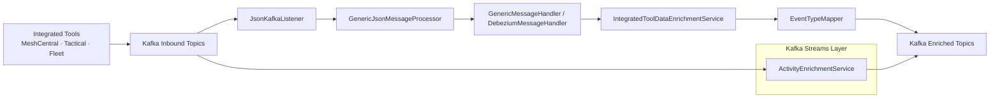
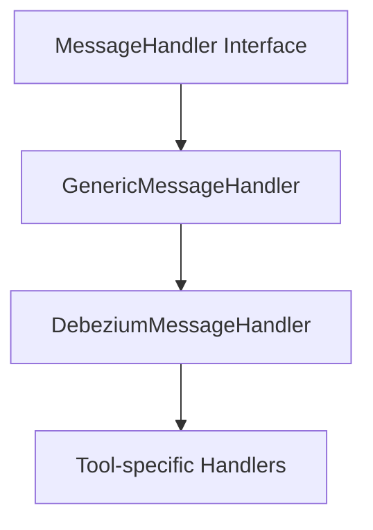
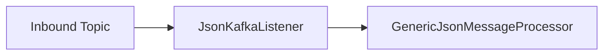
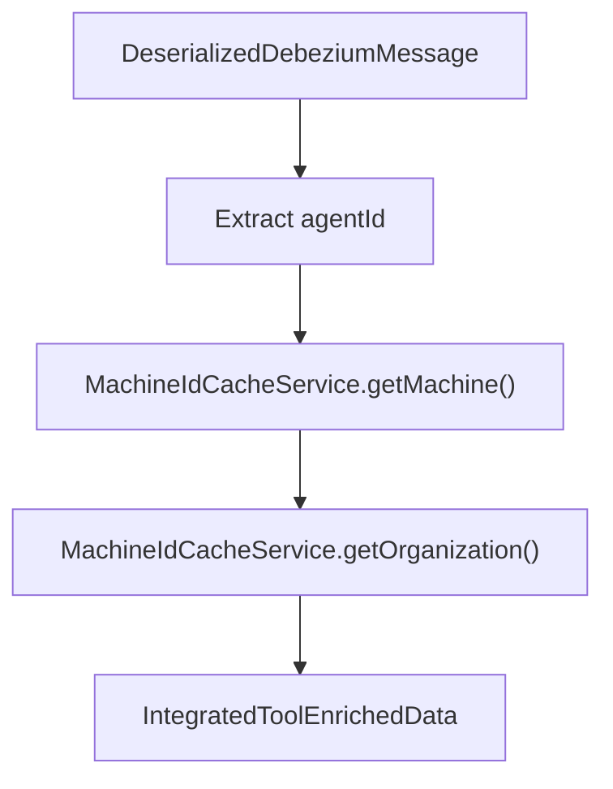
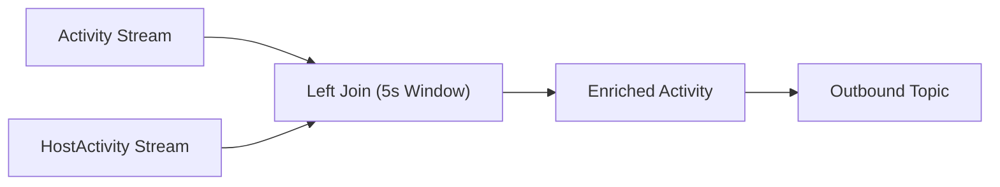
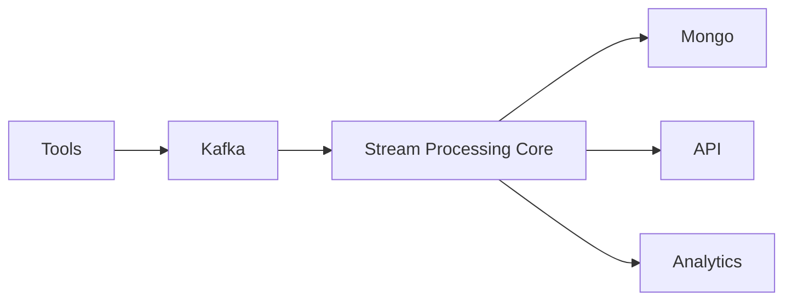

# Stream Processing Core

The **Stream Processing Core** module is responsible for real-time event ingestion, transformation, enrichment, and normalization within the OpenFrame platform. It acts as the event backbone that consumes Kafka topics, enriches tool-specific payloads, unifies event semantics, and republishes structured events for downstream services.

This module is part of the streaming layer that connects:

- External integrated tools (MeshCentral, Tactical RMM, Fleet MDM, etc.)
- Kafka infrastructure
- Data enrichment services (Redis-based caching)
- Unified event consumers across the platform

It is built on:

- **Spring Kafka** (listeners + producers)
- **Kafka Streams** (stateful and windowed stream processing)
- **Jackson-based JSON deserialization**
- **Multi-tenant Kafka configuration**

---

## 1. High-Level Responsibilities

The Stream Processing Core performs four primary functions:

1. **Kafka Configuration & Multi-Tenant Streams Setup**
2. **Inbound Message Consumption & Routing**
3. **Event Enrichment (Machine, Organization, Host)**
4. **Event Normalization (Tool-specific → UnifiedEventType)**

---

## 2. Architectural Overview



### Key Flow Characteristics

- Tool-specific events enter via inbound Kafka topics
- Messages are processed using a generic, extensible handler abstraction
- Machine and organization metadata is injected via Redis cache
- Tool-specific event types are mapped to `UnifiedEventType`
- Enriched events are republished for downstream services
- Kafka Streams performs time-window joins for activity enrichment

---

## 3. Kafka Configuration Layer

### 3.1 KafkaConfig

`KafkaConfig` provides foundational Kafka bean configuration.

Primary responsibility:

- Defines a `Converter<byte[], MessageType>` to interpret Kafka headers
- Safely parses message type headers into the `MessageType` enum
- Prevents consumer crashes from malformed headers

This ensures that message routing is type-aware while remaining resilient.

---

### 3.2 KafkaStreamsConfig

`KafkaStreamsConfig` enables and configures Kafka Streams processing.

Core responsibilities:

- Enables `@EnableKafkaStreams`
- Configures:
  - `application.id` (namespaced by cluster/tenant)
  - bootstrap servers
  - state directory
  - processing guarantee (`AT_LEAST_ONCE`)
  - stream threads
- Defines JSON `Serde` implementations for:
  - `ActivityMessage`
  - `HostActivityMessage`

Multi-tenant isolation is achieved by constructing the Streams application ID as:

```text
{spring.application.name}-{clusterId}
```

If no cluster ID is defined, the application name is used directly.

---

## 4. Message Handling Abstraction

The module uses a layered abstraction for handling Debezium-based messages.



### 4.1 GenericMessageHandler

This abstract class defines a structured processing lifecycle:

1. Validate message
2. Transform raw payload → domain object
3. Determine `OperationType`
4. Route to:
   - `handleCreate()`
   - `handleRead()`
   - `handleUpdate()`
   - `handleDelete()`

This enforces consistent behavior across all event types.

---

### 4.2 DebeziumMessageHandler

Extends `GenericMessageHandler` and adds Debezium-specific behavior.

Responsibilities:

- Extracts operation codes (`c`, `r`, `u`, `d`)
- Converts them into:
  - `CREATE`
  - `READ`
  - `UPDATE`
  - `DELETE`
- Delegates transformation to concrete implementations

This abstraction ensures CDC (Change Data Capture) events are handled consistently.

---

## 5. Kafka Listener Layer

### JsonKafkaListener

`JsonKafkaListener` consumes inbound integrated tool topics.

Key behavior:

- Listens to multiple inbound tool topics
- Receives:
  - `CommonDebeziumMessage` payload
  - `MessageType` header
- Delegates processing to `GenericJsonMessageProcessor`



This design allows:

- Centralized deserialization
- Type-aware routing
- Tool-specific processing extensions

---

## 6. Event Normalization Layer

### EventTypeMapper

`EventTypeMapper` converts tool-specific event types into a unified platform taxonomy.

Mapping key format:

```text
{toolName}:{sourceEventType}
```

Example:

```text
MESHCENTRAL:user.login → LOGIN
TACTICAL:agent_add → DEVICE_REGISTERED
FLEET:created_user → USER_CREATED
```

If no mapping exists:

- The event defaults to `UnifiedEventType.UNKNOWN`

This layer is critical for:

- Cross-tool analytics
- Unified auditing
- Consistent frontend representation
- Rule engine compatibility

---

## 7. Data Enrichment Layer

### 7.1 IntegratedToolDataEnrichmentService

Adds contextual metadata to inbound events using Redis cache.

Lookup process:



Enriched fields may include:

- machineId
- hostname
- organizationId
- organizationName

If machine lookup fails:

- Event continues without enrichment
- Warning log emitted

This avoids blocking the stream pipeline.

---

### 7.2 ActivityEnrichmentService (Kafka Streams)

This service performs **windowed stream joins** between:

- `ActivityMessage`
- `HostActivityMessage`

Join characteristics:

- Left join
- 5-second window
- No grace period
- Fixed key processor adds required headers



Enrichment logic:

- Extract hostId from HostActivity
- Set:
  - `activity.hostId`
  - `activity.agentId`
- Attach headers:
  - `MESSAGE_TYPE_HEADER`
  - `__TypeId__`

This enables correlation of activity events with host metadata in near real-time.

---

## 8. Multi-Tenant Considerations

The Stream Processing Core supports multi-tenant SaaS deployments by:

- Namespacing Kafka Streams `application.id`
- Using tenant-specific Kafka properties
- Relying on cluster ID for stream isolation

This ensures:

- Stream state isolation
- Independent scaling per tenant
- Safe offset management

---

## 9. Fault Tolerance & Guarantees

Configured behaviors:

- Processing guarantee: `AT_LEAST_ONCE`
- Consumer auto offset reset: `earliest`
- Controlled batch size and poll limits
- Configurable producer batching
- Stream idle management to prevent join stalling

Error-handling patterns:

- Null-safe deserialization
- OperationType validation
- Defensive enrichment logic
- Unknown event type fallback

---

## 10. Integration Within the Platform

The Stream Processing Core sits between:

- Kafka Infrastructure Layer
- Redis Cache Services
- Data Persistence (Mongo)
- Downstream Analytics & API Services



It acts as the **real-time event transformation backbone** of the OpenFrame platform.

---

# Summary

The **Stream Processing Core** module provides:

- Kafka multi-tenant configuration
- Structured CDC message handling
- Tool-specific → unified event mapping
- Machine & organization enrichment via Redis
- Kafka Streams windowed joins for activity correlation
- Safe, extensible event processing abstractions

It ensures that heterogeneous tool events become normalized, enriched, and platform-ready in real time — forming the foundation for auditing, monitoring, automation, and analytics across the OpenFrame ecosystem.
