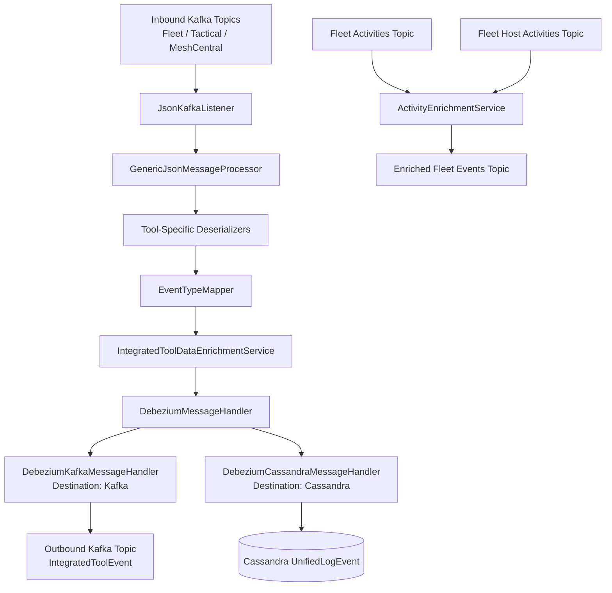
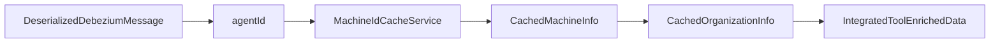
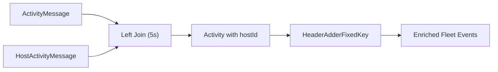
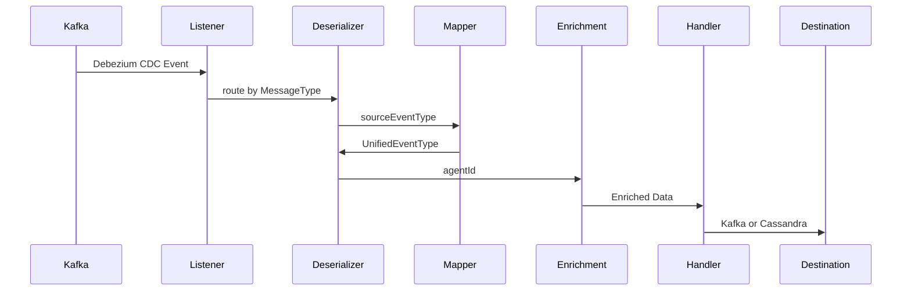

# Stream Processing Core

The **Stream Processing Core** module is the real-time event ingestion, normalization, enrichment, and distribution engine of the OpenFrame platform. It consumes change data capture (CDC) events from integrated tools (Fleet MDM, Tactical RMM, MeshCentral), transforms them into a unified event model, enriches them with organizational and device context, and routes them to downstream systems such as Kafka and Cassandra.

This module is part of the Stream Service and operates as the backbone for:

- Unified audit and activity logs  
- Real-time automation triggers  
- Device and user event tracking  
- Cross-tool normalization into a single event taxonomy  

It integrates with:

- [Data Transport Kafka](../data_transport_kafka/data_transport_kafka.md)  
- [Data Platform and Pinot Cassandra](../data_platform_and_pinot_cassandra/data_platform_and_pinot_cassandra.md)  
- [Data Cache Redis](../data_cache_redis/data_cache_redis.md)  

---

## High-Level Architecture



---

# Core Responsibilities

## 1. Kafka Configuration

### KafkaConfig

Provides Spring beans required for Kafka integration.

Key responsibility:

- Converts Kafka header `MESSAGE_TYPE_HEADER` from `byte[]` to `MessageType`

```java
@Bean
public Converter<byte[], MessageType> messageTypeConverter()
```

This allows dynamic routing of messages based on tool type.

---

## 2. Kafka Streams Processing

### KafkaStreamsConfig

Enables and configures Kafka Streams for stream-level joins and transformations.

Key configuration:

- `application.id` namespaced by `clusterId`
- At-least-once processing guarantee
- Single stream thread (controlled parallelism)
- Window configuration for joins
- Custom JSON Serdes for:
  - `ActivityMessage`
  - `HostActivityMessage`

Application ID logic:

```text
application.id = spring.application.name + "-" + clusterId
```

This ensures tenant isolation in SaaS deployments.

---

# Event Ingestion Layer

## JsonKafkaListener

Listens to inbound integrated tool topics:

- MeshCentral events  
- Tactical RMM events  
- Fleet MDM events  
- Fleet Query Result events  

```java
@KafkaListener(topics = { ... })
public void listenIntegratedToolsEvents(...)
```

The listener extracts the `MessageType` header and forwards the message to a processor.

---

# Tool-Specific Deserializers

Each integrated tool emits different event schemas. The Stream Processing Core normalizes them through specialized deserializers.

All extend:

```text
IntegratedToolEventDeserializer
```

### FleetEventDeserializer

- Extracts `agentId`, `activity_type`, `created_at`
- Maps activity types to human-readable messages via `FleetActivityTypeMapping`
- Converts ISO timestamps using `TimestampParser`

### FleetQueryResultEventDeserializer

- Handles scheduled/live query results
- Uses `FleetMdmCacheService` to resolve query names
- Produces structured JSON for:
  - `error`
  - `result`

### MeshCentralEventDeserializer

- Parses embedded JSON payload
- Extracts:
  - `nodeid`
  - `etype.action`
  - Mongo-style `$oid` identifiers

### TrmmAgentHistoryEventDeserializer

- Handles script and command execution lifecycle
- Uses `TacticalRmmCacheService` to resolve:
  - Script names
  - Agent IDs
- Distinguishes between started/finished events

### TrmmAuditEventDeserializer

- Parses Tactical audit logs
- Extracts object type + action
- Maps to unified types

---

# Event Normalization

## SourceEventTypes

Defines canonical constants for raw tool event types:

- `MeshCentral.*`
- `Tactical.*`
- `Fleet.*`

These are raw event identifiers.

---

## EventTypeMapper

Maps:

```text
IntegratedToolType + sourceEventType
        ↓
UnifiedEventType
```

Example:

```text
MESHCENTRAL:user.login → LOGIN
TACTICAL:agent.execute_script → SCRIPT_EXECUTED
FLEET:mdm_enrolled → MDM_ENROLLED
```

If no mapping exists:

```text
UnifiedEventType.UNKNOWN
```

This is the core abstraction layer that unifies heterogeneous tools.

---

# Data Enrichment

## IntegratedToolDataEnrichmentService

Adds contextual metadata using Redis caches:

- Machine ID
- Hostname
- Organization ID
- Organization Name

Flow:



If the agent is unknown, enrichment safely degrades.

---

# Message Handling Framework

## GenericMessageHandler

Template pattern implementation:

```text
handle()
  → validate
  → transform
  → determine operation
  → pushData()
```

Supports:

- CREATE
- READ
- UPDATE
- DELETE

---

## DebeziumMessageHandler

Specialized handler for CDC events.

Maps Debezium operation codes:

```text
"c" → CREATE
"r" → READ
"u" → UPDATE
"d" → DELETE
```

Delegates final processing to destination-specific handlers.

---

# Output Destinations

## DebeziumKafkaMessageHandler

Destination: Kafka  
Produces: `IntegratedToolEvent`

Responsibilities:

- Applies enrichment
- Builds broker key (deviceId-toolType)
- Publishes via `OssTenantRetryingKafkaProducer`
- Filters invisible events

---

## DebeziumCassandraMessageHandler

Destination: Cassandra  
Entity: `UnifiedLogEvent`

Transforms enriched event into:

```text
UnifiedLogEvent
  ├─ toolType
  ├─ eventType
  ├─ severity
  ├─ organization
  ├─ device
  └─ timestamp
```

Primary key structure includes:

- ingestDay
- toolType
- eventType
- eventTimestamp
- toolEventId

---

# Fleet Activity Stream Join

## ActivityEnrichmentService

Implements Kafka Streams join:

```text
activities topic
LEFT JOIN (5s window)
host_activities topic
```

Purpose:

- Add `hostId`
- Populate `agentId`
- Add required Kafka headers



Headers added:

- `MESSAGE_TYPE_HEADER = FLEET_MDM_EVENT`
- `__TypeId__ = CommonDebeziumMessage`

---

# Timestamp Handling

## TimestampParser

Utility to safely parse ISO 8601 timestamps:

```java
Instant.parse(timestamp)
```

Returns:

```text
Optional<Long> (epoch millis)
```

Ensures robust handling of malformed timestamps.

---

# End-to-End Flow Summary



---

# Design Characteristics

✅ Multi-tool support  
✅ CDC-driven architecture  
✅ Unified event taxonomy  
✅ Tenant-aware Kafka Streams  
✅ Pluggable enrichment  
✅ Multiple destination routing  
✅ Windowed stream joins  
✅ Idempotent Cassandra writes  

---

# How It Fits Into OpenFrame

The Stream Processing Core acts as the **event normalization backbone** between:

- Integrated tool data sources  
- Unified audit storage (Cassandra)  
- Downstream Kafka consumers  
- Analytics pipelines (Pinot)  
- API service event queries  

Without this module, each integrated tool would require custom logic in every downstream service. Instead, this module guarantees:

```text
One unified event model
One enrichment pipeline
One routing mechanism
Multiple consistent destinations
```

It is the critical real-time processing layer that powers observability, automation, and cross-tool intelligence across the OpenFrame platform.
