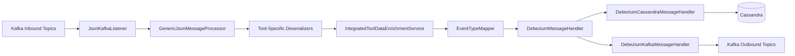
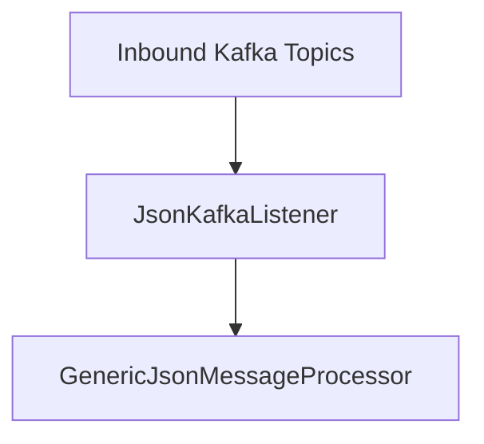
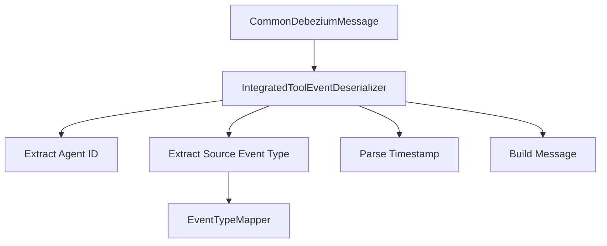
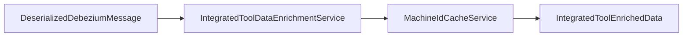
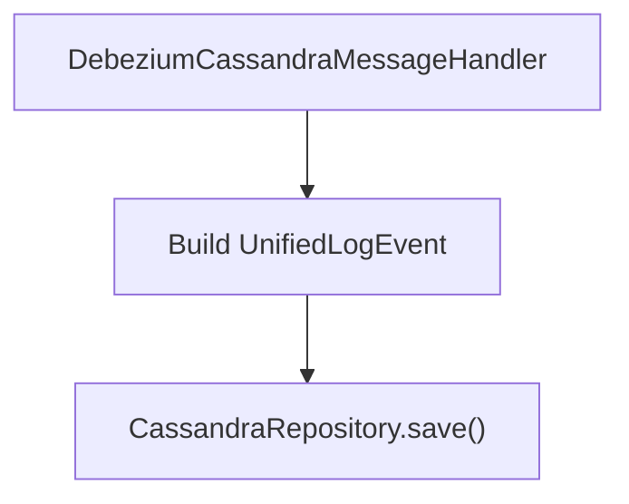
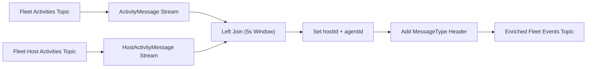
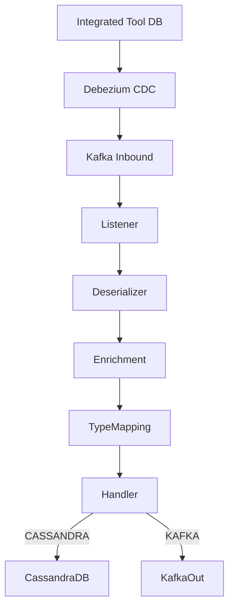

# Stream Processing Service Core

The **Stream Processing Service Core** module is the event ingestion and real-time transformation engine of the OpenFrame platform. It consumes change data capture (CDC) events and integrated tool events from Kafka, normalizes them into unified event types, enriches them with contextual metadata, and dispatches them to downstream destinations such as Cassandra and Kafka.

This module is responsible for:

- Consuming Debezium-based CDC streams from integrated tools (Fleet MDM, Tactical RMM, MeshCentral)
- Enriching events with device and organization metadata
- Mapping tool-specific event types to platform-wide unified event types
- Persisting normalized events to Cassandra
- Republishing enriched events to Kafka for further processing
- Performing stream joins using Kafka Streams for activity enrichment

It acts as the **real-time backbone** between external tools and OpenFrame’s analytics, audit, and event-driven subsystems.

---

## High-Level Architecture



### Key Responsibilities by Layer

| Layer | Responsibility |
|--------|----------------|
| Listener | Consumes raw Debezium events from Kafka |
| Deserializer | Extracts agent ID, timestamps, tool event type, message, details |
| Enrichment | Adds device, hostname, and organization metadata |
| Mapping | Converts tool-specific event types to UnifiedEventType |
| Handler | Routes and persists events to Cassandra or republishes to Kafka |
| Streams | Performs activity-to-host joins for Fleet MDM |

---

# Core Components

## 1. Kafka Configuration

### KafkaConfig
Provides:

- `Converter<byte[], MessageType>` for resolving `MessageType` from Kafka headers
- Header-based message routing support

This allows the system to dynamically determine which deserializer to use based on the `MESSAGE_TYPE_HEADER`.

---

### KafkaStreamsConfig
Enables and configures Kafka Streams processing.

Key configurations:

- `application.id` namespaced with cluster ID
- `AT_LEAST_ONCE` processing guarantee
- Controlled stream threads (1 thread)
- Window idle configuration for proper join closure
- JSON SerDes for:
  - `ActivityMessage`
  - `HostActivityMessage`

This configuration powers the Fleet activity enrichment pipeline.

---

## 2. Kafka Listener

### JsonKafkaListener

Consumes events from inbound topics:

- MeshCentral events
- Tactical RMM events
- Fleet MDM events
- Fleet MDM query result events



The listener:

- Reads `CommonDebeziumMessage`
- Extracts `MessageType` from headers
- Delegates to the JSON message processor

---

## 3. Tool-Specific Deserializers

Each integrated tool has a dedicated deserializer that:

- Extracts agent ID
- Extracts tool-specific event type
- Parses timestamp
- Builds human-readable message
- Extracts result/error payloads

### Implementations

- `FleetEventDeserializer`
- `FleetQueryResultEventDeserializer`
- `MeshCentralEventDeserializer`
- `TrmmAgentHistoryEventDeserializer`
- `TrmmAuditEventDeserializer`

### Deserialization Flow



Each deserializer returns a structured `DeserializedDebeziumMessage`.

---

## 4. Event Type Normalization

### EventTypeMapper

Maps:

- `IntegratedToolType` + source event string
- → `UnifiedEventType`

If no mapping exists, it defaults to `UNKNOWN`.

This ensures:

- Cross-tool normalization
- Unified analytics
- Consistent severity classification

Mapping examples:

- `MESHCENTRAL:user.login` → `LOGIN`
- `TACTICAL:agent.execute_script` → `SCRIPT_EXECUTED`
- `FLEET:user_logged_in` → `LOGIN`

---

## 5. Data Enrichment

### IntegratedToolDataEnrichmentService

Enriches events with contextual metadata using Redis cache:

- Machine ID
- Hostname
- Organization ID
- Organization Name



If a machine is not found in cache, enrichment gracefully degrades.

---

## 6. Message Handling & Routing

### GenericMessageHandler

Defines the template pattern:

- Validate message
- Transform message
- Determine operation type
- Push to destination

Operation mapping:

```text
c -> CREATE
r -> READ
u -> UPDATE
d -> DELETE
```

---

### DebeziumMessageHandler

Extends the generic handler with:

- Debezium operation parsing
- Typed transformation hook

---

### DebeziumCassandraMessageHandler

Destination: **Cassandra**

Transforms event into `UnifiedLogEvent`:

- Sets composite primary key
- Adds enriched metadata
- Stores raw Debezium payload
- Persists to Cassandra repository



---

### DebeziumKafkaMessageHandler

Destination: **Kafka**

- Builds `IntegratedToolEvent`
- Publishes to outbound topic
- Uses tenant-aware retrying producer
- Filters invisible events

Message broker key strategy:

```text
DeviceId-ToolType
UserId-ToolType
ToolType
```

---

## 7. Fleet Activity Enrichment (Kafka Streams)

### ActivityEnrichmentService

Performs real-time join between:

- `activities` topic
- `host_activities` topic

Join window:

```text
5 seconds (no grace)
```

### Join Flow



This enables:

- Host ID propagation into activity records
- Agent ID assignment from host
- Proper routing into the main event ingestion pipeline

---

# Data Models

## ActivityMessage
Typed Debezium wrapper for Fleet activities.

## HostActivityMessage
Typed Debezium wrapper for host activity records.

## HostActivity
Maps:

- `host_id`
- `activity_id`

---

# Timestamp Handling

### TimestampParser

All Debezium timestamps are ISO 8601 formatted.

The parser:

- Converts ISO 8601 string → epoch milliseconds
- Fails safely and logs warnings

---

# End-to-End Event Flow



---

# Design Characteristics

✅ Multi-tool normalization  
✅ Tenant-aware Kafka Streams configuration  
✅ Pluggable deserializer architecture  
✅ Template-based message handling  
✅ Redis-backed enrichment  
✅ Cassandra persistence  
✅ Kafka republishing  
✅ Real-time stream joins  

---

# Summary

The **Stream Processing Service Core** module is the real-time event normalization and routing engine of OpenFrame. It bridges external tool ecosystems and internal analytics infrastructure by:

- Transforming raw CDC streams
- Normalizing event semantics
- Enriching with contextual metadata
- Persisting and broadcasting unified events

It ensures that heterogeneous tool events become consistent, queryable, and actionable within the OpenFrame platform.
