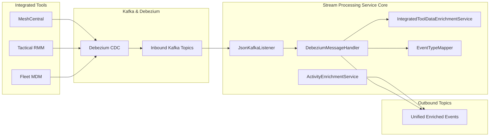
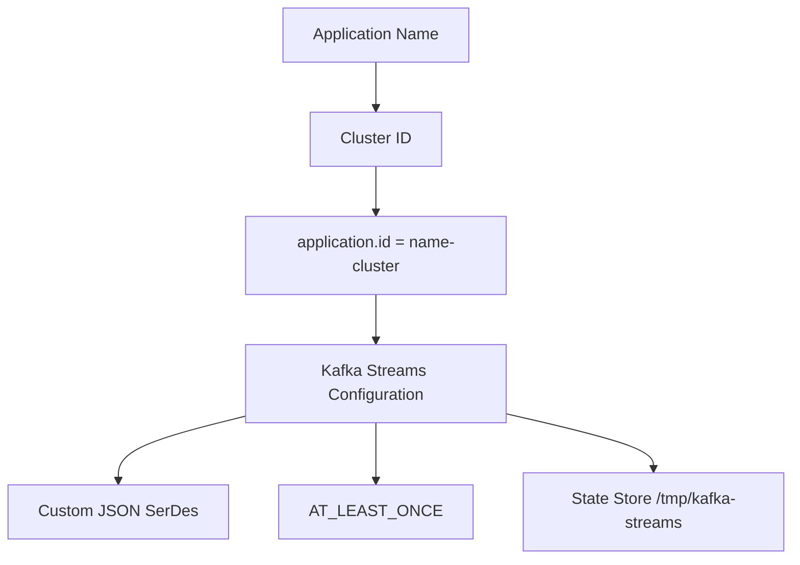
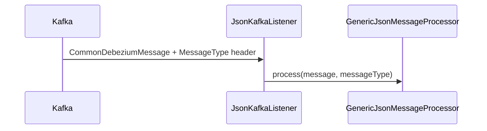
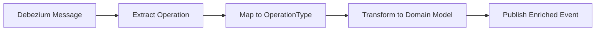
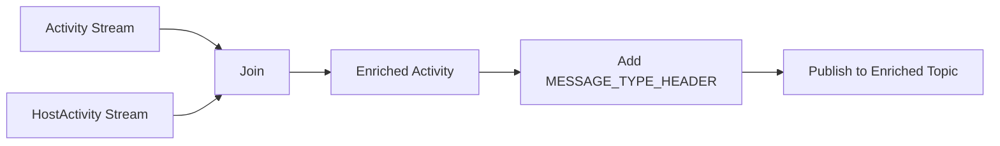
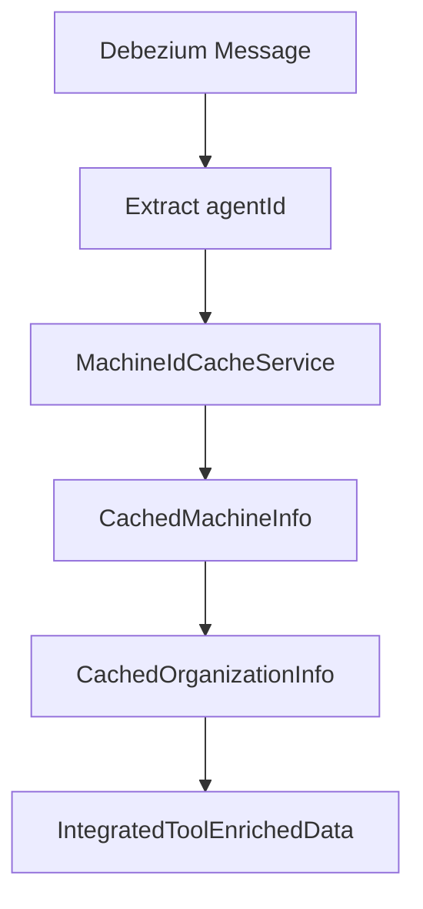

# Stream Processing Service Core

## Overview

The **Stream Processing Service Core** module is the event-driven backbone of the OpenFrame platform. It is responsible for consuming change data capture (CDC) and activity streams from integrated tools, enriching them with contextual metadata, normalizing event types, and publishing unified events for downstream services.

Built on **Spring Boot**, **Spring Kafka**, and **Kafka Streams**, this module transforms raw Debezium messages into enriched, standardized events that power analytics, activity timelines, automation, and cross-tool correlation across the platform.

This service primarily interacts with:

- [Data Persistence and Messaging Core](../data_persistence_and_messaging_core/data_persistence_and_messaging_core.md)
- [Management Service Core](../management_service_core/management_service_core.md)
- [API Service Core](../api_service_core/api_service_core.md)

---

## High-Level Responsibilities

The Stream Processing Service Core is responsible for:

- Consuming Debezium CDC messages from integrated tools (MeshCentral, Tactical RMM, Fleet MDM)
- Enriching events with machine and organization context
- Normalizing heterogeneous tool-specific event types into unified platform event types
- Performing real-time stream joins (e.g., activity + host activity)
- Republishing enriched events to Kafka for downstream services
- Ensuring tenant-aware Kafka Streams processing

---

## Architecture Overview



---

## Application Entry Point

### StreamApplication

The `StreamApplication` class bootstraps the service.

**Key characteristics:**

- `@SpringBootApplication`
- `@EnableKafka`
- Component scanning for:
  - `com.openframe.stream`
  - `com.openframe.data`
  - `com.openframe.kafka.producer`

This ensures tight integration with:

- Kafka infrastructure from the Data Persistence and Messaging Core
- Redis and Mongo repositories
- Kafka producers for publishing enriched events

---

## Kafka and Streams Configuration

### KafkaConfig

Provides custom converters such as:

- `Converter<byte[], MessageType>`

This allows extraction of the `MessageType` from Kafka headers and ensures correct routing of messages inside processors.

---

### KafkaStreamsConfig

Enables Kafka Streams processing using `@EnableKafkaStreams`.

#### Key Capabilities

- Tenant-aware `application.id` generation using `clusterId`
- Custom SerDes for:
  - `ActivityMessage`
  - `HostActivityMessage`
- At-least-once processing guarantee
- Controlled stream threading
- Explicit state directory configuration



This configuration ensures tenant isolation in SaaS deployments while preserving scalable stream processing semantics.

---

## Message Consumption Layer

### JsonKafkaListener

Consumes inbound events from tool-specific Kafka topics:

- MeshCentral events
- Tactical RMM events
- Fleet MDM events
- Fleet MDM query results



The listener delegates all logic to a generic processor abstraction, allowing extensible handling strategies based on message type.

---

## Debezium Message Handling

### DebeziumMessageHandler

An abstract base class that standardizes handling of Debezium CDC events.

#### Responsibilities

- Extract operation type (`c`, `u`, `d`, `r`)
- Convert to internal `OperationType` enum
- Provide extension hook: `transform(...)`



This abstraction ensures consistent processing across multiple integrated tools.

---

## Event Type Normalization

### EventTypeMapper

Maps tool-specific event names into platform-wide `UnifiedEventType` values.

Supported tools:

- MeshCentral
- Tactical RMM
- Fleet MDM

The mapping key format:

```text
<toolDbName>:<sourceEventType>
```

If no mapping exists, the event defaults to `UnifiedEventType.UNKNOWN`.

This provides:

- Cross-tool analytics compatibility
- Unified dashboards
- Simplified automation rules

---

## Activity Stream Enrichment

### ActivityEnrichmentService

Implements a Kafka Streams topology that joins:

- `fleet-mdm-activities`
- `fleet-mdm-host-activities`

#### Join Logic

- Keyed by `activityId`
- 5-second time window
- Left join semantics
- Adds host metadata into activity events
- Adds constant Kafka headers before publishing



This enables correlation between device-level actions and host metadata in real time.

---

## Integrated Tool Data Enrichment

### IntegratedToolDataEnrichmentService

Provides contextual enrichment using Redis-backed caches.

#### Enrichment Data

- Machine ID
- Hostname
- Organization ID
- Organization name

It uses `MachineIdCacheService` from the Data Persistence and Messaging Core to resolve:

- `agentId → machine`
- `machine → organization`



This allows all downstream services to operate on fully contextualized events.

---

## Timestamp Normalization

### TimestampParser

Utility class for parsing ISO 8601 timestamps (as emitted by Debezium).

```text
Input:  2024-01-01T12:34:56Z
Output: Epoch milliseconds (Long)
```

Provides:

- Safe parsing
- Optional return type
- Warning-level logging on parse failure

---

## Interaction with Other Modules

### Data Persistence and Messaging Core

Provides:

- Kafka infrastructure
- Mongo repositories
- Redis cache services
- Shared data models

Stream Processing Service Core depends heavily on this module for:

- Machine and organization resolution
- Kafka configuration
- Shared event models

---

### Management Service Core

Produces configuration and integration metadata that influences event semantics and processing behavior.

---

### API Service Core

Consumes enriched and normalized events for:

- Dashboards
- Activity timelines
- Analytics queries

---

## Multi-Tenant Stream Isolation

Kafka Streams `application.id` is dynamically built as:

```text
<spring.application.name>-<clusterId>
```

If `clusterId` is empty, it falls back to the application name.

This ensures:

- Tenant isolation
- Independent state stores
- Safe horizontal scaling

---

## Reliability and Processing Guarantees

- Processing guarantee: `AT_LEAST_ONCE`
- Configured batch size and linger settings
- Bounded poll record counts
- Join window idle handling (`MAX_TASK_IDLE_MS`)

This configuration balances:

- Throughput
- Reliability
- Real-time responsiveness

---

## Summary

The **Stream Processing Service Core** is the real-time transformation engine of OpenFrame.

It:

- Bridges external tool ecosystems into a unified event model
- Performs enrichment and normalization
- Enables cross-tool analytics and automation
- Operates in a tenant-aware, scalable Kafka Streams architecture

Without this module, the platform would lack a consistent, enriched, and correlated event stream across integrated MSP tools.