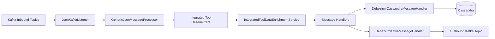
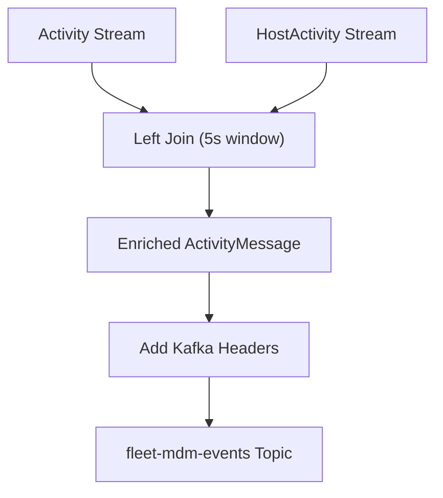
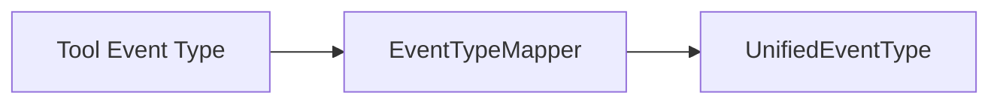
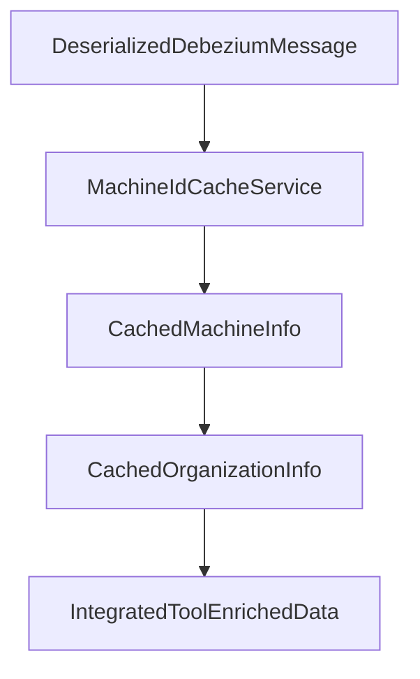
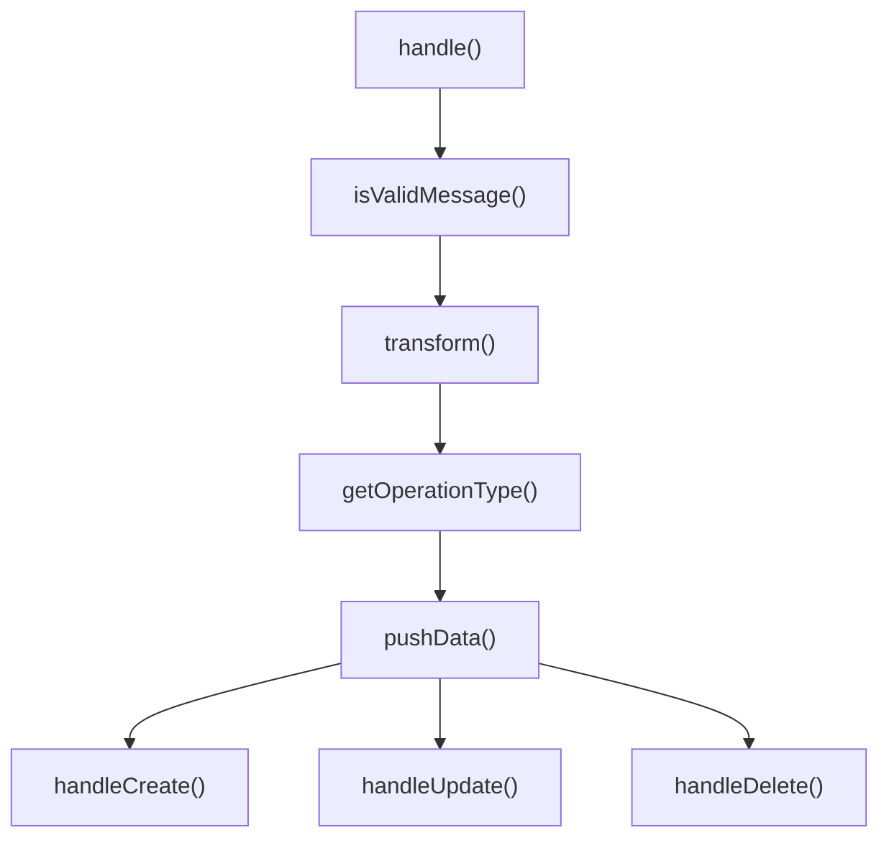
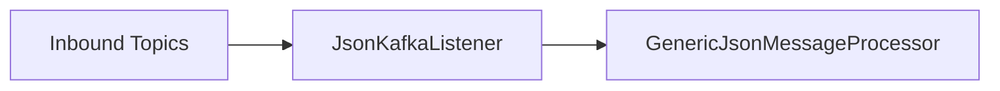
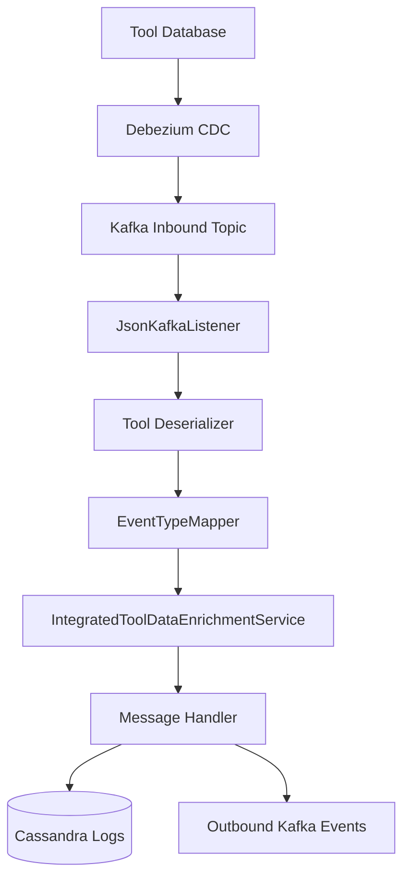

# Stream Processing Service Core

## Overview

The **Stream Processing Service Core** module is responsible for ingesting, transforming, enriching, and routing real-time events from integrated tools (Fleet MDM, Tactical RMM, MeshCentral, and others) into unified OpenFrame event streams and persistent storage.

It acts as the real-time backbone of the platform, converting raw Debezium change data capture (CDC) events into:

- ✅ Unified event types
- ✅ Enriched device and organization-aware events
- ✅ Cassandra log records
- ✅ Outbound Kafka integration events

This module is deployed through the `StreamApplication` entry point and integrates closely with:

- Kafka (data_messaging_kafka)
- Redis cache (data_cache_redis)
- Cassandra (data_platform_core)
- Mongo (indirectly via other services)

---

## High-Level Architecture



### Processing Responsibilities

1. Consume CDC events from integrated tool topics
2. Deserialize tool-specific payloads
3. Map source event types to `UnifiedEventType`
4. Enrich events with device + organization context
5. Route events to:
   - Cassandra (log persistence)
   - Kafka (integration event stream)

---

# 1. Kafka Configuration Layer

## KafkaConfig

Provides infrastructure configuration for Kafka consumers.

### Key Responsibility

- Registers a `Converter<byte[], MessageType>`
- Converts Kafka header `MESSAGE_TYPE_HEADER` into strongly typed `MessageType`

This enables header-based routing of events in downstream processors.

---

## KafkaStreamsConfig

Enables and configures **Kafka Streams** for stateful stream processing.

### Key Features

- Enables `@EnableKafkaStreams`
- Registers JSON SerDes for:
  - `ActivityMessage`
  - `HostActivityMessage`
- Configures:
  - `application.id` (cluster-aware)
  - At-least-once processing
  - Stream threads = 1
  - Join idle time configuration
  - Producer + consumer tuning

### Multi-Tenant Application ID

```text
application.id = <spring.application.name>-<clusterId>
```

Ensures isolation between tenants in SaaS deployments.

---

# 2. Kafka Streams Enrichment

## ActivityEnrichmentService

This service performs **stateful stream joins** between:

- `fleet-mdm-activities`
- `fleet-mdm-host-activities`

### Join Strategy



### Enrichment Logic

- Keyed by `activity_id`
- Adds `hostId`
- Sets `agentId = hostId`
- Adds Kafka headers:
  - `MESSAGE_TYPE_HEADER = FLEET_MDM_EVENT`
  - `__TypeId__ = CommonDebeziumMessage`

This ensures downstream consumers treat enriched activity messages as standard integrated tool events.

---

# 3. Deserialization Layer

All tool-specific deserializers extend `IntegratedToolEventDeserializer` and convert raw JSON into a normalized internal representation.

## Supported Tool Deserializers

| Tool | Deserializer | MessageType |
|------|--------------|-------------|
| Fleet MDM | FleetEventDeserializer | FLEET_MDM_EVENT |
| Fleet Query Results | FleetQueryResultEventDeserializer | FLEET_MDM_QUERY_RESULT_EVENT |
| MeshCentral | MeshCentralEventDeserializer | MESHCENTRAL_EVENT |
| Tactical RMM Agent History | TrmmAgentHistoryEventDeserializer | TACTICAL_RMM_AGENT_HISTORY_EVENT |
| Tactical RMM Audit | TrmmAuditEventDeserializer | TACTICAL_RMM_AUDIT_EVENT |

### Common Responsibilities

Each deserializer extracts:

- Agent ID
- Source event type
- Tool event ID
- Message
- Timestamp
- Optional result / error payload

---

## Example: FleetEventDeserializer

- Reads `activity_type`
- Maps it to human-readable message using `FleetActivityTypeMapping`
- Extracts `created_at` timestamp via `TimestampParser`

---

## Example: TrmmAgentHistoryEventDeserializer

Handles script and command execution lifecycle:

- Detects started vs finished
- Extracts stdout/stderr
- Builds structured result JSON
- Resolves agent ID via `TacticalRmmCacheService`

---

# 4. Event Type Normalization

## EventTypeMapper

Maps tool-specific event types to platform-wide `UnifiedEventType`.



### Mapping Key Format

```text
<tool_db_name>:<source_event_type>
```

Example:

```text
meshcentral:user.login -> LOGIN
fleet:created_policy -> POLICY_APPLIED
```

If no mapping exists, the system falls back to `UnifiedEventType.UNKNOWN`.

---

## FleetActivityTypeMapping

Provides human-readable summaries for Fleet activity types.

Used when constructing event messages before normalization.

---

# 5. Data Enrichment Layer

## IntegratedToolDataEnrichmentService

Enriches events with:

- Machine ID
- Hostname
- Organization ID
- Organization Name

### Data Source

Uses Redis via:

- `MachineIdCacheService`

### Enrichment Flow



If machine is not found:

- Event still flows
- Enrichment fields remain null
- Warning logged

---

# 6. Message Handling Layer

All handlers extend:

- `GenericMessageHandler`
- `DebeziumMessageHandler`

## GenericMessageHandler

Core orchestration logic:



Supports operations:

- CREATE
- READ
- UPDATE
- DELETE

Derived from Debezium operation codes (`c`, `r`, `u`, `d`).

---

## DebeziumCassandraMessageHandler

### Destination: Cassandra

Transforms into:

- `UnifiedLogEvent`

Sets:

- Composite key (ingestDay, toolType, eventType, timestamp)
- Severity
- Message
- Details

Then persists via `CassandraRepository`.

---

## DebeziumKafkaMessageHandler

### Destination: Kafka

Transforms into:

- `IntegratedToolEvent`

Publishes to:

```text
openframe.oss-tenant.kafka.topics.outbound.integrated-tool-events
```

Message key strategy:

```text
<deviceId>-<toolType>
OR
<userId>-<toolType>
```

Ensures partition affinity by device or user.

---

# 7. Kafka Listener Entry Point

## JsonKafkaListener

Consumes inbound topics:

- meshcentral-events
- tactical-rmm-events
- fleet-mdm-events
- fleet-mdm-query-result-events



Uses header:

- `KafkaHeader.MESSAGE_TYPE_HEADER`

To determine which deserializer to apply.

---

# 8. Timestamp Handling

## TimestampParser

Utility to parse ISO 8601 timestamps into epoch milliseconds.

```text
2024-01-01T10:15:30Z -> 1704104130000
```

All integrated tool timestamps are normalized using this utility.

---

# 9. End-to-End Event Flow



---

# Design Characteristics

## ✅ Tool-Agnostic Processing

- New tool support only requires:
  - New deserializer
  - Event type mappings

No core pipeline changes required.

---

## ✅ Unified Event Model

All events converge into:

- `UnifiedEventType`
- `UnifiedLogEvent`
- `IntegratedToolEvent`

This enables consistent reporting and auditing across tools.

---

## ✅ Multi-Tenant Ready

- Kafka Streams `application.id` namespaced by cluster
- Topic names tenant-aware
- Redis cache scoped per tenant

---

## ✅ Separation of Concerns

| Layer | Responsibility |
|-------|----------------|
| Listener | Kafka consumption |
| Deserializer | Tool-specific parsing |
| Mapper | Event normalization |
| Enrichment | Device & org resolution |
| Handler | Destination routing |
| Streams | Stateful joins |

---

# Conclusion

The **Stream Processing Service Core** is the real-time transformation engine of OpenFrame.

It:

- Converts raw CDC events into structured platform events
- Normalizes disparate tool event taxonomies
- Enriches events with device and organization metadata
- Persists logs in Cassandra
- Publishes integration-ready Kafka events

This architecture ensures:

- Scalability
- Tool extensibility
- Multi-tenant isolation
- Consistent audit logging across the platform
