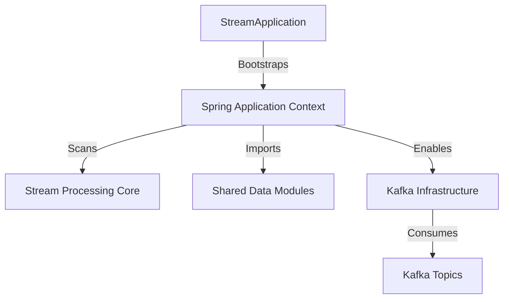
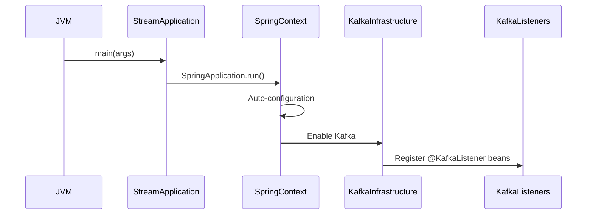
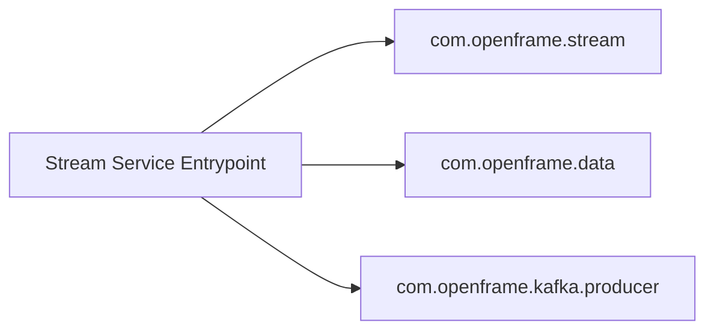
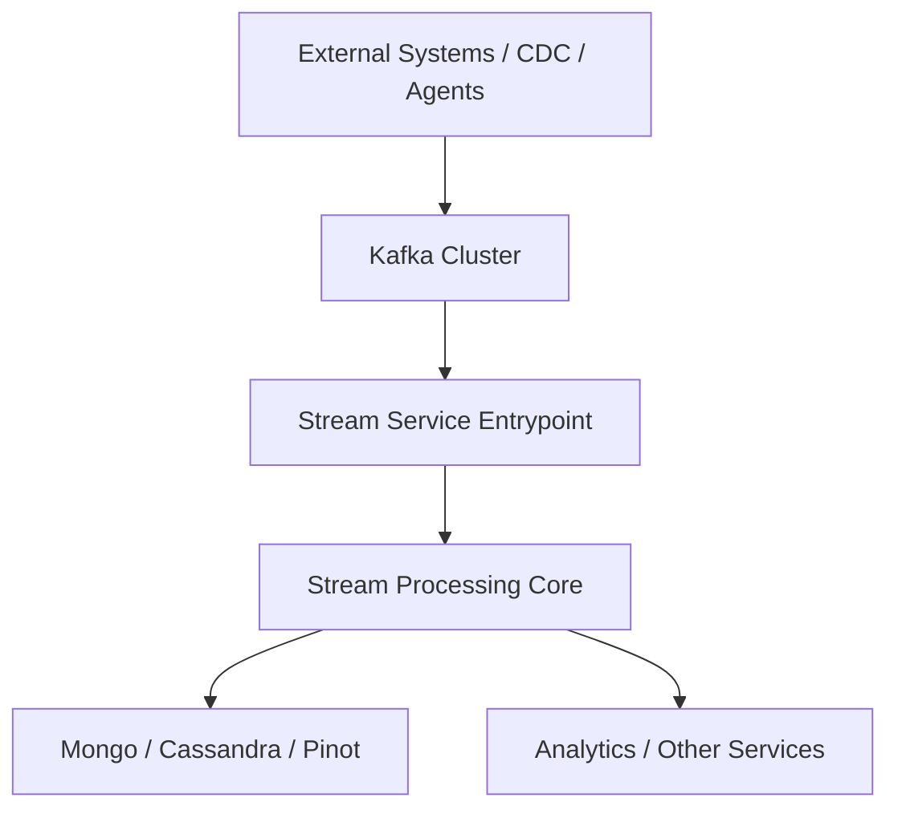

# Stream Service Entrypoint

The **Stream Service Entrypoint** module is the bootstrap layer for the OpenFrame Stream Service. It is responsible for initializing the Spring Boot runtime, enabling Kafka integration, and wiring together stream-processing components from the core streaming libraries and shared data modules.

While the heavy stream logic lives in the Stream Processing Core module, this module defines how the service starts, what packages are scanned, and which infrastructure capabilities (such as Kafka listeners) are activated.

---

## Purpose and Responsibilities

The Stream Service Entrypoint module:

- Boots the Stream microservice using Spring Boot
- Enables Kafka consumer infrastructure
- Registers component scanning across stream, data, and Kafka producer packages
- Acts as the deployment unit for event-driven processing

It contains a single primary class:

- `StreamApplication`

This class defines the runtime boundary of the Stream Service.

---

## Core Component: StreamApplication

```java
@SpringBootApplication
@EnableKafka
@ComponentScan(basePackages = {
        "com.openframe.stream",
        "com.openframe.data",
        "com.openframe.kafka.producer"
})
public class StreamApplication {

    public static void main(String[] args) {
        SpringApplication.run(StreamApplication.class, args);
    }
}
```

### Key Annotations

#### @SpringBootApplication

- Enables auto-configuration
- Activates component scanning
- Registers Spring Boot lifecycle management

#### @EnableKafka

- Enables detection of `@KafkaListener` methods
- Activates Kafka listener containers
- Integrates with Spring Kafka infrastructure

#### @ComponentScan

The application explicitly scans three base packages:

- `com.openframe.stream` → Stream processing components
- `com.openframe.data` → Shared data models, repositories, and platform integrations
- `com.openframe.kafka.producer` → Kafka producer utilities and retry handlers

This ensures that stream handlers, deserializers, enrichment services, and Kafka producers are all registered in the application context.

---

## High-Level Architecture

The Stream Service Entrypoint sits at the boundary between the runtime container and the stream-processing logic.



### Relationship to Stream Processing Core

All Kafka listeners, deserializers, handlers, and enrichment services are implemented in the Stream Processing Core module:

- [Stream Processing Core](stream_processing_core.md)

The Stream Service Entrypoint provides the runtime shell that activates and wires those components together.

---

## Runtime Initialization Flow

When the service starts:



### Step-by-Step Breakdown

1. The JVM invokes `main()`.
2. `SpringApplication.run()` initializes the Spring container.
3. Auto-configuration registers infrastructure beans.
4. Kafka support is enabled via `@EnableKafka`.
5. All Kafka listener beans discovered in scanned packages are registered.
6. The service begins consuming messages.

---

## Component Scanning Boundaries

The explicit `@ComponentScan` defines architectural boundaries.



### Why Explicit Scanning Matters

- Prevents accidental classpath-wide scanning
- Ensures only intended modules are loaded
- Supports modular microservice packaging
- Keeps stream service independent from unrelated services (API, Gateway, Management, etc.)

---

## Role in the Overall Platform

Within the OpenFrame architecture, the Stream Service:

- Consumes domain events from Kafka
- Processes and enriches activity data
- Handles Debezium change streams
- Publishes transformed or enriched messages
- Feeds analytics pipelines and persistence layers

The Stream Service Entrypoint is the executable unit deployed in containers or Kubernetes environments.



---

## Deployment Model

This module represents a standalone microservice:

- Packaged as a Spring Boot application
- Runs independently from API, Gateway, and Authorization services
- Horizontally scalable
- Kafka-consumer driven

Because Kafka consumer groups manage partition assignment, scaling multiple instances allows:

- Parallel stream processing
- Fault tolerance
- Automatic rebalancing

---

## Observability and Lifecycle

Through Spring Boot auto-configuration, the service inherits:

- Health indicators (including Kafka health)
- Logging configuration
- Metrics exposure (if enabled via Actuator)

Startup failures typically occur if:

- Kafka is unreachable
- Required configuration properties are missing
- Core stream beans fail during initialization

---

## Summary

The **Stream Service Entrypoint** module is intentionally minimal yet architecturally critical.

It:

- Defines the runtime boundary of the Stream Service
- Enables Kafka-driven event processing
- Wires stream logic, data integrations, and Kafka producers
- Serves as the deployable unit of the streaming subsystem

All business and event-processing logic resides in the Stream Processing Core module, while this module ensures that the infrastructure and runtime environment are correctly initialized and managed.