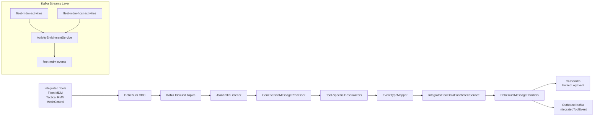
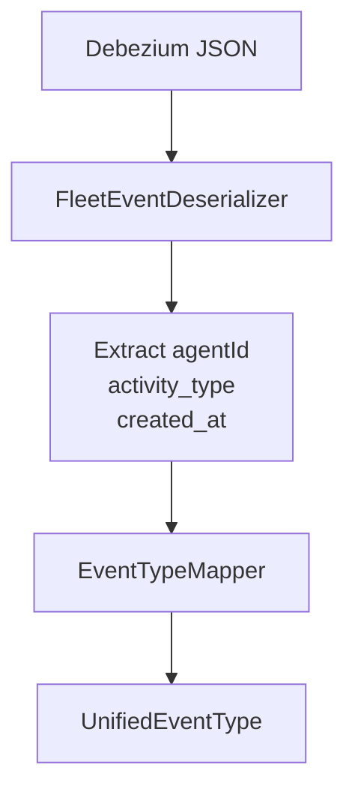
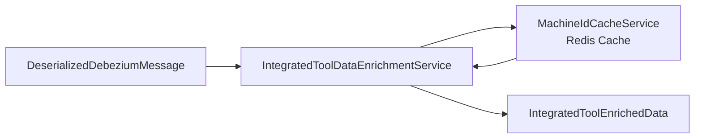
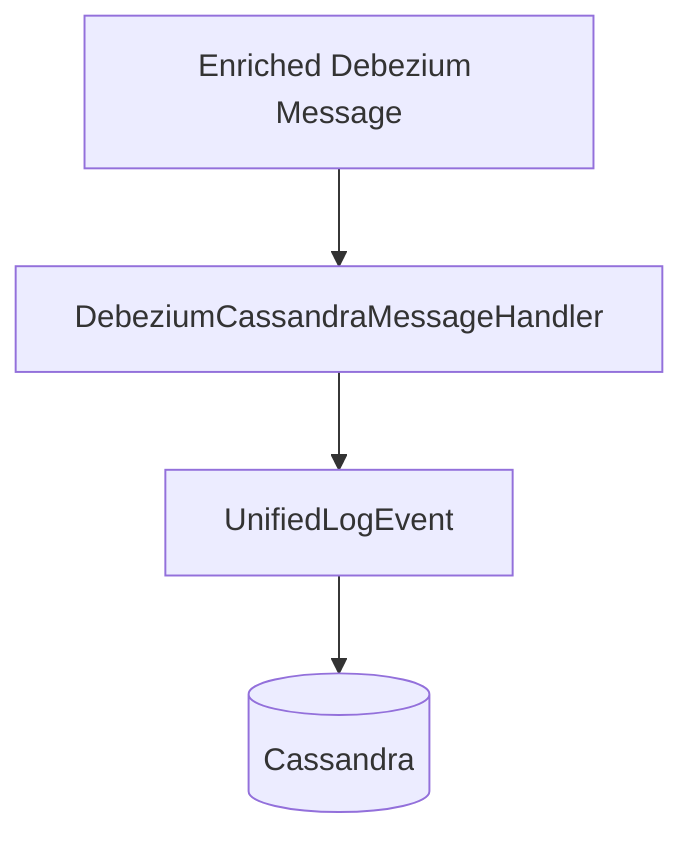
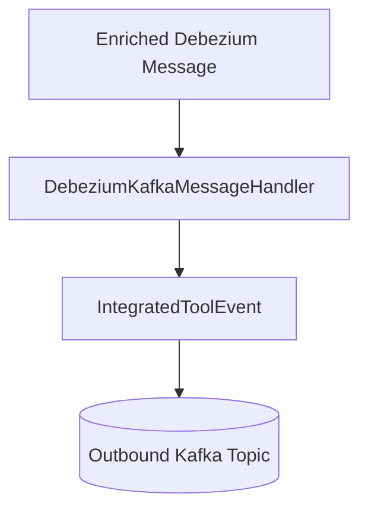
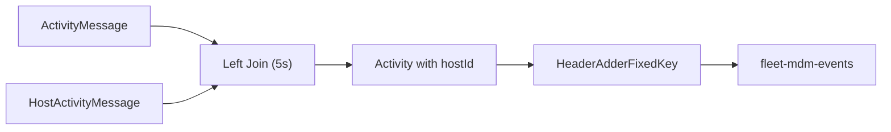
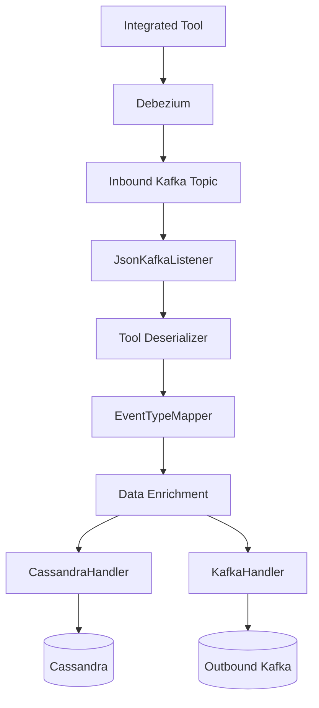

# Stream Service Kafka Debezium Enrichment

## Overview

The **Stream Service Kafka Debezium Enrichment** module is the real-time event processing backbone of OpenFrame. It consumes Change Data Capture (CDC) events from integrated tools (Fleet MDM, Tactical RMM, MeshCentral) via Kafka, enriches them with platform context, normalizes them into unified event types, and forwards them to downstream systems such as Cassandra and Kafka.

This module is responsible for:

- Consuming Debezium CDC messages from tool-specific Kafka topics
- Deserializing tool-specific payloads into structured domain models
- Mapping source event types to platform-wide `UnifiedEventType`
- Enriching events with machine and organization context
- Persisting normalized events to Cassandra
- Publishing enriched events to outbound Kafka topics
- Performing Kafka Streams joins for Fleet activity enrichment

It acts as the **real-time event normalization and enrichment layer** between integrated tools and the rest of the OpenFrame platform.

---

## High-Level Architecture



---

## Core Responsibilities

### 1. Kafka Configuration

#### `KafkaConfig`
- Registers a `Converter<byte[], MessageType>`
- Converts Kafka header values into strongly typed `MessageType`
- Ensures inbound events are correctly routed to tool-specific deserializers

#### `KafkaStreamsConfig`
- Enables Kafka Streams (`@EnableKafkaStreams`)
- Configures:
  - Application ID (optionally namespaced per cluster/tenant)
  - Serialization (String keys, JSON values)
  - At-least-once processing
  - State store directory
  - Producer/consumer tuning
- Registers custom `Serde` instances for:
  - `ActivityMessage`
  - `HostActivityMessage`

This configuration powers the Fleet activity enrichment pipeline.

---

### 2. Kafka Listener Layer

#### `JsonKafkaListener`

Consumes Debezium messages from inbound topics:

- `meshcentral-events`
- `tactical-rmm-events`
- `fleet-mdm-events`
- `fleet-mdm-query-result-events`

Each message includes a Kafka header containing `MessageType`. The listener delegates processing to a `GenericJsonMessageProcessor`, which:

1. Selects the correct deserializer
2. Produces a `DeserializedDebeziumMessage`
3. Triggers enrichment and downstream handlers

---

## Tool-Specific Deserialization

All tool deserializers extend a shared base class (via `IntegratedToolEventDeserializer`) and extract:

- Agent ID
- Source event type
- Tool event ID
- Message summary
- Timestamp
- Error/result details

### Implementations

| Tool | Deserializer | MessageType |
|------|-------------|------------|
| Fleet MDM | `FleetEventDeserializer` | `FLEET_MDM_EVENT` |
| Fleet Query | `FleetQueryResultEventDeserializer` | `FLEET_MDM_QUERY_RESULT_EVENT` |
| MeshCentral | `MeshCentralEventDeserializer` | `MESHCENTRAL_EVENT` |
| Tactical RMM (History) | `TrmmAgentHistoryEventDeserializer` | `TACTICAL_RMM_AGENT_HISTORY_EVENT` |
| Tactical RMM (Audit) | `TrmmAuditEventDeserializer` | `TACTICAL_RMM_AUDIT_EVENT` |

### Example: Fleet Event Flow



The deserializer:

- Maps Fleet `activity_type` values
- Uses `FleetActivityTypeMapping` for human-readable messages
- Parses ISO 8601 timestamps via `TimestampParser`

---

## Event Type Normalization

### `EventTypeMapper`

This component translates tool-specific event types into platform-wide `UnifiedEventType` values.

Mapping key format:

```text
tool_db_name:source_event_type
```

If no mapping is found:

```text
UnifiedEventType.UNKNOWN
```

This ensures all downstream systems operate on a unified semantic model regardless of source tool.

---

## Data Enrichment Layer

### `IntegratedToolDataEnrichmentService`

After deserialization, events are enriched with:

- Machine ID
- Hostname
- Organization ID
- Organization name

Data source:

- Redis-backed `MachineIdCacheService`



If no machine is found, the event proceeds without enrichment but logs a warning.

---

## Message Handling Abstraction

### `GenericMessageHandler<T, U, V>`

Base handler responsible for:

1. Validating messages
2. Transforming them
3. Determining operation type (`CREATE`, `READ`, `UPDATE`, `DELETE`)
4. Dispatching to correct persistence method

### `DebeziumMessageHandler`

Adds CDC operation parsing:

```text
c -> CREATE
r -> READ
u -> UPDATE
d -> DELETE
```

---

## Downstream Destinations

Two primary handlers process enriched events:

### 1. `DebeziumCassandraMessageHandler`

Transforms events into `UnifiedLogEvent` and writes to Cassandra.

Key fields:

- Ingest day
- Tool type
- Unified event type
- Timestamp
- Organization context
- Severity



### 2. `DebeziumKafkaMessageHandler`

Publishes normalized `IntegratedToolEvent` to outbound Kafka topic.

Features:

- Tenant-aware producer
- Retry support
- Visibility filtering
- Device/User-based partition key



---

## Fleet Activity Enrichment (Kafka Streams)

### `ActivityEnrichmentService`

Performs a Kafka Streams left join between:

- `fleet-mdm-activities`
- `fleet-mdm-host-activities`

Goal:

- Attach `hostId` to activity
- Set `agentId` from host
- Add required Kafka headers

Join characteristics:

- Window: 5 seconds
- Left join
- At-least-once processing



This ensures Fleet activity events have complete device context before entering the main ingestion pipeline.

---

## Core Domain Models

### `ActivityMessage`
Typed Debezium message wrapping `Activity`.

### `HostActivityMessage`
Typed Debezium message wrapping `HostActivity`.

### `HostActivity`
Contains:
- `hostId`
- `activityId`

These typed models replace generic JSON nodes in Kafka Streams processing.

---

## End-to-End Processing Flow



---

## Design Principles

- **Tool-agnostic normalization** – All tool events become unified types
- **Pluggable deserializers** – New tools can be added without modifying core pipeline
- **CDC-first architecture** – Database changes drive event generation
- **Stateless enrichment** – Context resolved via Redis cache
- **Dual destination** – Events are persisted and streamed simultaneously
- **Tenant-aware processing** – Kafka Streams application ID and producers are cluster-aware

---

## Role Within OpenFrame

The Stream Service Kafka Debezium Enrichment module acts as:

- The **real-time integration bridge** between external tools and OpenFrame
- The **normalization engine** for event semantics
- The **enrichment layer** for organization and device context
- The **fan-out hub** for storage (Cassandra) and streaming (Kafka)

Without this module, the platform would lack:

- Unified event semantics
- Organization-aware device logs
- Cross-tool event consistency
- Real-time analytics feed

It is a critical part of the OpenFrame event-driven architecture.
