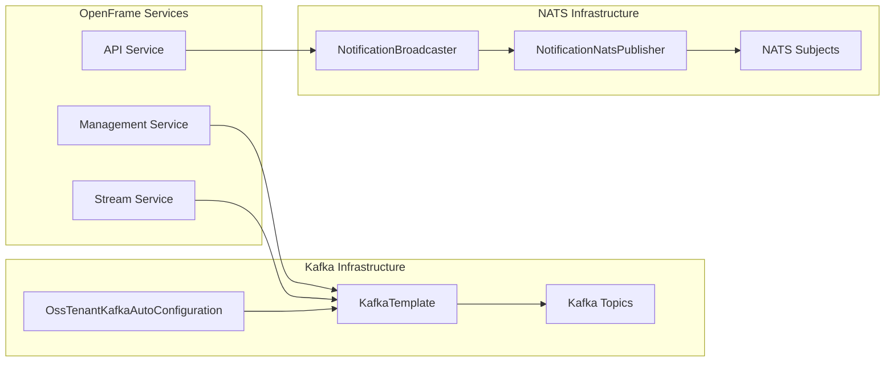
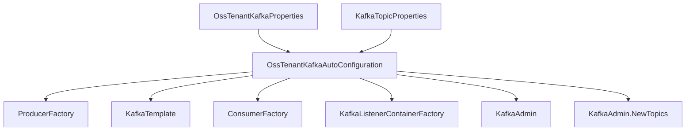
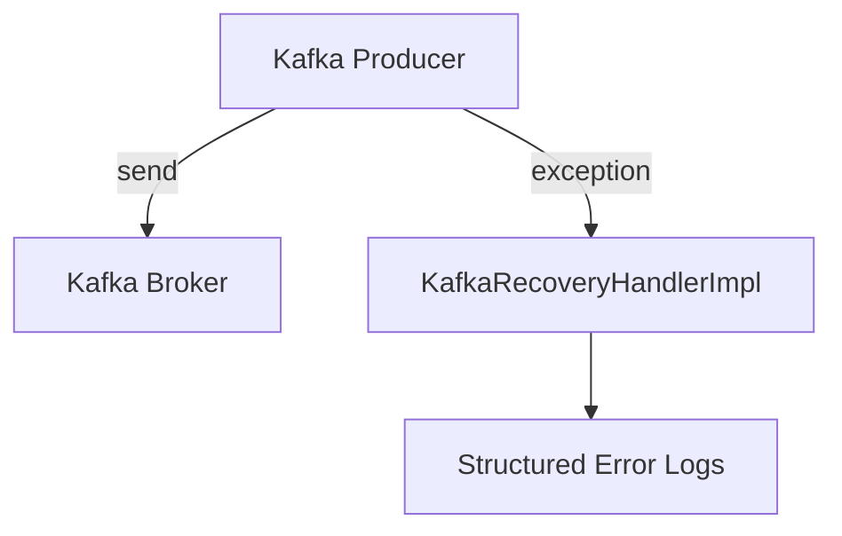
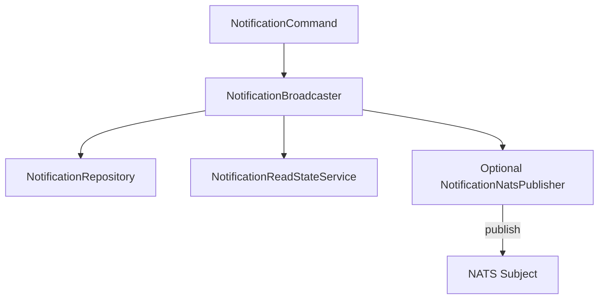
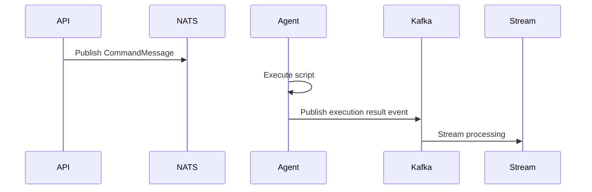

# Tenant Messaging Nats And Kafka

The **Tenant Messaging Nats And Kafka** module provides the messaging backbone for tenant-scoped communication across the OpenFrame platform. It encapsulates:

- Multi-tenant Kafka configuration and topic management
- Standardized Kafka producer and consumer infrastructure
- NATS-based real-time messaging for agents, users, and machines
- Structured notification broadcasting and command delivery
- Resilient error handling for message publishing

This module acts as the integration layer between:

- Core services (API, Management, Stream)
- External agents and tools
- Real-time user and machine notification channels
- Kafka-based event streaming pipelines

It is intentionally infrastructure-focused and does not implement business logic. Instead, it provides reusable building blocks used by higher-level services.

---

## Architectural Overview

Tenant Messaging Nats And Kafka combines two messaging paradigms:

- **Kafka** → Durable, high-throughput, stream-oriented processing
- **NATS** → Low-latency, real-time, subject-based communication



Kafka is used for event ingestion, enrichment, and durable processing.
NATS is used for immediate delivery to connected clients and agents.

---

## Core Responsibilities

### 1. Multi-Tenant Kafka Configuration

The module replaces Spring Boot’s default Kafka auto-configuration and introduces a tenant-aware Kafka setup.

Key components:

- `OssKafkaConfig` – Disables default Kafka auto-configuration
- `OssTenantKafkaProperties` – Binds `spring.oss-tenant.*` properties
- `OssTenantKafkaAutoConfiguration` – Creates all Kafka infrastructure beans
- `KafkaTopicProperties` – Defines auto-created inbound topics

### Kafka Bean Graph



### Topic Management

`KafkaTopicProperties` supports declarative topic configuration:

- Auto-creation enabled by default
- Per-topic partitions
- Per-topic replication factor
- Inbound topic grouping

Topics are registered via `KafkaAdmin.NewTopics` when the admin feature is enabled.

---

## Kafka Producer & Error Recovery

### KafkaHeader

Defines standard headers such as:

- `message-type`

This allows consumers to deserialize polymorphic events safely.

### KafkaRecoveryHandlerImpl

Provides structured error handling when message publishing fails.

Responsibilities:

- Logs topic, key, and payload
- Attaches exception class and message
- Ensures failures are observable without crashing upstream logic



The recovery handler is intentionally lightweight. It does not requeue automatically but ensures failures are visible for observability and alerting systems.

---

## NATS Real-Time Messaging

NATS is used for low-latency, subject-based communication between backend services and connected agents or clients.

### Messaging Patterns

- `user.{userId}.notification`
- `machine.{machineId}.notification`
- `machine.{machineId}.command-execution`

### Notification Flow



The process is:

1. Validate notification input via `NotificationCommand`
2. Persist notification document
3. Create read states for users and machines
4. Publish to NATS (if enabled)
5. Clients reconcile via GraphQL if NATS delivery fails

If NATS is disabled, notifications are still persisted and later retrieved via API queries.

---

## Notification Subsystem

### NotificationCommand

An immutable, validated command object that ensures:

- Title is non-blank
- Severity is defined
- Context is defined and typed
- At least one audience (admins or machines) is present

This guarantees structural correctness before any persistence or messaging occurs.

### NotificationBroadcaster

Central orchestration component.

Responsibilities:

- Builds Notification domain object
- Persists via `NotificationRepository`
- Creates recipient read-state entries
- Publishes via `NotificationNatsPublisher`
- Performs rollback if audience creation fails

It ensures storage consistency by deleting orphaned notifications when read-state creation fails.

---

## Agent & Tool Messaging Models

The module defines structured NATS payloads for agent communication:

### CommandMessage

Used for ad-hoc command execution.

Fields include:

- `executionId`
- `code`
- `shell`
- `privilegeLevel`
- `timeout`

Subject format:

```text
machine.{machineId}.command-execution
```

### CancelMessage

Sent to abort in-flight execution.

### InstalledAgentMessage

Used when agents register or update installation state.

### ToolInstallationMessage

Rich installation payload including:

- Tool metadata
- Assets
- Download configurations
- Command arguments
- Reinstall flag

### ToolAgentUpdateMessage

Handles version updates and asset refresh.

### ToolConnectionMessage

Indicates tool connection state changes.

### ClientConnectionEvent

Represents client connectivity events for monitoring and telemetry.

---

## End-to-End Command Execution Example



This demonstrates the hybrid model:

- NATS → real-time command delivery
- Kafka → durable event processing

---

## Configuration Model

### OSS Tenant Kafka Properties

Prefix:

```text
spring.oss-tenant.*
```

Controls:

- Enable/disable Kafka integration
- Bootstrap servers
- Producer/consumer settings
- Listener concurrency
- Acknowledgment mode
- Template defaults

### Topic Properties

Prefix:

```text
openframe.oss-tenant.kafka.topics.*
```

Allows declarative inbound topic configuration.

---

## Fault Tolerance & Degradation Strategy

The module is designed to degrade gracefully:

- If NATS publishing fails → notifications remain queryable via API
- If audience creation fails → notification document is rolled back
- If Kafka publishing fails → recovery handler logs structured error
- If Kafka admin disabled → topics must exist externally

This ensures:

- No silent data loss
- Observable failure modes
- Consistent storage state

---

## Relationship to Other Platform Modules

Tenant Messaging Nats And Kafka supports:

- API services for user-triggered actions
- Management services for scheduled and orchestration events
- Stream services for Kafka-based processing
- Authorization and multi-tenant boundary enforcement
- Data persistence layers for notification and tenant-scoped data

It does not implement business logic but enables event-driven architecture across the entire OpenFrame tenant runtime.

---

## Summary

Tenant Messaging Nats And Kafka is the messaging foundation of the OpenFrame multi-tenant architecture.

It provides:

- Tenant-aware Kafka configuration
- Declarative topic management
- Structured producer/consumer infrastructure
- Real-time NATS notification delivery
- Agent command and lifecycle messaging models
- Safe recovery and graceful degradation patterns

By cleanly separating durable event streaming (Kafka) from real-time subject messaging (NATS), the module enables a scalable, resilient, and extensible messaging layer for all tenant services.