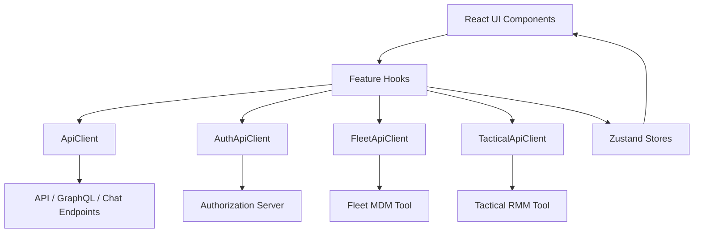
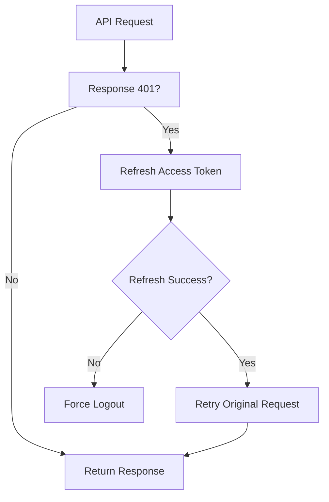
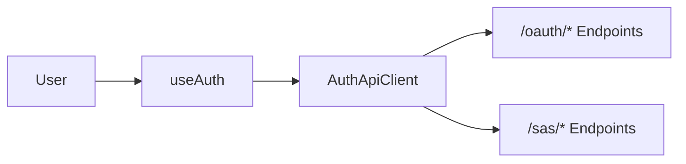
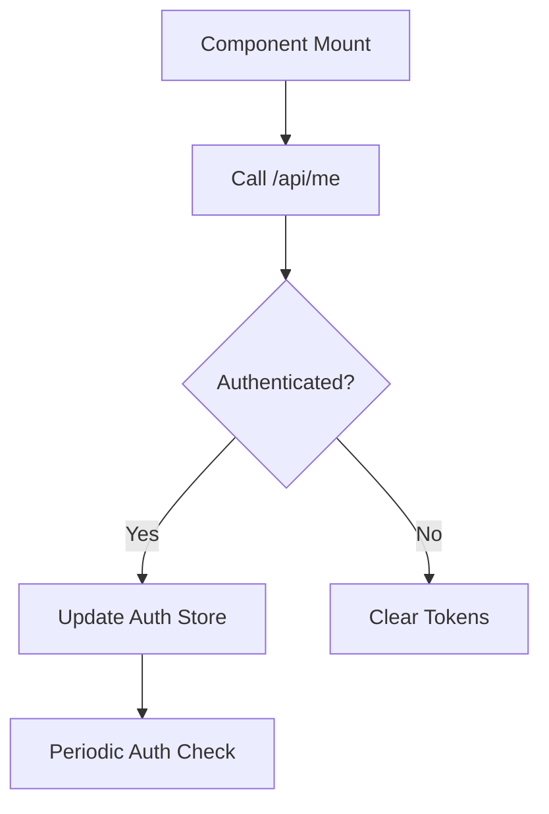
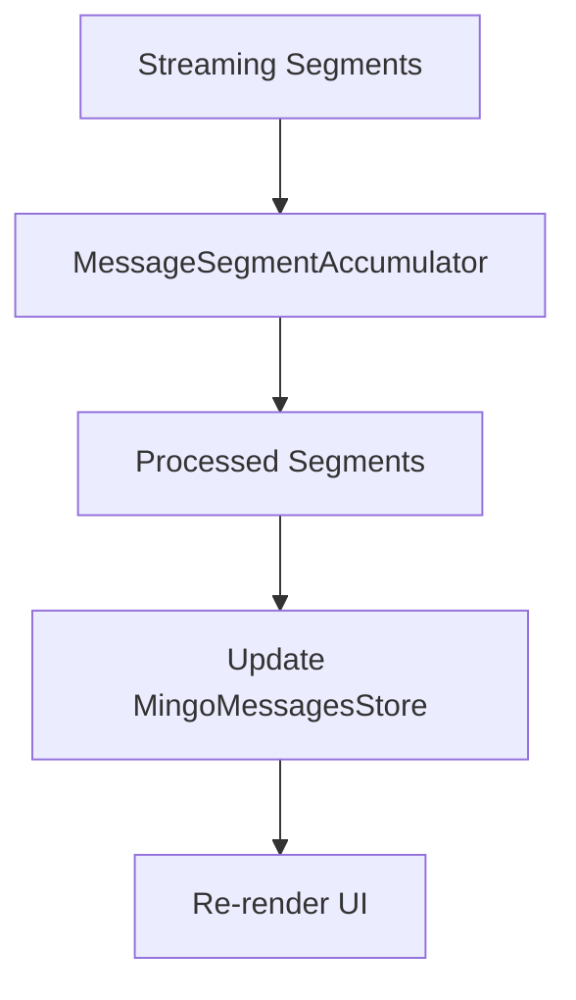
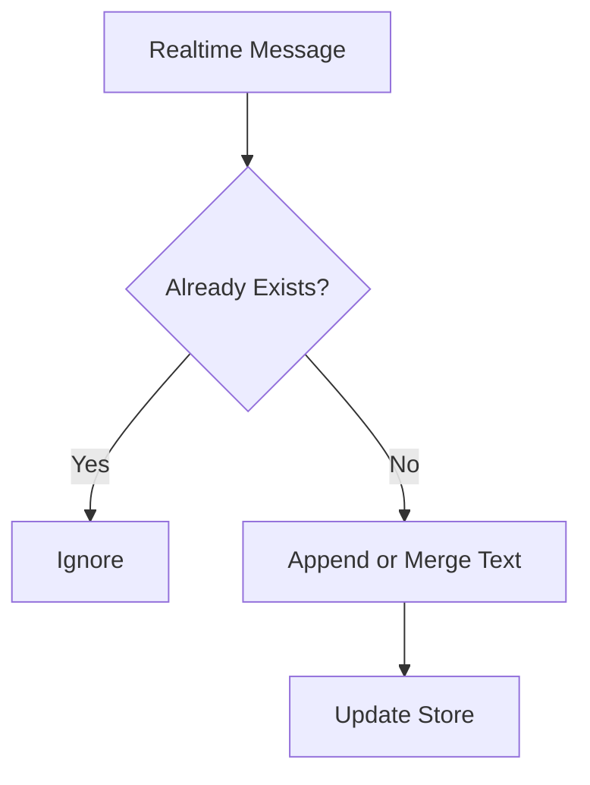
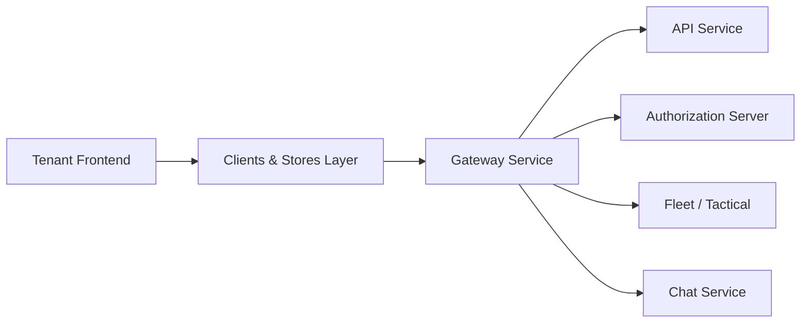

# Tenant Frontend Service Core Clients And Stores

The **Tenant Frontend Service Core Clients And Stores** module provides the foundational client-side infrastructure for the OpenFrame Tenant frontend application. It centralizes:

- HTTP communication (REST + GraphQL)
- Authentication and token lifecycle management
- Tool-specific API clients (Fleet, Tactical RMM)
- AI chat (Mingo) integration
- Dialog and message state management via Zustand

This module acts as the **frontend integration layer** between the UI and backend services such as the API Service, Authorization Server, Gateway, and Chat services.

---

## 1. Architectural Overview

At a high level, this module organizes frontend communication and state into four main layers:

1. **Core HTTP Clients** – `ApiClient`, `AuthApiClient`
2. **Tool-Specific Clients** – Fleet and Tactical
3. **Feature Hooks & Services** – Auth, Tickets, Mingo
4. **State Stores** – Dialog and message state (Zustand)

### High-Level Architecture



The module ensures:

- Centralized authentication handling
- Automatic token refresh and retry
- Consistent error handling
- Typed API responses
- Predictable state management

---

# 2. Core API Infrastructure

## 2.1 ApiClient

**Core Component:**
- `ApiClient`

The `ApiClient` is the primary HTTP abstraction for authenticated requests.

### Responsibilities

- Build full URLs based on tenant runtime configuration
- Support cookie-based and header-based authentication
- Automatically refresh tokens on `401`
- Queue concurrent requests during refresh
- Force logout on refresh failure
- Normalize responses into:

```text
ApiResponse<T> {
  data?: T
  error?: string
  status: number
  ok: boolean
}
```

### Token Refresh Flow



### Key Features

- Supports `GET`, `POST`, `PUT`, `PATCH`, `DELETE`
- Always sends `credentials: include` for cookie auth
- DevTicket mode: attaches `Authorization: Bearer <token>` from localStorage
- Prevents infinite auth loops on `/auth` routes

This client is used by:

- Ticket GraphQL hooks
- Mingo chat
- Tool API clients
- General REST endpoints

---

## 2.2 AuthApiClient

**Core Component:**
- `AuthApiClient`

The `AuthApiClient` is dedicated to authentication-related endpoints such as:

- `/oauth/*`
- `/sas/*`
- `/oauth/refresh`

### Responsibilities

- Login URL generation
- Tenant discovery
- Organization registration
- SSO provider handling
- Password reset
- Token refresh
- Dev ticket exchange

### Auth Flow Integration



Unlike `ApiClient`, this client:

- Uses `sharedHostUrl()` when configured
- Supports public (no credentials) requests
- Handles refresh token headers in DevTicket mode
- Delegates logout via redirect

---

# 3. Tool-Specific API Clients

These clients extend the base `ApiClient` to communicate with integrated tools.

## 3.1 FleetApiClient

**Core Component:**
- `FleetApiClient`

Base path:

```text
/tools/fleetmdm-server
```

### Features

- Policies CRUD
- Queries CRUD + live query execution
- Hosts, teams, labels, packs
- Typed `Policy`, `Query`, and `Host` responses

Internally delegates to `ApiClient.request()`.

---

## 3.2 TacticalApiClient

**Core Component:**
- `TacticalApiClient`

Base path:

```text
/tools/tactical-rmm
```

### Features

- Agent management
- Script execution
- Scheduled tasks
- System information retrieval
- Logs, services, processes, policies

Like Fleet, it:

- Builds tool-specific base URL
- Reuses centralized auth and retry logic

---

# 4. Authentication Hooks

## 4.1 useAuth

**Core Component:**
- `TenantInfo`

`useAuth` orchestrates frontend authentication.

### Responsibilities

- Tenant discovery
- Registration (password + SSO)
- Login via SSO
- Session validation via `/api/me`
- Periodic authentication checks
- Token storage and cleanup
- Auth store synchronization

### Auth Lifecycle



It integrates:

- `ApiClient` for `/me`
- `AuthApiClient` for registration and SSO
- Local storage token management
- Global auth Zustand store

---

## 4.2 SSO Provider Hooks

**Core Components:**
- `SSOProvider` (Invite)
- `SSOProvider` (Registration)

Hooks:

- `useInviteProviders`
- `useRegistrationProviders`

They fetch enabled SSO providers and normalize them into:

```text
{
  provider: string
  enabled: boolean
}
```

---

# 5. Mingo AI Chat Integration

The Mingo subsystem integrates AI-powered administrative chat.

## 5.1 MingoApiService

**Core Components:**
- `MingoApiService`
- `SendMessageResponse`

Provides React Query mutations for:

- Create dialog
- Send message
- Approve request
- Reject request

All operations call:

```text
/chat/api/v1/*
```

---

## 5.2 useMingoDialog Hook

**Core Components:**
- `CreateDialogRequest`
- `SendMessageRequest`

Encapsulates:

- Dialog creation
- Message sending
- Automatic dialog creation if missing
- Toast-based error handling

---

## 5.3 MingoMessagesStore

**Core Component:**
- `MingoMessagesStore`

A Zustand store managing:

- Messages per dialog (`Map<string, Message[]>`)
- Streaming message segments
- Typing states
- Unread counters
- Approval status updates
- Segment accumulators

### Streaming Message Flow



This design enables:

- Incremental AI response streaming
- Tool execution segments
- Approval request segments
- Dynamic approval state updates

---

# 6. Ticket Dialog GraphQL Layer

Ticket dialogs are fetched via `/chat/graphql`.

## 6.1 useDialogsQuery

Uses React Query to:

- Fetch dialog lists
- Apply filters
- Manage pagination
- Cache responses

---

## 6.2 useDialogDetails

Fetches a single dialog via GraphQL.

---

## 6.3 useDialogMessages

Fetches all messages for a dialog:

- Iterative pagination until complete
- GraphQL error handling
- Toast feedback

---

## 6.4 DialogDetailsStore

**Core Components:**
- `DialogDetailsStore`
- `DialogResponse`
- `MessagesResponse`
- `GraphQLResponse`

Zustand store managing:

- Current dialog
- Client messages
- Admin messages
- Pagination cursors
- Typing indicators
- Realtime message merging

### Realtime Message Merge Logic



This ensures assistant text messages are merged progressively.

---

# 7. Cross-Cutting Concerns

## 7.1 Runtime Configuration

All clients rely on:

- `runtimeEnv.tenantHostUrl()`
- `runtimeEnv.sharedHostUrl()`
- `runtimeEnv.enableDevTicketObserver()`

This enables:

- SaaS shared mode
- Multi-tenant domain resolution
- Local development support

---

## 7.2 Unified Error Handling

All clients normalize responses into structured result objects instead of throwing by default. Hooks convert these into:

- Toast notifications
- Store updates
- Controlled UI state transitions

---

# 8. How This Module Fits Into the System

This module connects the frontend to backend services such as:

- API Service (REST + GraphQL)
- Authorization Server (OAuth, SSO)
- Gateway (tenant routing)
- Tool integrations (Fleet, Tactical)
- Chat service

### System Context



The **Tenant Frontend Service Core Clients And Stores** module ensures that:

- Authentication is robust and transparent
- Tool integrations reuse centralized auth logic
- AI chat supports streaming and approvals
- Dialog state is predictable and real-time capable
- Frontend communication remains consistent and maintainable

It is the backbone of frontend-to-backend communication within the Tenant application.