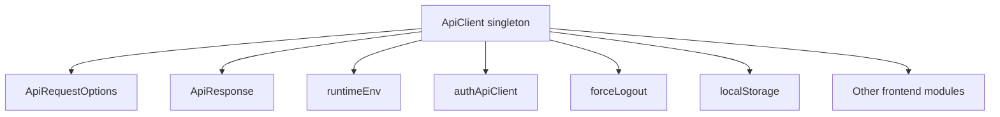
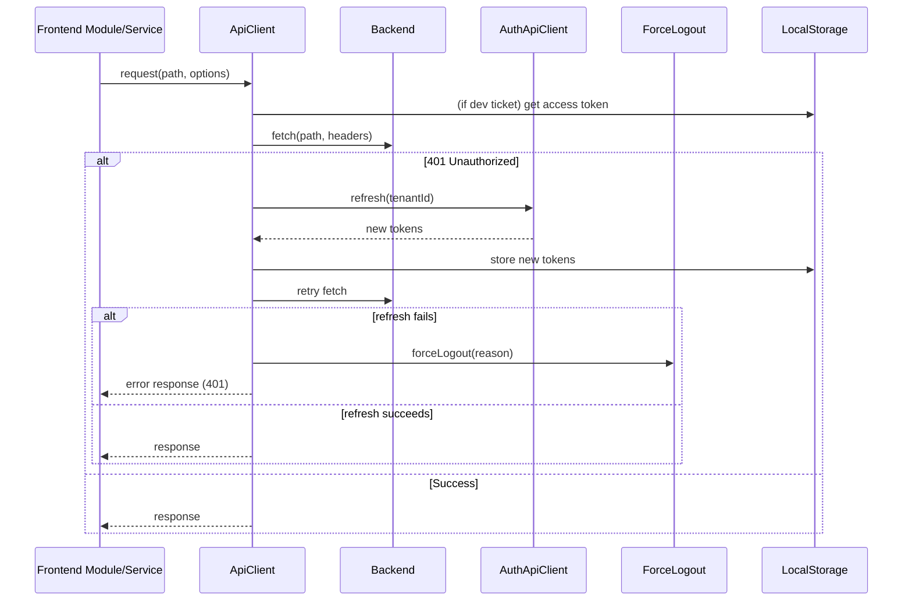
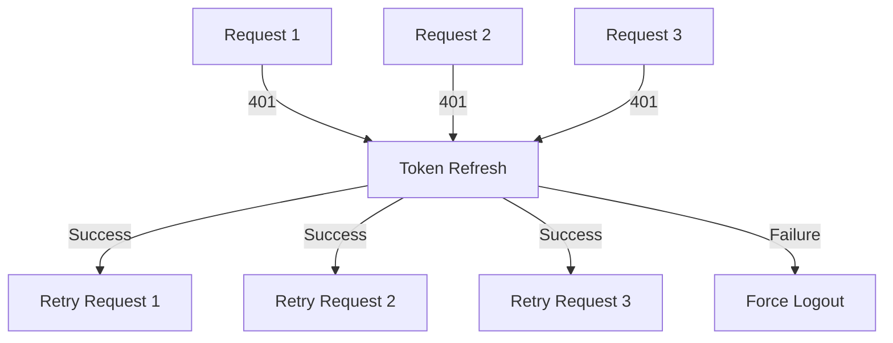
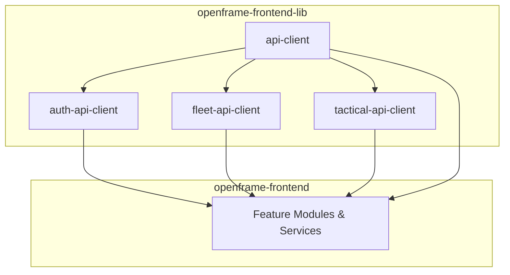

# API Client Module Documentation

## Introduction

The **api-client** module provides a centralized, robust, and extensible HTTP client for interacting with backend APIs in the OpenFrame frontend ecosystem. It abstracts authentication, error handling, token refresh, and request/response normalization, ensuring consistent API communication across the application. This module is foundational for all API interactions and is designed to be used by higher-level service modules and feature implementations.

---

## Core Components

- **ApiRequestOptions**: Type definition for request options, extending the standard `RequestInit` with additional fields for headers and authentication control.
- **ApiResponse**: Standardized response type for all API requests, encapsulating data, error, status, and success flag.
- **ApiClient**: The main class providing methods for HTTP requests (GET, POST, PUT, PATCH, DELETE), authentication management, token refresh, and error handling.

---

## Architecture Overview

The api-client module is implemented as a singleton instance of the `ApiClient` class. It is responsible for:

- Managing authentication headers (cookie-based and header-based)
- Handling token refresh logic and queuing requests during refresh
- Providing convenience methods for all HTTP verbs
- Integrating with the authentication and force-logout utilities
- Supporting both internal and external API requests

### High-Level Architecture

---

## Component Relationships & Dependencies

- **ApiClient** depends on:
  - `runtimeEnv` for environment-specific configuration (e.g., tenant host URL, dev ticket mode)
  - `authApiClient` ([see auth-api-client documentation](auth-api-client.md)) for token refresh operations
  - `forceLogout` utility for unified logout handling
  - `localStorage` for storing and retrieving access/refresh tokens (when dev ticket mode is enabled)

- **ApiClient** is used by:
  - All frontend modules and services that require API communication
  - Higher-level API clients (e.g., [auth-api-client](auth-api-client.md), [fleet-api-client](fleet-api-client.md), [tactical-api-client](tactical-api-client.md))

---

## Data Flow & Process Diagrams

### API Request Lifecycle

### Request Queueing During Token Refresh

---

## APIClient Class: Key Methods

- `request<T>(path, options, isRetry)`: Core method for making API requests, handling authentication, token refresh, and error normalization.
- `get<T>(path, options)`, `post<T>(path, body, options)`, `put<T>(path, body, options)`, `patch<T>(path, body, options)`, `delete<T>(path, options)`: Convenience methods for standard HTTP verbs.
- `external<T>(url, options)`: For requests to external APIs (not using the base URL).
- `me<T>()`: Fetches the current user's information from `/api/me`.
- Private methods: `getAuthHeaders()`, `buildUrl()`, `refreshAccessToken()`, `forceLogout()`.

---

## Integration in the OpenFrame System

The api-client module is the foundation for all API communication in the OpenFrame frontend. It is used directly by feature modules and indirectly by higher-level API clients:

- For details on authentication-specific API logic, see [auth-api-client documentation](auth-api-client.md).
- For fleet/device management API logic, see [fleet-api-client documentation](fleet-api-client.md).
- For tactical integration, see [tactical-api-client documentation](tactical-api-client.md).

---

## Error Handling & Edge Cases

- Handles both cookie-based and header-based authentication automatically.
- Detects 401 Unauthorized responses and attempts a single token refresh before forcing logout.
- Queues concurrent requests during token refresh to avoid race conditions.
- Provides robust error messages and status codes for all failure scenarios.

---

## References

- [auth-api-client.md](auth-api-client.md)
- [fleet-api-client.md](fleet-api-client.md)
- [tactical-api-client.md](tactical-api-client.md)
- [app-config.md](app-config.md)

---

## Summary

The **api-client** module is a critical infrastructure component for the OpenFrame frontend, providing a secure, reliable, and extensible foundation for all API interactions. Its design ensures consistent authentication, error handling, and integration with the broader OpenFrame system.
