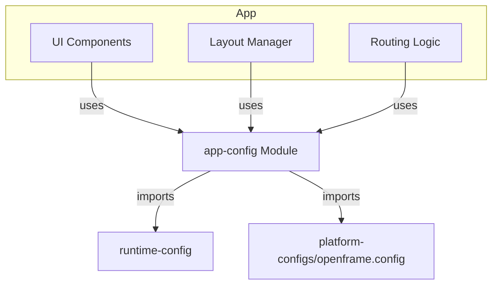
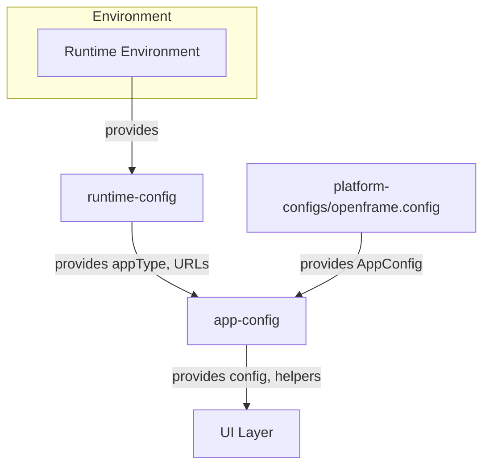
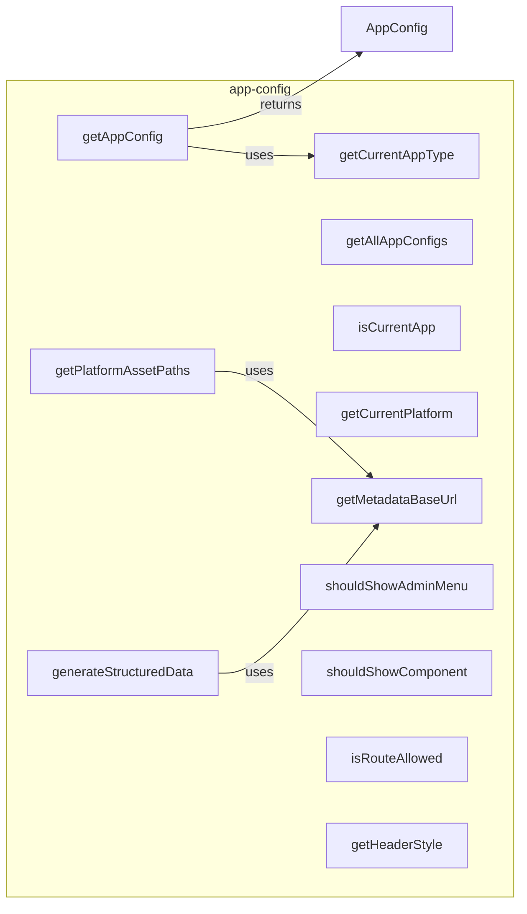

# app-config Module Documentation

## Introduction

The `app-config` module in the OpenFrame Frontend Library provides a unified, extensible configuration system for frontend applications. It defines the structure and access patterns for application-wide settings, including navigation, branding, layout, SEO, and footer configuration. This module enables consistent UI/UX, dynamic branding, and environment-aware behavior across different OpenFrame frontend deployments.

## Core Functionality

The module exposes TypeScript interfaces and utility functions to:
- Define and manage navigation menus and sections
- Configure footer content and call-to-actions
- Centralize application metadata (name, description, URLs, branding, SEO)
- Dynamically select and retrieve the current app configuration based on runtime environment
- Provide helpers for UI logic (e.g., route access, component visibility)
- Generate structured data for SEO and social sharing

## Key Components

### Types & Interfaces
- **NavigationMenuItem**: Represents a single navigation item, supporting nesting, icons, badges, and click handlers.
- **NavigationSection**: Groups navigation items, supporting dropdowns and custom rendering.
- **FooterLink, FooterSection, FooterCTA, FooterConfig**: Define the structure of the application footer, including links, sections, and call-to-action banners.
- **AppConfig**: The main configuration object, encapsulating all app-level settings (branding, navigation, layout, SEO, UI, contact, social, etc.).

### Utility Functions
- **getCurrentAppType**: Determines the current app type from the runtime environment.
- **getAppConfig**: Retrieves the configuration for the current or specified app type.
- **getAllAppConfigs**: Returns all available app configurations.
- **isCurrentApp**: Checks if the current app matches a given type.
- **getCurrentPlatform**: Returns the platform identifier (always 'openframe').
- **getMetadataBaseUrl**: Determines the base URL for assets and metadata.
- **getPlatformAssetPaths**: Returns asset paths (favicon, manifest, images) for the current app.
- **generateStructuredData**: Produces schema.org structured data for SEO and organization info.
- **shouldShowAdminMenu, shouldShowComponent**: UI logic helpers for conditional rendering.
- **isRouteAllowed**: Checks if a route is allowed based on config.
- **getHeaderStyle**: Returns the current header style.

## Architecture & Component Relationships

The `app-config` module is a foundational part of the OpenFrame frontend architecture. It is designed to be consumed by UI components, layout managers, and routing logic throughout the frontend application. It does not directly render UI, but provides the configuration and logic that drive UI behavior.

### High-Level Architecture

- **UI Components, Layout Manager, Routing Logic**: Consume configuration and helpers from `app-config` to determine navigation, layout, and access control.
- **runtime-config**: Provides environment-specific values (e.g., app type, URLs) used by `app-config`.
- **platform-configs/openframe.config**: Supplies the actual configuration object(s) for OpenFrame apps.

### Data Flow

- The runtime environment and platform configs feed into `app-config`, which then exposes configuration and logic to the UI layer.

### Component Interaction

## Integration in the Overall System

The `app-config` module is part of the [openframe-frontend-lib](openframe-frontend-lib.md) package and is used by the main [openframe-frontend](openframe-frontend.md) application. It is agnostic to backend services, but relies on environment and platform configuration files. Other modules (such as `api-client`, `auth-api-client`, etc.) may use `app-config` for branding or navigation, but do not directly depend on its logic.

For more details on environment configuration, see [runtime-config](runtime-config.md). For the structure of the main configuration object, see [platform-configs/openframe.config](platform-configs/openframe.config.md).

## References
- [openframe-frontend-lib](openframe-frontend-lib.md)
- [openframe-frontend](openframe-frontend.md)
- [runtime-config](runtime-config.md)
- [platform-configs/openframe.config](platform-configs/openframe.config.md)
