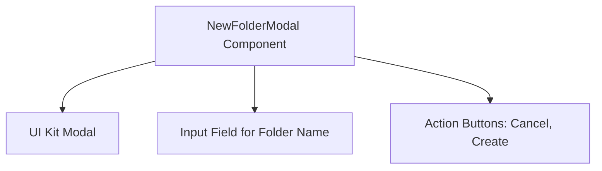

# architecture_diagram Module Documentation

## Introduction

The `architecture_diagram` module provides a visual representation of the component structure and interactions within the NewFolderModal feature of the device file manager interface. This module focuses on illustrating how the NewFolderModal component integrates with its UI elements and manages user interactions for creating new folders.

## Module Purpose and Core Functionality

The primary purpose of the `architecture_diagram` module is to document and visualize the architecture of the NewFolderModal component. This includes showing the relationships and dependencies between the modal dialog, input fields, and action buttons that facilitate folder creation.

## Architecture Overview

The core component visualized in this module is the `NewFolderModal` React component. It acts as a modal dialog that allows users to input a new folder name and submit the creation request. The diagram highlights the following key UI elements:

- **Modal (UI Kit Modal):** The container dialog that displays the folder creation interface.
- **Input Field for Folder Name:** The text input where users type the desired folder name.
- **Action Buttons:** Buttons for user actions, including "Cancel" to close the modal and "Create" to submit the new folder.

## Component Relationships and Interactions

This diagram shows that the `NewFolderModal` component encapsulates the modal dialog and manages the input and buttons as child components or elements. It handles user input changes, submission state, and modal visibility.

## Integration with Other Modules

- The `NewFolderModal` component and its props interface `NewFolderModalProps` are defined in the `new-folder-modal` module. For detailed information on the component's implementation, props, and event handlers, please refer to the [new-folder-modal.md](new-folder-modal.md) documentation.
- The `name` and `description` modules provide contextual information about the folder creation feature and its user interface, which complements the architectural visualization presented here.

## Summary

The `architecture_diagram` module serves as a visual aid to understand the structure and interaction flow within the NewFolderModal component. It helps developers and maintainers quickly grasp how the modal dialog is composed and how it facilitates folder creation in the device file manager.

For further details on the component's behavior and properties, see the [new-folder-modal.md](new-folder-modal.md) documentation.
