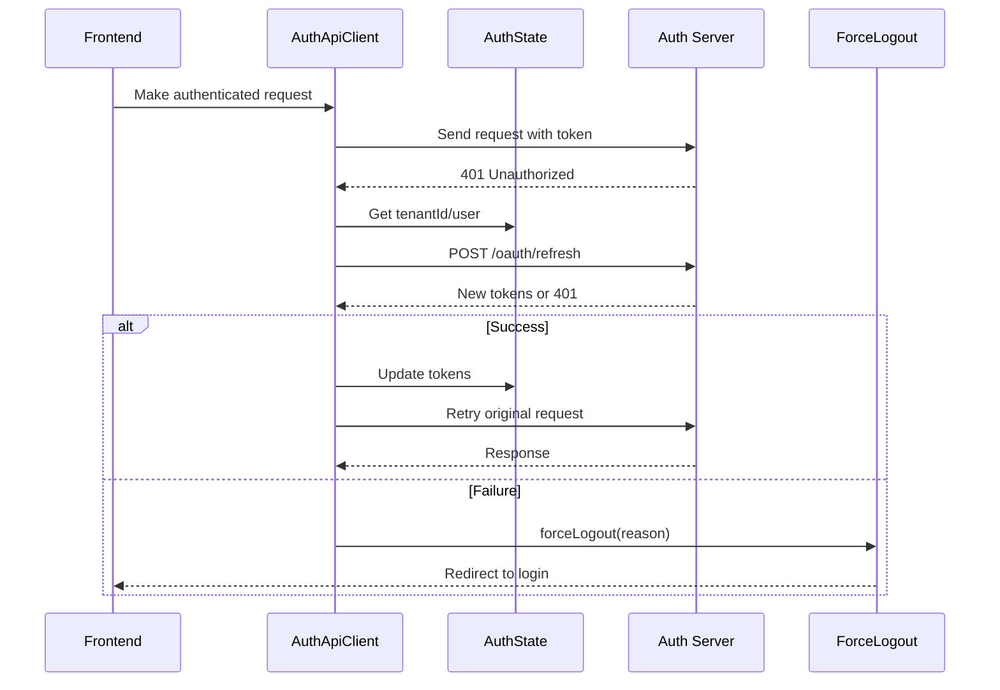
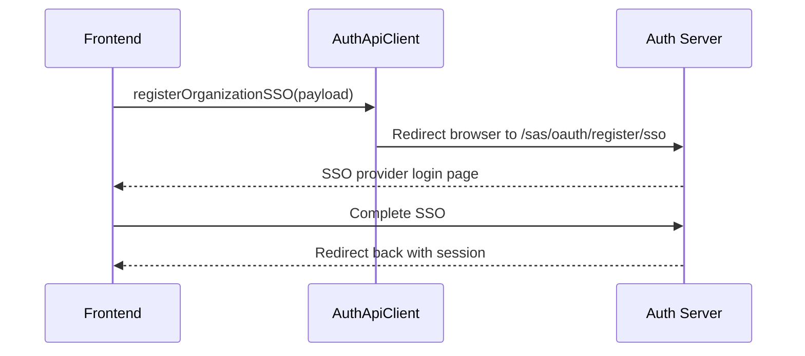

# Auth API Client Module Documentation

## Introduction

The **Auth API Client** module provides a dedicated client for handling authentication-related API endpoints in the OpenFrame frontend ecosystem. It abstracts the complexity of authentication flows, token refresh, tenant discovery, registration, and Single Sign-On (SSO) operations, ensuring a consistent and secure interface for authentication across the application.

This module is a core part of the `openframe-frontend-lib` package and is used by the OpenFrame frontend to interact with authentication endpoints, manage tokens, and handle user session state. It is designed to work seamlessly in both SaaS shared and dedicated deployment modes.

---

## Core Functionality

### Main Components
- **AuthApiClient**: The main class providing methods for all authentication-related API calls and flows.
- **AuthApiResponse**: A generic response type for all authentication API requests.

### Key Features
- Handles `/me`, `/oauth/*`, `/oauth/refresh`, and other auth endpoints
- Supports both shared-host (SaaS) and dedicated deployments
- Manages access and refresh tokens, including automatic refresh and forced logout on failure
- Provides methods for:
  - Token refresh and exchange
  - SSO and standard registration flows
  - Tenant discovery and domain availability
  - Password reset and invitation acceptance
  - SSO provider discovery
- Integrates with the frontend's auth state store for tenant/user context

---

## Architecture & Component Relationships

```mermaid
flowchart TD
    subgraph FrontendApp[OpenFrame Frontend]
        FE1[UI Components]
        FE2[Auth State Store (AuthState) ]
        FE3[ApiClient]
        FE4[ForceLogout]
    end
    subgraph AuthApiClientModule[auth-api-client]
        AAC1[AuthApiClient]
        AAC2[AuthApiResponse]
    end
    subgraph External[Backend Auth API]
        EXT1[/me, /oauth/*, /sas/*, /api/tenant/*]
    end

    FE1 --> AAC1
    FE2 --> AAC1
    AAC1 --> FE2
    AAC1 --> FE4
    AAC1 --> FE3
    AAC1 --> EXT1
    FE3 -.-> AAC1
    FE4 -.-> AAC1
```

### Component Interactions
- **AuthApiClient** interacts with the frontend's `AuthState` store to obtain tenant/user context for requests.
- It uses the `forceLogout` utility to handle session invalidation.
- It shares some logic and patterns with the general-purpose [api-client.md] for consistency, but is specialized for authentication flows.

---

## Data Flow & Process Overview

### Token Refresh Flow


### SSO Registration Flow


---

## API Surface

### Main Methods (selected)
- `refresh(tenantId?)`: Refreshes the access token using the refresh token
- `oauth(path, body?, init?)`: Generic OAuth endpoint handler
- `discoverTenants(email)`: Finds tenants for a given email
- `checkDomainAvailability(subdomain, organizationName)`: Checks if a domain is available
- `registerOrganization(payload)`: Registers a new organization
- `registerOrganizationSSO(payload)`: Initiates SSO registration (redirects browser)
- `getRegistrationProviders()`: Lists available SSO registration providers
- `getInviteProviders(invitationId)`: Lists SSO providers for an invitation
- `acceptInvitation(payload)`: Accepts an invitation with password
- `acceptInvitationSSO(payload)`: Accepts an invitation via SSO (redirects browser)
- `confirmPasswordReset(payload)`: Confirms a password reset
- `requestPasswordReset(payload)`: Requests a password reset
- `loginUrl(tenantId, redirectTo, provider?)`: Constructs a login URL
- `logout(tenantId?)`: Logs out the user (redirects browser)

See the TypeScript definitions in the source for full method signatures and options.

---

## How This Module Fits Into the System

- **Frontend Integration**: Used by UI components and hooks to perform all authentication-related actions.
- **State Management**: Reads and updates authentication state via the [auth-store](openframe-frontend.md) (see `AuthState`).
- **Token Management**: Handles all token storage, refresh, and invalidation logic, ensuring secure session management.
- **Error Handling**: Centralizes error and unauthorized handling, including forced logout and user redirection.
- **SSO and Multi-Tenant Support**: Provides first-class support for SSO flows and multi-tenant SaaS scenarios.

---

## Related Modules
- [api-client.md]: General-purpose API client for non-auth endpoints
- [force-logout.md]: Centralized forced logout utility
- [openframe-frontend.md]: Frontend state and auth store details

---

## References
- [api-client.md]
- [force-logout.md]
- [openframe-frontend.md]
