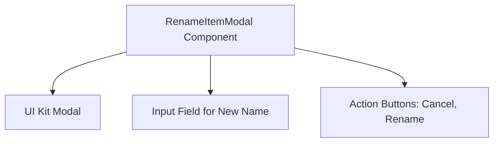
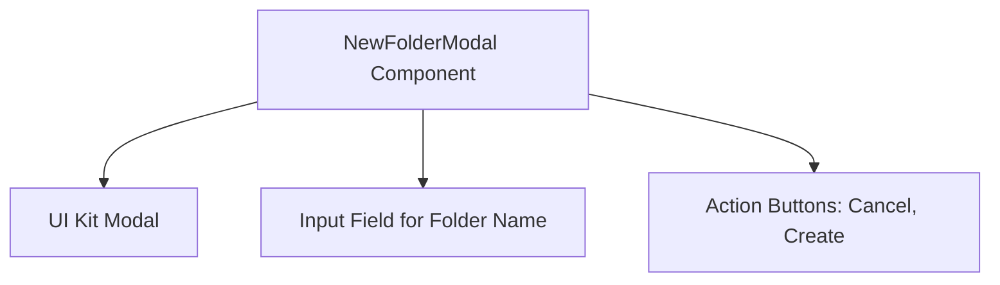

# Core Components Module Documentation

## Introduction

The Core Components module provides essential UI components for the device file manager interface, focusing on user interactions related to file and folder management. The primary component in this module is the `RenameItemModal`, a React modal dialog that facilitates renaming files or folders. This component handles user input for the new name, manages submission states, and controls modal visibility.

## Components Overview

### RenameItemModal

The `RenameItemModal` component is a modal dialog that allows users to rename an item (file or folder) within the device file manager. It encapsulates the following functionalities:

- Displaying a modal dialog when triggered
- Accepting user input for the new name of the item
- Managing submission states to provide feedback during the renaming process
- Handling user actions such as canceling or submitting the rename request

### RenameItemModalProps

This interface defines the properties passed to the `RenameItemModal` component, including:

- `isOpen`: Boolean indicating whether the modal is open
- `currentValue`: The current name of the item to be renamed
- `isSubmitting`: Boolean indicating if the rename submission is in progress
- Event handlers for input change, form submission, and modal close actions

## Architecture

The architecture of the `RenameItemModal` component is designed to integrate seamlessly with the UI Kit and the overall file manager interface. Below is a Mermaid diagram illustrating the component's structure and its interactions:

## Component Interaction and Data Flow

- The `RenameItemModal` receives props defined by `RenameItemModalProps` to control its behavior and state.
- When the modal is open (`isOpen` is true), it displays the current item name in the input field.
- User input changes trigger the `onChange` handler to update the state.
- Submitting the form triggers the `onSubmit` handler, which manages the renaming process and updates the `isSubmitting` state.
- The modal can be closed via the `onClose` handler, resetting or maintaining state as needed.

## Integration with Other Modules

This module is focused on the rename functionality within the file manager UI. For broader context and related components, refer to the following modules:

- [UI Kit Modal Component](ui_kit.md): Provides the modal dialog foundation used by `RenameItemModal`.
- [File Manager Components](file_manager.md): Contains other components related to file and folder management.

## Summary

The Core Components module, centered on the `RenameItemModal`, provides a focused and reusable UI element for renaming items within the device file manager. Its design ensures clear user interaction, state management, and integration with the overall UI framework.

---

For detailed API specifications and usage examples, please refer to the source code and related module documentation files.

## Introduction
The Core Components module provides essential UI components for the device file manager interface, focusing on user interactions related to folder management. The primary component in this module is the `NewFolderModal`, a React modal dialog that facilitates the creation of new folders by handling user input, submission states, and modal visibility.

## Module Overview
This module encapsulates the `NewFolderModal` component and its associated properties interface `NewFolderModalProps`. It is designed to integrate seamlessly with the device file manager, providing a user-friendly modal dialog for folder creation.

### Key Features
- Modal dialog for creating new folders
- Input field for entering folder names
- Submission state management
- Event handlers for input changes, form submission, and modal closure

## Architecture
The architecture of the `NewFolderModal` component is straightforward, focusing on UI composition and state management. Below is a Mermaid diagram illustrating the component's internal structure and its interaction with UI elements:

## Component Details

### NewFolderModal
The `NewFolderModal` component is a React functional component that renders a modal dialog. It accepts props defined by the `NewFolderModalProps` interface, which control the modal's open state, folder name input, submission state, and event handlers.

### NewFolderModalProps
This interface defines the properties passed to the `NewFolderModal` component:
- `isOpen`: Boolean indicating whether the modal is visible.
- `folderName`: String representing the current value of the folder name input.
- `isSubmitting`: Boolean indicating if the form submission is in progress.
- `onChange`: Event handler for changes in the folder name input field.
- `onSubmit`: Event handler for form submission.
- `onClose`: Event handler to close the modal.

## Integration
The `NewFolderModal` component is intended to be used within the device file manager interface. It relies on the UI Kit Modal component for rendering the modal dialog and standard input and button components for user interaction.

For more details on the UI Kit Modal component and other UI elements, please refer to the [UI Kit Module Documentation](ui_kit.md).

## References
- [UI Kit Module Documentation](ui_kit.md) - For modal and input components used within `NewFolderModal`.
- [Device File Manager Module Documentation](device_file_manager.md) - For overall context on how `NewFolderModal` fits into the file management system.

---

This documentation provides a comprehensive overview of the Core Components module focusing on the `NewFolderModal` component. For further exploration, please consult the referenced module documents.