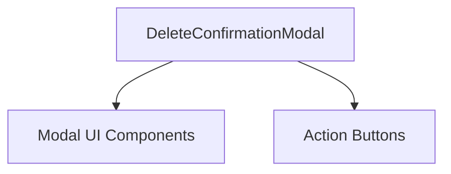

# DeleteConfirmationModal Component

## Overview
The `DeleteConfirmationModal` component provides a confirmation dialog for deleting one or multiple items in the device file manager. It ensures users explicitly confirm destructive delete actions.

## Core Components and Responsibilities
- **Props:**
  - `isOpen` (boolean): Controls modal visibility.
  - `itemCount` (number): Number of items to delete, used to customize messages.
  - `submitting` (boolean, optional): Indicates if the delete action is in progress.
  - `onConfirm` (function): Callback triggered when the user confirms deletion.
  - `onClose` (function): Callback to close the modal.

- **Functionality:**
  - Dynamically adjusts title and description based on the number of items.
  - Listens for Enter key to confirm deletion if not submitting.
  - Renders modal with cancel and delete buttons.
  - Disables buttons during submission.

## Usage
Used in the device file manager to confirm deletion of files or folders.

## Code Location
`openframe/services/openframe-frontend/src/app/devices/details/[deviceId]/file-manager/components/delete-confirmation-modal.tsx`

---

```typescript
// See the source code in the file for implementation details.
```

---

## Component Interaction Diagram


