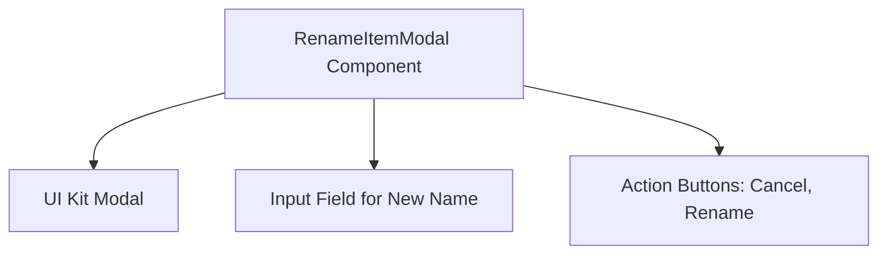
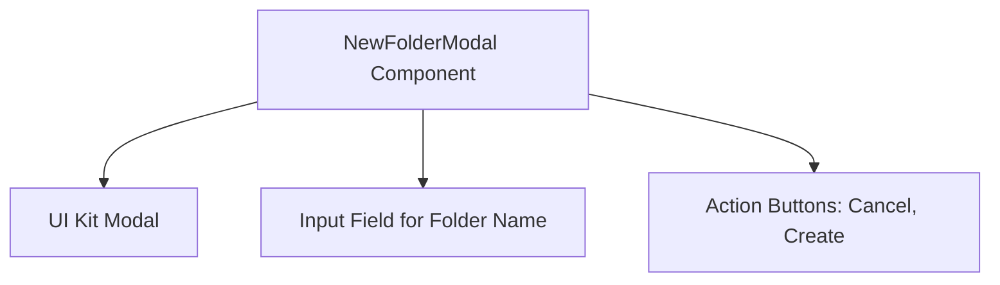

# Description Module Documentation

## Introduction

The Description module provides the `RenameItemModal` component, a React modal dialog designed for renaming files or folders within the device file manager interface. This component is essential for managing user interactions related to renaming operations, including handling user input for the new name, managing submission states, and controlling the modal's visibility.

## Core Functionality

- **RenameItemModal Component**: A modal dialog that allows users to rename an item (file or folder).
- **User Input Management**: Captures and validates the new name entered by the user.
- **Submission Handling**: Manages the state during the renaming process, including loading or disabled states.
- **Modal Visibility Control**: Opens and closes the modal based on user actions or external triggers.

## Architecture and Component Relationships

The `RenameItemModal` component integrates with a UI Kit Modal for the dialog presentation, includes an input field for the new name, and provides action buttons for cancelling or confirming the rename operation.

## Module Interfaces

The module defines the `RenameItemModalProps` interface, which specifies the properties required by the `RenameItemModal` component. These include:

- `isOpen`: Boolean indicating if the modal is open.
- `currentValue`: The current name of the item to be renamed.
- `isSubmitting`: Boolean indicating if the rename operation is in progress.
- `onChange`: Event handler for input changes.
- `onSubmit`: Event handler for submitting the new name.
- `onClose`: Event handler for closing the modal.

For detailed interface definitions, please refer to the [core_components.md](core_components.md) documentation.

## Integration with Overall System

The `RenameItemModal` is a part of the device file manager interface, enabling users to rename files or folders seamlessly. It interacts with the file management logic to update item names and reflects changes in the UI accordingly.

## References

- For detailed properties and types, see [core_components.md](core_components.md).
- For UI Kit Modal details, refer to the [name.md](name.md) module documentation.
- For related components and their interactions, see [core_components.md](core_components.md).

---

This documentation provides a comprehensive overview of the Description module, focusing on the `RenameItemModal` component and its role within the system. For further details, please consult the referenced module documents.

## Introduction

The Description module provides the `NewFolderModal` component, a React modal dialog designed for creating new folders within the device file manager interface. This component facilitates user interaction by handling folder name input, managing submission states, and controlling the modal's visibility.

## Core Functionality

- **NewFolderModal Component**: A modal dialog that allows users to input a new folder name and submit it to create a folder.
- **User Input Handling**: Captures and manages the folder name entered by the user.
- **Submission State Management**: Tracks the state of the folder creation process (e.g., loading, success, error).
- **Modal Visibility Control**: Opens and closes the modal based on user actions or external triggers.

## Architecture and Component Relationships

The `NewFolderModal` component is composed of several UI elements and interacts with event handlers to provide a seamless user experience. Below is a Mermaid diagram illustrating the component's architecture:

### Component Details

- **UI Kit Modal**: The base modal dialog component that provides the overlay and modal window.
- **Input Field for Folder Name**: A text input where users type the desired folder name.
- **Action Buttons**: Includes 'Cancel' to close the modal without action and 'Create' to submit the new folder name.

## Integration and Dependencies

The `NewFolderModal` component relies on the `NewFolderModalProps` interface defined in the `core_components` module. This interface specifies the properties required by the component, including:

- `isOpen`: Boolean indicating if the modal is visible.
- `folderName`: The current value of the folder name input.
- `isSubmitting`: Boolean indicating if the submission is in progress.
- Event handlers for input change, form submission, and modal close actions.

For detailed information on the props interface, please refer to the [core_components module documentation](core_components.md).

## How This Module Fits Into The Overall System

This module is part of the device file manager interface, providing users with the ability to create new folders through a modal dialog. It enhances user experience by encapsulating folder creation logic and UI in a reusable component.

The modal interacts with the broader file management system by emitting events or calling callbacks when a new folder creation is requested, allowing the parent components or services to handle the actual folder creation logic.

## References

- For the props interface and detailed component properties, see [core_components.md](core_components.md).
- For UI elements and modal behavior, see [name.md](name.md).
- For architectural overview including other related components, see [architecture_diagram.md](architecture_diagram.md).

---

*This documentation was generated to provide a comprehensive understanding of the Description module and its role within the system.*
