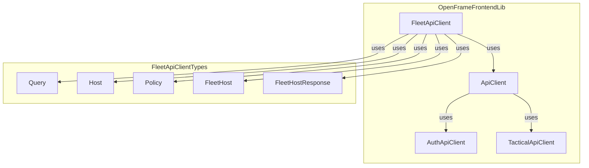
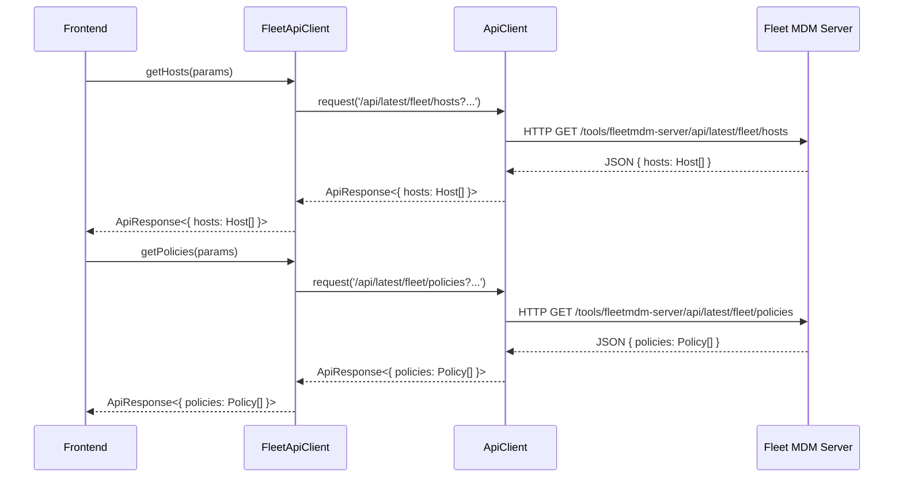

# Fleet API Client Module Documentation

## Introduction

The **Fleet API Client** module provides a high-level, type-safe interface for interacting with the Fleet MDM (Mobile Device Management) server within the OpenFrame platform. It is designed to abstract and simplify HTTP communication with the Fleet backend, enabling frontend services to manage hosts, policies, queries, teams, labels, and packs efficiently. The module is built on top of the generic [ApiClient](api-client.md) and integrates with OpenFrame's authentication and runtime environment configuration.

---

## Core Functionality

- **FleetApiClient**: Main class for all Fleet API operations (CRUD for policies, queries, hosts, teams, labels, packs, and live query execution).
- **Query**: Type definition for Fleet queries (osquery jobs, metadata, scheduling, etc.).
- **Host**: Type definition for basic host information (status, platform, versioning, etc.).

The module also re-exports types and interfaces for seamless integration with other OpenFrame modules.

---

## Architecture & Component Relationships

- **FleetApiClient** is the main entry point, wrapping and extending the generic [ApiClient](api-client.md).
- It uses types from [policies.types](openframe-frontend.md) and [fleet.types](openframe-frontend.md) for strong typing.
- All HTTP requests are routed through the shared [ApiClient](api-client.md), which handles authentication, error handling, and token refresh.

---

## Data Flow & Process Overview

### Example: Fetching Hosts and Policies

---

## Component Details

### FleetApiClient
- **Purpose**: Provides all Fleet-specific API methods (CRUD for policies, queries, hosts, teams, labels, packs, and live query execution).
- **Key Methods**:
  - `getPolicies`, `getPolicy`, `createPolicy`, `updatePolicy`, `deletePolicy`, `runPolicyOnHost`
  - `getQueries`, `getQuery`, `createQuery`, `updateQuery`, `deleteQuery`, `runQuery`, `runLiveQuery`
  - `getHosts`, `getHost`, `getHostPolicies`, `getHostQueries`
  - `getTeams`, `getTeam`, `getLabels`, `getLabel`, `getPacks`, `getPack`
- **Implements**: All requests via [ApiClient](api-client.md) for authentication, error handling, and token refresh.
- **Base URL**: Dynamically constructed from the runtime environment (tenant-aware).

### Query (Type)
- **Purpose**: Represents a Fleet query (osquery job), including metadata, scheduling, and authoring information.
- **Fields**: id, name, query, description, author info, scheduling, platform, etc.

### Host (Type)
- **Purpose**: Represents a basic host (device) in Fleet, with status, platform, and versioning info.
- **Fields**: id, hostname, status, platform, os_version, agent_version, last_seen, etc.

### Policy (Type)
- **Purpose**: Represents a policy in Fleet (see [openframe-frontend.md](openframe-frontend.md) for full details).

### FleetHost & FleetHostResponse (Types)
- **Purpose**: Rich, detailed host information and response structure (see [openframe-frontend.md](openframe-frontend.md)).

---

## How This Module Fits Into the System

- **Frontend Integration**: Used by OpenFrame frontend services to interact with the Fleet MDM backend for device and policy management.
- **Authentication**: All requests are authenticated and routed through [ApiClient](api-client.md), which manages tokens and error handling.
- **Type Safety**: Leverages shared types from [openframe-frontend.md](openframe-frontend.md) for consistency across the platform.
- **Extensibility**: Designed to be extended or composed with other API clients (e.g., [AuthApiClient](auth-api-client.md), [TacticalApiClient](tactical-api-client.md)).

---

## References
- [ApiClient](api-client.md)
- [AuthApiClient](auth-api-client.md)
- [TacticalApiClient](tactical-api-client.md)
- [openframe-frontend.md](openframe-frontend.md) (for Policy, FleetHost, FleetHostResponse, and related types)
