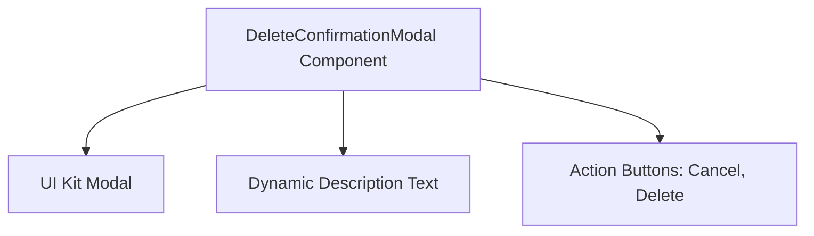
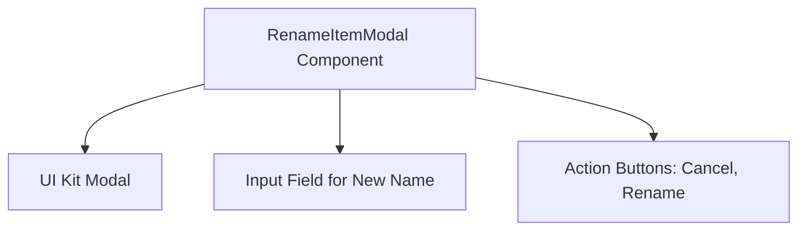
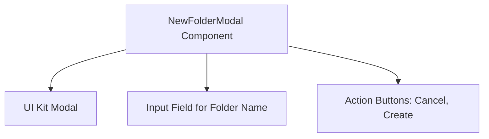

# name Module Documentation

## Introduction

The `name` module provides the `DeleteConfirmationModal` component, a React modal dialog designed for confirming the deletion of one or multiple items within the device file manager interface. This component enhances user experience by ensuring that deletion actions are deliberate and confirmed, preventing accidental data loss.

## Core Functionality

The primary functionality of the `DeleteConfirmationModal` component includes:

- Displaying a modal dialog when triggered to confirm deletion.
- Dynamically adjusting the confirmation message based on the number of items selected for deletion.
- Handling user interactions such as confirming the deletion or canceling the action.
- Managing submission states to provide feedback during the deletion process.

## Architecture

The `DeleteConfirmationModal` component leverages a UI Kit Modal for the base modal functionality, incorporates dynamic description text to inform users about the deletion context, and provides action buttons for user decisions.

## Component Details

### DeleteConfirmationModalProps

The `DeleteConfirmationModalProps` interface defines the properties for the `DeleteConfirmationModal` component. It includes:

- `isOpen`: Boolean indicating whether the modal is open.
- `itemCount`: Number of items selected for deletion.
- `isSubmitting` (optional): Boolean indicating if the deletion is in progress.
- `onConfirm`: Event handler triggered when the user confirms deletion.
- `onClose`: Event handler triggered when the modal is closed or the action is canceled.

For detailed interface definitions, refer to the [core_components.md](core_components.md) documentation.

## Integration and Usage

The `DeleteConfirmationModal` is typically used within the device file manager interface to prompt users before deleting files or folders. It ensures that users are aware of the consequences of their actions and provides a clear, accessible way to confirm or cancel deletions.

## Related Modules

- For UI Kit Modal details, see the [ui_kit.md](ui_kit.md) module documentation.
- For core component interfaces and types, see the [core_components.md](core_components.md) documentation.

---

This documentation provides a comprehensive overview of the `name` module, its purpose, architecture, and integration points within the system. For further details on implementation and usage, please refer to the linked module documents.

## Introduction

The `name` module provides functionality related to renaming items within the device file manager interface. Its core component is the `RenameItemModal`, a React modal dialog that allows users to rename files or folders. This module handles user input for the new name, manages submission states, and controls the visibility of the modal dialog.

## Core Components

### RenameItemModal

The `RenameItemModal` component is a modal dialog that facilitates renaming an item (file or folder). It includes:
- An input field for entering the new name
- Action buttons for cancelling or submitting the rename operation
- State management for modal visibility and submission status

### RenameItemModalProps

This interface defines the properties passed to the `RenameItemModal` component, including:
- `isOpen`: Boolean indicating if the modal is open
- `currentValue`: The current name of the item
- `isSubmitting`: Boolean indicating if the rename operation is in progress
- Event handlers for input change, form submission, and modal close actions

## Architecture

## Module Relationships

The `name` module is focused on the user interface aspect of renaming items and depends on UI components such as modals and input fields. For detailed information on the modal and input components, please refer to the UI Kit module documentation.

## See Also

- [description.md](description.md) - Detailed description of the `RenameItemModal` component
- [core_components.md](core_components.md) - Definitions of the `RenameItemModalProps` interface and other core components
- [architecture_diagram.md](architecture_diagram.md) - Visual diagrams illustrating the component architecture

---

This documentation provides a comprehensive overview of the `name` module, its purpose, and its core components to assist developers and maintainers in understanding and utilizing this module effectively.

## Introduction

The `name` module provides the `NewFolderModal` component, a React modal dialog designed for creating new folders within a device file manager interface. This component facilitates user interaction by allowing input of folder names, managing submission states, and controlling modal visibility.

## Core Functionality

- **NewFolderModal Component**: A modal dialog that prompts users to enter a new folder name.
- Handles user input for the folder name.
- Manages submission states to provide feedback during folder creation.
- Controls modal visibility to show or hide the dialog as needed.

## Architecture

The architecture of the `NewFolderModal` component is straightforward and focuses on user interaction within a modal dialog. Below is a Mermaid diagram illustrating the component's structure and its key UI elements:

## Component Details

The `NewFolderModal` component relies on the `NewFolderModalProps` interface, which defines the properties required for its operation. These include:

- `modalOpen`: Boolean indicating whether the modal is visible.
- `folderName`: The current value of the folder name input field.
- `isSubmitting`: Boolean indicating if the form submission is in progress.
- Event handlers for:
  - `onChange`: Handling changes to the folder name input.
  - `onSubmit`: Handling the submission of the new folder creation.
  - `onClose`: Handling the closing of the modal.

For detailed information on the props interface, please refer to the [core_components.md](core_components.md) documentation.

## Integration and Usage

The `NewFolderModal` component is intended to be used within the device file manager interface where users need to create new folders. It integrates with the UI Kit's modal system and standard input components to provide a consistent user experience.

## References

- For detailed prop definitions and event handling, see [core_components.md](core_components.md).
- For a description of the component's purpose and user interaction, see [description.md](description.md).
- For the architecture diagram and component relationships, see [architecture_diagram.md](architecture_diagram.md).

---

This documentation provides a comprehensive overview of the `name` module, focusing on the `NewFolderModal` component and its role within the system. For further details, please consult the referenced documents.