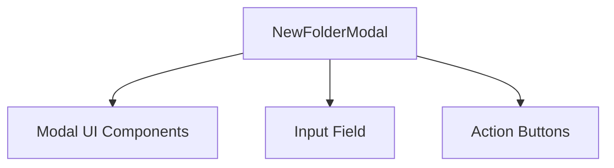

# NewFolderModal Component

## Overview
The `NewFolderModal` component provides a user interface modal dialog for creating a new folder within the device file manager. It captures the folder name input from the user and handles submission and cancellation actions.

## Core Components and Responsibilities
- **Props:**
  - `isOpen` (boolean): Controls the visibility of the modal.
  - `folderName` (string): The current value of the folder name input.
  - `submitting` (boolean): Indicates if the creation process is ongoing to disable inputs and buttons.
  - `onChange` (function): Callback to update the folder name state.
  - `onSubmit` (function): Callback triggered when the user submits the new folder creation.
  - `onClose` (function): Callback to close the modal.

- **Functionality:**
  - Listens for the Enter key to submit the form if the folder name is valid and not submitting.
  - Renders a modal with input for folder name and buttons for cancel and create actions.
  - Disables inputs and buttons appropriately during submission.

## Usage
This component is used within the device file manager context to allow users to create new folders easily.

## Code Location
`openframe/services/openframe-frontend/src/app/devices/details/[deviceId]/file-manager/components/new-folder-modal.tsx`

---

```typescript
// See the source code in the file for implementation details.
```

---

## Component Interaction Diagram


