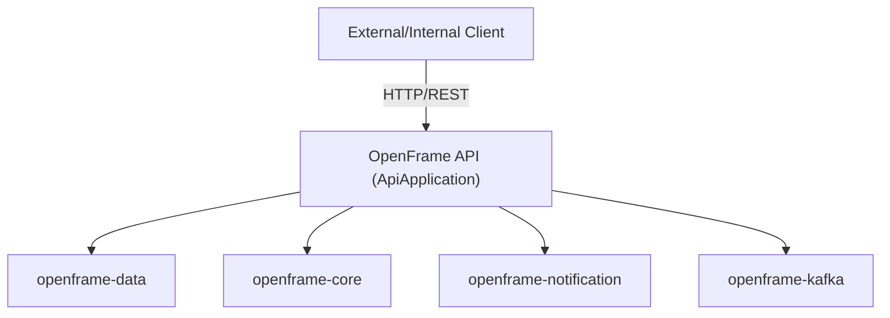
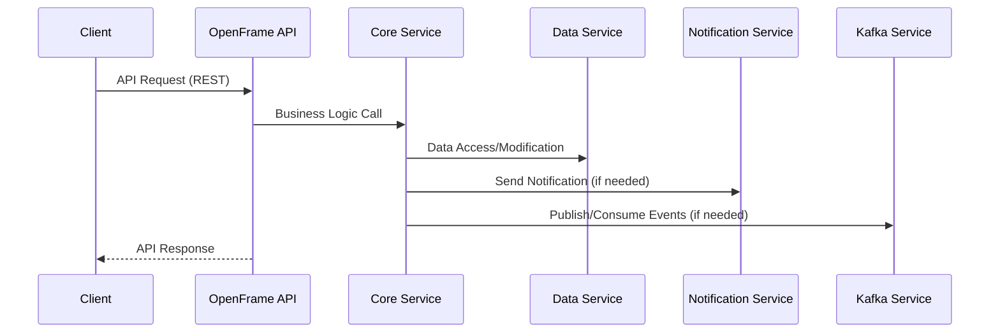
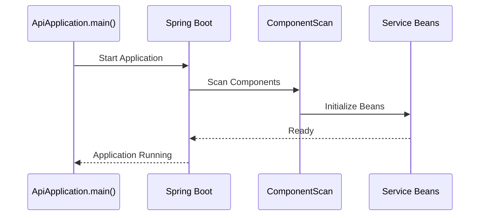

# OpenFrame API Module Documentation

## Introduction

The **OpenFrame API** module serves as the primary RESTful API gateway for the OpenFrame platform. It exposes core business functionalities to external clients and internal services, acting as the main entry point for all API requests. Built on Spring Boot, it leverages a modular architecture to integrate with various OpenFrame subsystems, including data management, core business logic, notifications, and Kafka-based messaging.

## Core Functionality

- **API Gateway**: Handles incoming HTTP(S) requests, routing them to the appropriate service components.
- **Service Integration**: Connects to data, core logic, notification, and messaging modules.
- **Spring Boot Foundation**: Utilizes Spring Boot for rapid development, dependency injection, and auto-configuration.
- **Component Scanning**: Automatically discovers and wires beans from multiple OpenFrame packages.
- **Logging**: Uses SLF4J for structured application logging.

## Architecture Overview

The OpenFrame API module is designed as a Spring Boot application with a broad component scan, enabling seamless integration with other OpenFrame modules. The following diagram illustrates its high-level architecture and relationships:

### Component Relationships

- **ApiApplication**: The main entry point, responsible for bootstrapping the API service and initializing all required components.
- **ComponentScan**: Ensures beans from `com.openframe.api`, `com.openframe.data`, `com.openframe.core`, `com.openframe.notification`, and `com.openframe.kafka` are available for dependency injection.

## Data Flow

## Integration with the OpenFrame System

The OpenFrame API module is a central part of the OpenFrame microservices ecosystem. It interacts with the following modules:

- **[openframe-data](openframe-data.md)**: For persistent data storage and retrieval.
- **[openframe-core](openframe-core.md)**: For core business logic and orchestration.
- **[openframe-notification](openframe-notification.md)**: For sending notifications to users or systems.
- **[openframe-kafka](openframe-kafka.md)**: For event-driven communication and message brokering.

It is typically deployed alongside other OpenFrame services such as the [openframe-gateway](openframe-gateway.md) (for API aggregation and security), [openframe-authorization-server](openframe-authorization-server.md) (for authentication and authorization), and [openframe-management](openframe-management.md) (for administrative operations).

## Process Flow: Application Startup

## References

- [openframe-data](openframe-data.md)
- [openframe-core](openframe-core.md)
- [openframe-notification](openframe-notification.md)
- [openframe-kafka](openframe-kafka.md)
- [openframe-gateway](openframe-gateway.md)
- [openframe-authorization-server](openframe-authorization-server.md)
- [openframe-management](openframe-management.md)

---

For details on API endpoints, request/response formats, and security, refer to the respective service and controller documentation within the OpenFrame API source code.
