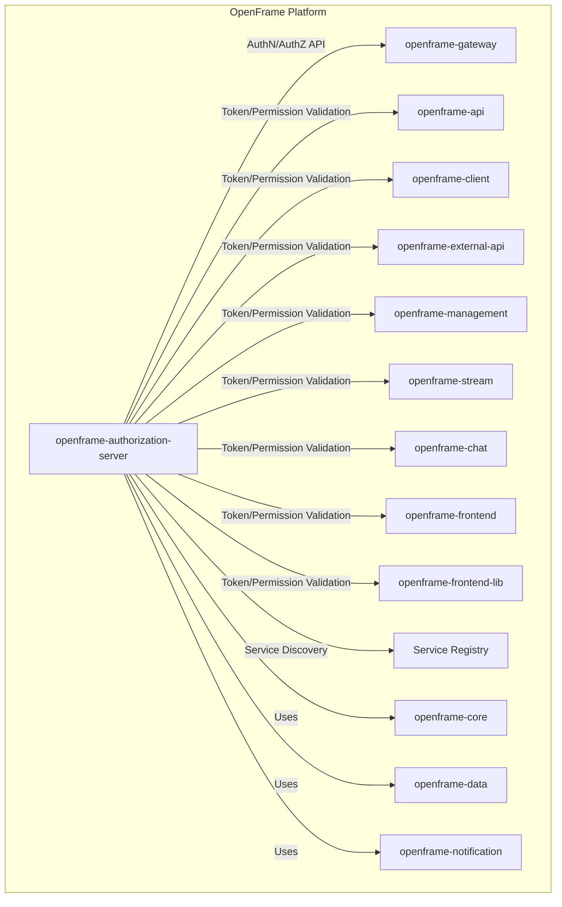
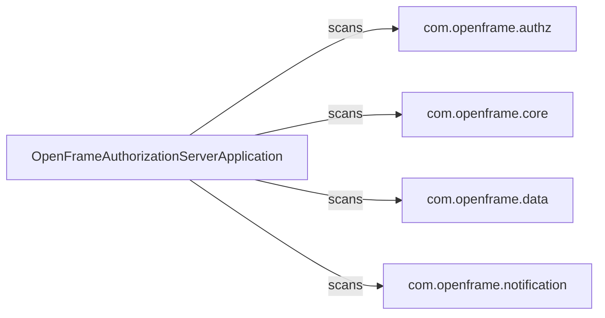
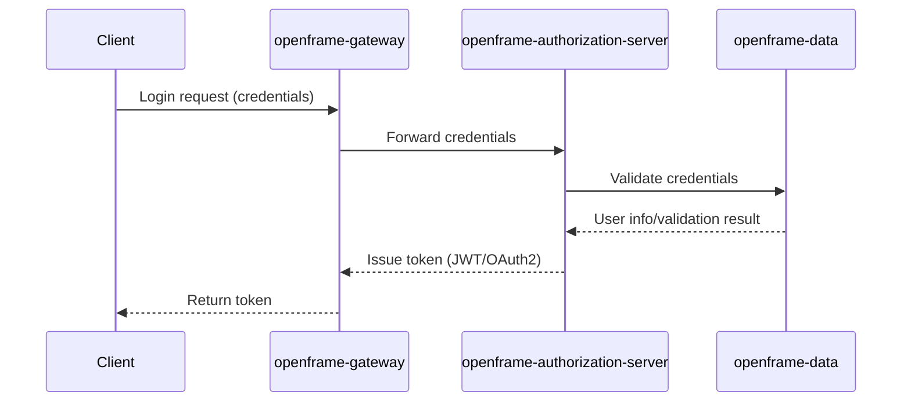
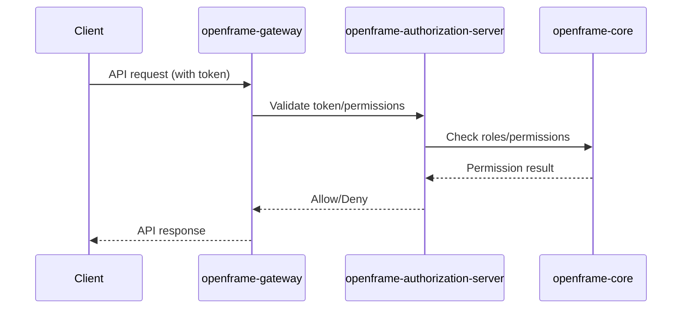

# OpenFrame Authorization Server

## Introduction

The **OpenFrame Authorization Server** is a core backend service responsible for handling authentication and authorization within the OpenFrame platform. It acts as the central authority for issuing, validating, and managing access tokens, user credentials, and permissions for all OpenFrame services and clients. Built on Spring Boot and integrated with service discovery, it ensures secure and scalable access control across the distributed OpenFrame ecosystem.

## Core Functionality
- **Authentication**: Validates user credentials and issues authentication tokens.
- **Authorization**: Manages user roles, permissions, and access policies for resources and APIs.
- **Token Management**: Issues, refreshes, and revokes access and refresh tokens.
- **Service Discovery**: Registers itself with the service registry for discoverability by other OpenFrame microservices.
- **Integration**: Leverages shared core, data, and notification modules for business logic, persistence, and eventing.

## Architecture Overview

The Authorization Server is a Spring Boot application, annotated with `@SpringBootApplication` and `@EnableDiscoveryClient`, enabling it to participate in the OpenFrame microservices architecture. It scans and integrates components from its own package as well as shared modules:
- `com.openframe.authz` (Authorization logic)
- `com.openframe.core` (Shared business logic/utilities)
- `com.openframe.data` (Persistence/data access)
- `com.openframe.notification` (Notification/eventing)

### High-Level Architecture

## Component Relationships

- **Spring Boot Application**: The entry point is `OpenFrameAuthorizationServerApplication`, which bootstraps the service and enables component scanning for all required packages.
- **Service Discovery**: Enabled via `@EnableDiscoveryClient`, allowing dynamic registration and lookup by other services (see [openframe-gateway.md]).
- **Shared Modules**:
    - **Core**: Business logic and utilities ([openframe-core.md])
    - **Data**: Persistence and data access ([openframe-data.md])
    - **Notification**: Eventing and notification ([openframe-notification.md])

### Component Scan and Dependency Diagram

## Data Flow and Process Overview

### Authentication Flow

### Authorization Flow

## Integration with the OpenFrame Ecosystem

The Authorization Server is a foundational service that interacts with nearly all other OpenFrame modules, either directly (for authentication/authorization) or indirectly (via service discovery and eventing). It is essential for securing APIs, managing user access, and supporting SSO and federated identity scenarios.

For details on how other modules interact with the Authorization Server, see:
- [openframe-gateway.md]
- [openframe-api.md]
- [openframe-client.md]
- [openframe-external-api.md]
- [openframe-management.md]
- [openframe-stream.md]
- [openframe-chat.md]
- [openframe-frontend.md]
- [openframe-frontend-lib.md]

## References
- [openframe-core.md]
- [openframe-data.md]
- [openframe-notification.md]
- [openframe-gateway.md]
