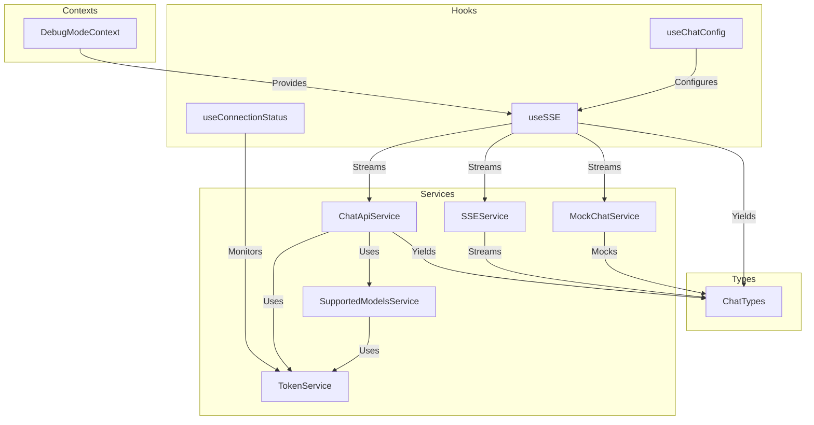
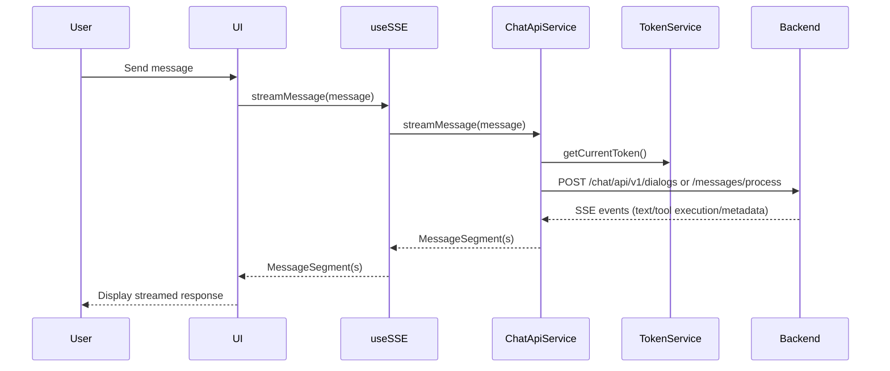
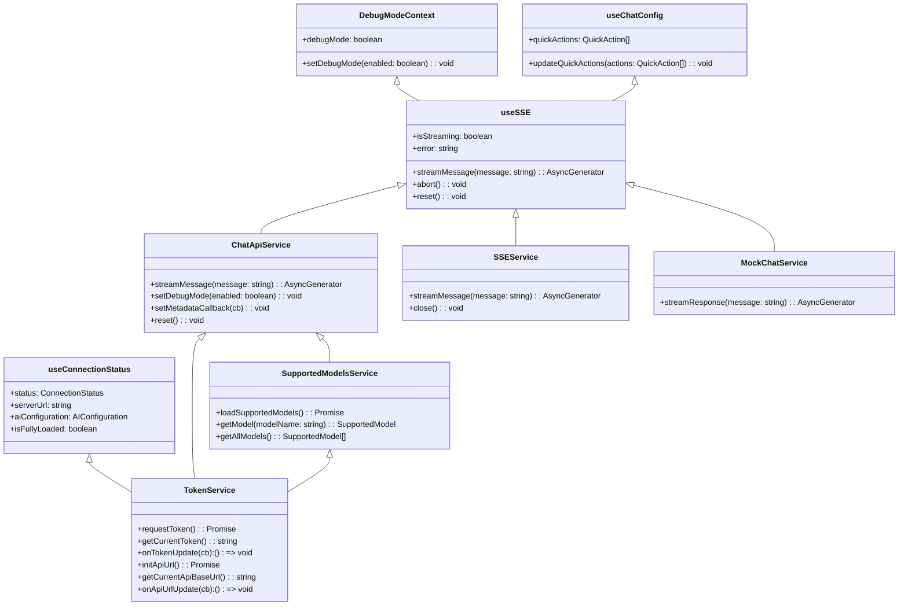

# openframe-chat Module Documentation

## Introduction and Purpose

The `openframe-chat` module provides the core chat and conversational AI functionality for the OpenFrame platform. It is responsible for managing chat sessions, streaming messages, handling tool execution events, managing AI model configurations, and integrating with both real and mock backend services. The module is designed to be extensible, supporting multiple AI providers and models, and is built with robust connection and token management for secure and reliable operation.

## Architecture Overview

The architecture of `openframe-chat` is organized into several key sub-modules:

- **Contexts**: Provides React context for global state such as debug mode.
- **Hooks**: Custom React hooks for chat configuration, connection status, and streaming events.
- **Services**: Core business logic for chat API, SSE, token management, supported models, and mock services.
- **Types**: Shared type definitions for chat messages, events, and tool execution.

### High-Level Architecture Diagram

## Sub-Modules and Core Functionality

### 1. Contexts
- **DebugModeContext**: Provides a global debug mode flag and setter for the application. See [DebugModeContext](openframe-chat.contexts.DebugModeContext.md).

### 2. Hooks
- **useChatConfig**: Loads and manages quick actions for chat UI. See [useChatConfig](openframe-chat.hooks.useChatConfig.md).
- **useConnectionStatus**: Monitors and manages the connection status to the chat backend, including AI configuration and server URL. See [useConnectionStatus](openframe-chat.hooks.useConnectionStatus.md).
- **useSSE**: Handles streaming chat messages via API, SSE, or mock services. See [useSSE](openframe-chat.hooks.useSSE.md).

### 3. Services
- **ChatApiService**: Manages dialog creation, message streaming, and event parsing from the chat API. See [ChatApiService](openframe-chat.services.chatApiService.md).
- **SSEService**: Handles Server-Sent Events (SSE) for real-time message streaming. See [SSEService](openframe-chat.services.sseService.md).
- **MockChatService**: Provides mock chat responses for development and testing. See [MockChatService](openframe-chat.services.mockChatService.md).
- **SupportedModelsService**: Loads and manages supported AI models and providers. See [SupportedModelsService](openframe-chat.services.supportedModelsService.md).
- **TokenService**: Handles authentication tokens and API base URL management. See [TokenService](openframe-chat.services.tokenService.md).

### 4. Types
- **Chat Types**: Defines message, event, and tool execution data structures. See [Chat Types](openframe-chat.types.chat.types.md).

## Integration with the OpenFrame System

The `openframe-chat` module is a frontend client module that interacts with backend services (such as the OpenFrame API and authorization server) for authentication, chat processing, and AI model management. It relies on:
- **Token and API URL**: Provided by the OpenFrame desktop app via Tauri commands and events.
- **AI Model Configuration**: Fetched from backend endpoints, with support for multiple providers (OpenAI, Anthropic, Google Gemini, etc.).
- **Streaming and Tool Execution**: Supports both real and mock streaming for development and production.

For details on backend API endpoints and authentication, see [openframe-api.md] and [openframe-authorization-server.md].

## Data Flow Diagram

## Component Interaction Diagram

## Further Reading
- [openframe-api.md]: Backend API endpoints and authentication
- [openframe-authorization-server.md]: Authorization and token management
- [openframe-frontend.md]: UI integration and usage

---

For detailed sub-module documentation, see the following files:
- [openframe-chat.contexts.DebugModeContext.md]
- [openframe-chat.hooks.useChatConfig.md]
- [openframe-chat.hooks.useConnectionStatus.md]
- [openframe-chat.hooks.useSSE.md]
- [openframe-chat.services.chatApiService.md]
- [openframe-chat.services.sseService.md]
- [openframe-chat.services.mockChatService.md]
- [openframe-chat.services.supportedModelsService.md]
- [openframe-chat.services.tokenService.md]
- [openframe-chat.types.chat.types.md]
