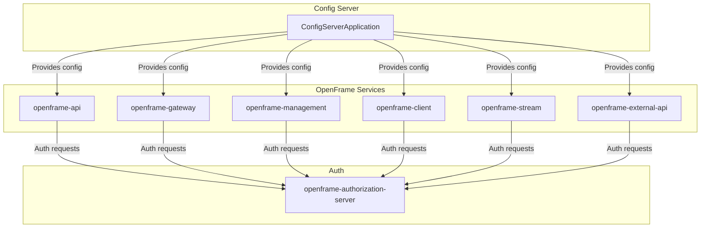
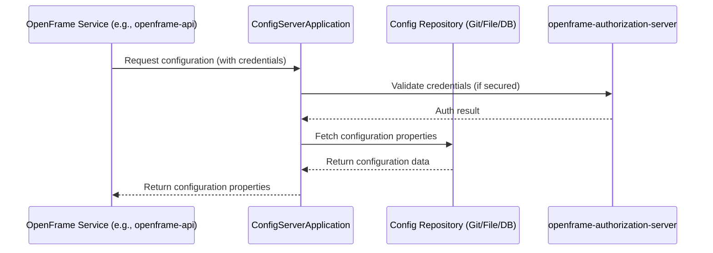

# openframe-config Module Documentation

## Introduction

The `openframe-config` module is a core backend service in the OpenFrame platform, responsible for providing centralized configuration management to other OpenFrame microservices. It is implemented as a Spring Boot application and typically acts as a configuration server, enabling dynamic and centralized management of application properties, environment variables, and service-specific settings across the distributed system.

## Core Functionality

- **Centralized Configuration Management:** Serves as the single source of truth for configuration data, reducing duplication and configuration drift across services.
- **Spring Cloud Config Server:** Leverages Spring Boot and (optionally) Spring Cloud Config to expose configuration properties to client services at runtime.
- **Dynamic Updates:** Supports dynamic refresh of configuration properties for dependent services, minimizing downtime and manual intervention.
- **Security and Auditing:** Can be integrated with authentication and authorization mechanisms to secure sensitive configuration data (see [openframe-authorization-server.md]).

## Architecture Overview

The `openframe-config` module is a foundational part of the OpenFrame microservices architecture. It is typically deployed as a standalone service and interacts with other modules such as `openframe-gateway`, `openframe-api`, `openframe-management`, and more, providing them with configuration data at startup and during runtime.

### High-Level Architecture



### Component Relationships

- **ConfigServerApplication:** The main entry point of the module, bootstrapping the Spring Boot application and exposing configuration endpoints.
- **Other OpenFrame Services:** Consume configuration from the config server at startup and may refresh configuration at runtime.
- **Authorization Server:** Secures access to configuration endpoints if required.

## Data Flow and Process

### Configuration Retrieval Flow



### Service Startup and Refresh

1. **Startup:** On startup, each OpenFrame service requests its configuration from the config server.
2. **Runtime Refresh:** If enabled, services can refresh their configuration without restarting, either via actuator endpoints or by listening to config server events.

## Integration with the OpenFrame System

The `openframe-config` module is essential for:
- Ensuring consistent configuration across all OpenFrame services
- Enabling environment-specific and service-specific configuration
- Supporting secure and auditable configuration management

For details on how client services consume configuration, see the documentation for [openframe-api.md], [openframe-gateway.md], [openframe-management.md], and other relevant modules.

## References
- [openframe-api.md]
- [openframe-gateway.md]
- [openframe-management.md]
- [openframe-authorization-server.md]
- [openframe-client.md]
- [openframe-stream.md]
- [openframe-external-api.md]

## Core Component

### ConfigServerApplication

- **Location:** `openframe.services.openframe-config.src.main.java.com.openframe.config.ConfigServerApplication.ConfigServerApplication`
- **Description:** The main class that starts the Spring Boot application, enabling the config server functionality.
- **Key Annotations:**
    - `@SpringBootApplication`: Marks this as a Spring Boot application.
    - `@Slf4j`: Enables logging for the application.
- **Entry Point:** Contains the `main` method which launches the config server.

```java
@SpringBootApplication
@Slf4j
public class ConfigServerApplication { 
    public static void main(String[] args) {
        SpringApplication.run(ConfigServerApplication.class, args);
    }
}
```

---

For more details on configuration formats, security, and advanced usage, refer to the [Spring Cloud Config documentation](https://cloud.spring.io/spring-cloud-config/).
