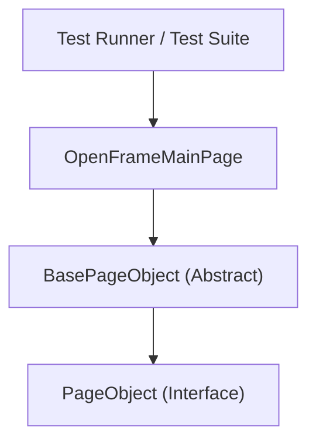
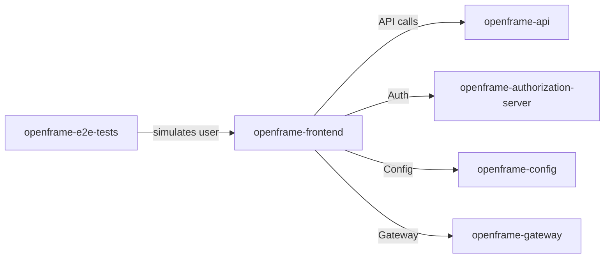

# openframe-e2e-tests Module Documentation

## Introduction and Purpose

The `openframe-e2e-tests` module provides end-to-end (E2E) automated testing for the OpenFrame platform. It leverages the Selenide framework to interact with the web UI, simulating user actions and verifying application behavior. The module is designed to ensure the reliability and correctness of the OpenFrame user interface and its integration with backend services.

## Architecture Overview

The architecture of `openframe-e2e-tests` is based on the Page Object Model (POM) pattern, which promotes maintainability and reusability of test code. Each page or significant UI component is represented by a dedicated Page Object class, encapsulating the logic for interacting with that part of the UI.

- **Test Runner / Test Suite**: (Not shown in code, but typically present) Orchestrates test execution using the Page Objects.
- **PageObject (Interface)**: Defines the contract for all page objects.
- **BasePageObject (Abstract)**: Implements common functionality for all page objects, such as navigation and element interaction.
- **OpenFrameMainPage**: Concrete implementation for the main page, including organization registration and login forms.

## High-Level Functionality of Each Sub-Module

### 1. [PageObject Interface](openframe-e2e-tests_pageObjects.md#pageobject-interface)
Defines the contract for all page objects, including methods for initialization, navigation, and page state verification. See [openframe-e2e-tests_pageObjects.md](openframe-e2e-tests_pageObjects.md#pageobject-interface) for details.

### 2. [BasePageObject](openframe-e2e-tests_pageObjects.md#basepageobject)
Provides shared functionality for all page objects, such as navigation, waiting for elements, and common element interactions using XPath. See [openframe-e2e-tests_pageObjects.md](openframe-e2e-tests_pageObjects.md#basepageobject) for details.

### 3. [OpenFrameMainPage](openframe-e2e-tests_pageObjects.md#openframemainpage)
Implements the main page interactions, including organization creation, user registration, and login form handling. See [openframe-e2e-tests_pageObjects.md](openframe-e2e-tests_pageObjects.md#openframemainpage) for details.

## Integration with the Overall System

The `openframe-e2e-tests` module interacts primarily with the OpenFrame frontend (see [openframe-frontend.md](openframe-frontend.md)) and indirectly with backend services (such as [openframe-api.md](openframe-api.md), [openframe-authorization-server.md](openframe-authorization-server.md), etc.) by simulating real user workflows. This ensures that the UI and its integration points are functioning as expected.

## Further Reading
- [openframe-e2e-tests_pageObjects.md](openframe-e2e-tests_pageObjects.md): Detailed documentation of the Page Objects and their responsibilities.
- [openframe-frontend.md](openframe-frontend.md): For details on the frontend application under test.
- [openframe-api.md](openframe-api.md): For backend API details.
- [openframe-authorization-server.md](openframe-authorization-server.md): For authentication and authorization flows.
