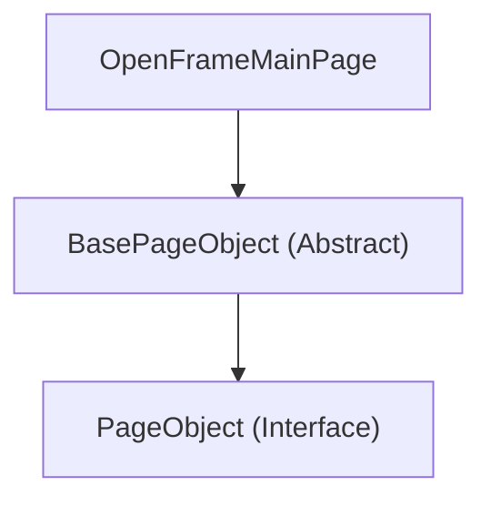

# openframe-e2e-tests Page Objects Documentation

This document provides detailed descriptions of the Page Object sub-module in the `openframe-e2e-tests` module. It covers the core components and their responsibilities.

## Table of Contents
- [PageObject Interface](#pageobject-interface)
- [BasePageObject](#basepageobject)
- [OpenFrameMainPage](#openframemainpage)

---

## PageObject Interface

**Location:** `openframe-e2e-tests/src/main/java/pageObjects/PageObject.java`

### Description
The `PageObject` interface defines the contract for all page objects in the E2E test suite. It ensures consistency and standardization across different page representations.

### Core Methods
- `void initialize(Object driver)`: Initializes the page object. (Selenide manages the WebDriver, so the parameter is for compatibility.)
- `boolean isPageLoaded()`: Checks if the page is loaded and ready for interaction.
- `void waitForPageLoad()`: Waits until the page is fully loaded.
- `String getCurrentUrl()`: Returns the current page URL.
- `void navigateTo()`: Navigates to the page.

---

## BasePageObject

**Location:** `openframe-e2e-tests/src/main/java/pageObjects/BasePageObject.java`

### Description
`BasePageObject` is an abstract class that implements the `PageObject` interface and provides shared functionality for all page objects. It encapsulates common operations such as navigation, waiting for elements, and interacting with elements using XPath locators.

### Core Responsibilities
- **Navigation:** Handles navigation to the base URL and local files.
- **Page State:** Implements checks for page load and visibility.
- **Element Interaction:** Provides protected methods for finding, clicking, sending keys, and retrieving attributes/text from elements using XPath.
- **Synchronization:** Waits for elements to be visible or clickable before interacting.

### Key Methods
- `findElementByXPath(String xpath)`: Finds a single element by XPath with explicit wait.
- `findElementsByXPath(String xpath)`: Finds multiple elements by XPath.
- `isElementVisibleByXPath(String xpath)`: Checks if an element is visible.
- `isElementPresentByXPath(String xpath)`: Checks if an element exists.
- `clickByXPath(String xpath)`: Clicks an element by XPath.
- `sendKeysByXPath(String xpath, String text)`: Sends text to an element by XPath.
- `getTextByXPath(String xpath)`: Gets the text of an element by XPath.
- `getAttributeByXPath(String xpath, String attributeName)`: Gets an attribute value from an element by XPath.
- `waitForElementByXPath(String xpath)`: Waits for an element to be visible by XPath.

---

## OpenFrameMainPage

**Location:** `openframe-e2e-tests/src/main/java/pageObjects/OpenFrameMainPage.java`

### Description
`OpenFrameMainPage` is a concrete implementation of `BasePageObject` that models the main page of the OpenFrame application. It encapsulates all interactions required for organization creation, user registration, and login workflows.

### Core Responsibilities
- **Organization Registration:** Methods to set and get organization name, domain, and interact with the organization creation form.
- **User Registration:** Methods to set and get user details (first name, last name, email, password) and interact with the registration form.
- **Login:** Methods to set and get login email and interact with the login form.
- **Form Validation:** Methods to check if forms are complete and if buttons are enabled.
- **Page State Verification:** Overrides `isPageLoaded` to ensure the main page is loaded and visible.
- **High-Level Actions:** Provides methods to complete the registration workflow in a single call.

### Key Methods
- `setOrganizationName(String organizationName)`, `getOrganizationName()`, `getDomain()`, `isDomainFieldDisabled()`
- `setFirstName(String firstName)`, `setLastName(String lastName)`, `setRegistrationEmail(String email)`, `setPassword(String password)`, `setConfirmPassword(String confirmPassword)`
- `clickCreateOrganization()`, `isCreateOrganizationButtonEnabled()`
- `setLoginEmail(String email)`, `getLoginEmail()`, `clickContinue()`, `isContinueButtonEnabled()`
- `isOrganizationFormComplete()`, `isLoginFormComplete()`, `isFormComplete()`
- `getFirstName()`, `getLastName()`, `getRegistrationEmail()`, `getPassword()`, `getConfirmPassword()`
- `getPageTitle()`
- `completeOrganizationRegistration(...)`: Fills out the entire registration form.

---

## Component Interaction Diagram

---

## Usage Example

A typical E2E test would instantiate `OpenFrameMainPage`, perform actions such as filling out forms, and assert the expected UI state. The shared methods in `BasePageObject` ensure consistency and reduce code duplication across different page objects.
