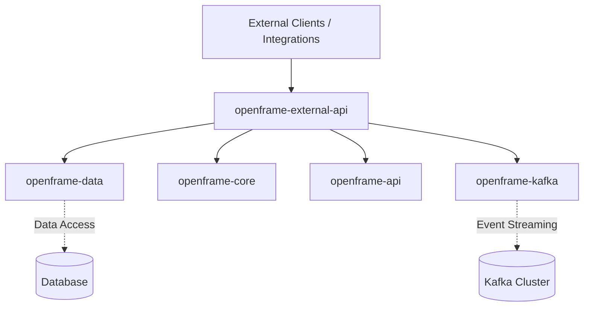
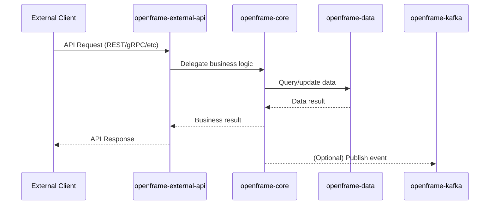

# openframe-external-api Module Documentation

## Introduction

The `openframe-external-api` module provides an external-facing API layer for the OpenFrame platform. It acts as a gateway for third-party integrations and external clients, exposing selected services and data from the OpenFrame ecosystem in a secure and controlled manner. This module is designed to be extensible and integrates with core OpenFrame services, data management, and event streaming subsystems.

## Core Functionality

At its core, the module is a Spring Boot application (`ExternalApiApplication`) that:
- Boots up the external API service
- Scans and wires together components from its own package and from shared OpenFrame modules (data, core, API, Kafka)
- Exposes RESTful endpoints and/or other API interfaces for external consumption
- Acts as a bridge between external consumers and internal OpenFrame services

## Architecture Overview

The `openframe-external-api` module is structured as a Spring Boot application. It leverages component scanning to include beans and services from several key OpenFrame packages:
- `com.openframe.external` (local controllers, services, configuration)
- `com.openframe.data` (data access and persistence)
- `com.openframe.core` (core business logic and utilities)
- `com.openframe.api` (internal API contracts and DTOs)
- `com.openframe.kafka` (event streaming and messaging)

### High-Level Architecture



- **External Clients** interact with the API endpoints exposed by this module.
- The module delegates business logic, data access, and event streaming to the respective internal modules.

## Component Relationships

### Component Scan and Dependency Integration

The `@ComponentScan` annotation in `ExternalApiApplication` ensures that beans from the following packages are available for dependency injection:
- `com.openframe.external` (this module)
- `com.openframe.data` ([openframe-config.md], [openframe-management.md], etc.)
- `com.openframe.core` ([openframe-management.md], [openframe-api.md])
- `com.openframe.api` ([openframe-api.md])
- `com.openframe.kafka` ([openframe-stream.md])

This design allows the external API to:
- Reuse data models, repositories, and services from the data and core modules
- Expose or adapt internal API contracts for external use
- Publish or consume events via Kafka for asynchronous workflows

### Data Flow and Process Overview



- Requests from external clients are received by the API layer.
- The API layer delegates to core services for business logic.
- Data access is handled by the data module.
- Events may be published to Kafka for asynchronous processing.

## How It Fits Into the Overall System

The `openframe-external-api` module is the primary entry point for third-party and external integrations. It is designed to:
- Provide a secure, stable, and versioned API surface
- Abstract and protect internal implementation details
- Orchestrate requests across multiple OpenFrame subsystems
- Enable event-driven integrations via Kafka

It works in concert with:
- [openframe-api.md]: Internal API contracts and DTOs
- [openframe-core.md]: Core business logic and orchestration
- [openframe-data.md]: Data persistence and access
- [openframe-stream.md]: Event streaming and messaging

## References
- [openframe-api.md]
- [openframe-core.md]
- [openframe-data.md]
- [openframe-stream.md]

## Appendix: Core Component

### `ExternalApiApplication`

```java
@SpringBootApplication
@ComponentScan(basePackages = {
        "com.openframe.external",
        "com.openframe.data",
        "com.openframe.core",
        "com.openframe.api",
        "com.openframe.kafka"
})
public class ExternalApiApplication {
    public static void main(String[] args) {
        SpringApplication.run(ExternalApiApplication.class, args);
    }
}
```

- **Purpose:** Boots the external API service and wires together all required components from OpenFrame modules.
- **Entry Point:** The `main` method starts the Spring Boot application.
- **Component Scan:** Ensures all necessary beans are available for the API layer to function.

---

For details on internal APIs, data models, or event streaming, see the referenced module documentation.