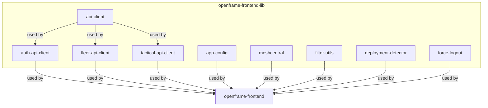
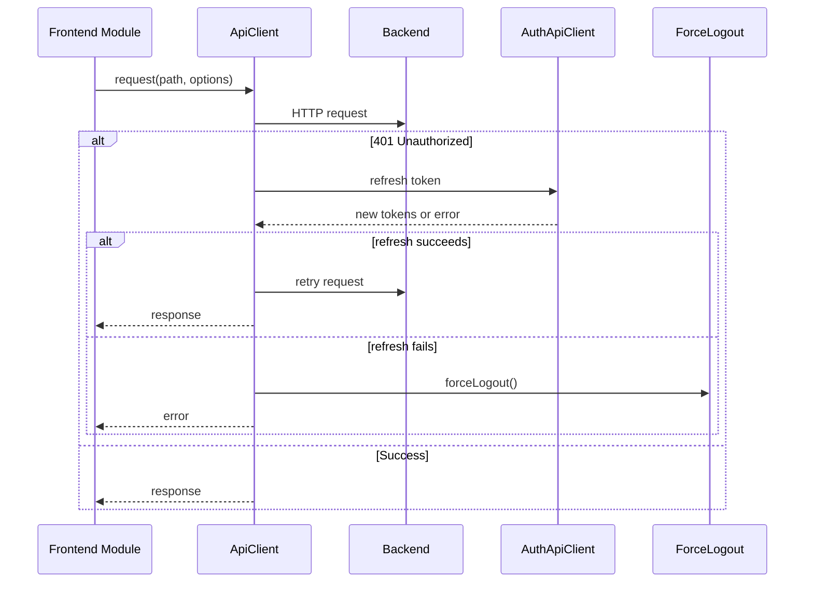

# openframe-frontend-lib Module Overview

## Purpose

The `openframe-frontend-lib` module is a foundational library for the OpenFrame frontend ecosystem. It provides shared, reusable infrastructure and utility code for frontend applications, including:

- **API clients** for secure, consistent communication with backend services (authentication, device management, etc.)
- **Application configuration** for navigation, branding, and layout
- **MeshCentral integration** for remote device management (file transfer, remote desktop, tunnels)
- **Utility types and helpers** for filtering, deployment detection, and session management

This library enables rapid development of robust, maintainable frontend features by centralizing core logic and patterns.

---

## Architecture

### High-Level Module Structure



### API Client Request Lifecycle



---

## Repository Structure

```
openframe/services/openframe-frontend/src/lib/
├── api-client/           # Generic API client (HTTP, auth, error handling)
├── auth-api-client/      # Authentication-specific API client
├── fleet-api-client/     # Device management (Fleet MDM) API client
├── tactical-api-client/  # Tactical RMM integration API client
├── app-config/           # Application configuration (navigation, branding, etc.)
├── meshcentral/          # MeshCentral integration (file, desktop, tunnel, websocket)
├── filter-utils.ts       # Filtering utilities
├── deployment-detector.ts# Deployment environment detection
├── force-logout.ts       # Forced logout utility
```

---

## Core Components Documentation

### 1. [api-client](#)
- **Purpose:** Centralized, extensible HTTP client for all backend API communication.
- **Key Types:** `ApiClient`, `ApiRequestOptions`, `ApiResponse`
- **Features:** Auth management, token refresh, error handling, request queueing.
- **See:** [API Client Documentation](#api-client-module-documentation)

### 2. [auth-api-client](#)
- **Purpose:** Handles authentication flows, token management, SSO, registration, and tenant discovery.
- **Key Types:** `AuthApiClient`, `AuthApiResponse`
- **See:** [Auth API Client Documentation](#auth-api-client-module-documentation)

### 3. [fleet-api-client](#)
- **Purpose:** High-level interface for interacting with Fleet MDM backend (devices, policies, queries).
- **Key Types:** `FleetApiClient`, `Query`, `Host`
- **See:** [Fleet API Client Documentation](#fleet-api-client-module-documentation)

### 4. [tactical-api-client](#)
- **Purpose:** Integration with Tactical RMM APIs for device management.
- **Key Types:** `TacticalApiClient`
- **See:** [Tactical API Client Documentation](#tactical-api-client)

### 5. [app-config](#)
- **Purpose:** Centralized application configuration (navigation, branding, layout, SEO).
- **Key Types:** `AppConfig`, `NavigationMenuItem`, `FooterConfig`
- **See:** [app-config Documentation](#app-config-module-documentation)

### 6. [meshcentral](#)
- **Purpose:** MeshCentral protocol integration for remote device management (file transfer, remote desktop, tunnels).
- **Key Types:** `MeshCentralFileManager`, `FileDownloader`, `FileUploader`, `MeshControlClient`, `MeshDesktop`, `MeshTunnel`, `WebSocketManager`
- **See:** [MeshCentral Integration Documentation](#meshcentral-module-documentation)

### 7. [filter-utils](#)
- **Purpose:** Utility types and helpers for filtering data in the frontend.
- **Key Types:** `FilterOption`

### 8. [deployment-detector](#)
- **Purpose:** Detects deployment environment and provides deployment-specific info.
- **Key Types:** `DeploymentInfo`

### 9. [force-logout](#)
- **Purpose:** Utility for handling forced logout scenarios (e.g., token expiry, session invalidation).
- **Key Types:** `ForceLogoutOptions`

---

## References to Core Component Documentation

- [API Client Module Documentation](#api-client-module-documentation)
- [Auth API Client Module Documentation](#auth-api-client-module-documentation)
- [Fleet API Client Module Documentation](#fleet-api-client-module-documentation)
- [app-config Module Documentation](#app-config-module-documentation)

---

## Summary

The `openframe-frontend-lib` module is the backbone of the OpenFrame frontend, providing robust, reusable building blocks for API communication, configuration, and remote device management. Its modular architecture ensures maintainability, security, and consistency across all OpenFrame frontend applications.