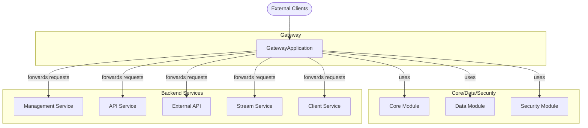
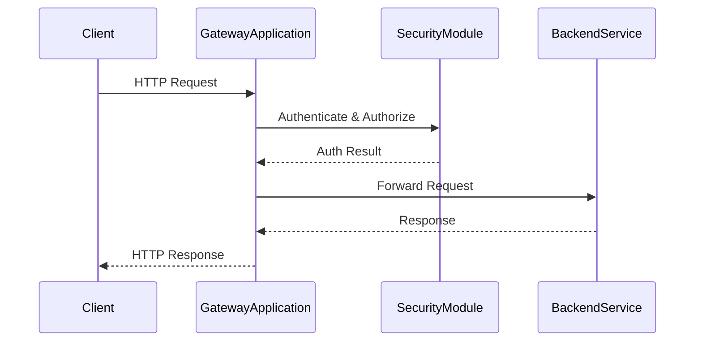

# OpenFrame Gateway Module Documentation

## Introduction

The **OpenFrame Gateway** module serves as the primary API gateway and entry point for the OpenFrame platform. It is responsible for routing, aggregating, and securing requests between external clients and the various backend microservices that comprise the OpenFrame ecosystem. Built on Spring Boot, the gateway centralizes cross-cutting concerns such as authentication, authorization, and request forwarding, ensuring a unified and secure interface for all client interactions.

## Core Functionality

- **API Gateway**: Acts as the single entry point for all client requests, forwarding them to the appropriate backend services.
- **Routing & Aggregation**: Routes requests based on path, method, or other criteria, and can aggregate responses from multiple services.
- **Security**: Integrates with the OpenFrame security infrastructure to enforce authentication and authorization policies.
- **Extensibility**: Designed to be easily extended with additional filters, interceptors, or custom routing logic as the platform evolves.

## Architecture Overview

The OpenFrame Gateway is a Spring Boot application that leverages component scanning to include beans from its own package as well as shared core, data, and security modules. This design enables the gateway to:
- Integrate tightly with shared security and data models
- Delegate business logic to specialized backend services
- Remain agnostic to the implementation details of downstream services

### Component Relationships

- **GatewayApplication**: The main entry point, responsible for bootstrapping the Spring context and initializing the gateway.
- **Core, Data, Security Modules**: Shared libraries providing foundational services (see [openframe-api.md], [openframe-authorization-server.md], [openframe-config.md]).
- **Backend Services**: Other OpenFrame modules (e.g., Management, Stream, Client, External API) that implement business logic and data processing (see their respective documentation files).

### Mermaid Diagram: High-Level Architecture

## Data Flow and Process

1. **Client Request**: An external client sends a request to the gateway.
2. **Security Enforcement**: The gateway applies authentication and authorization checks using the shared security module.
3. **Routing**: The gateway determines the appropriate backend service for the request.
4. **Request Forwarding**: The request is forwarded to the backend service, and the response is relayed back to the client.

### Mermaid Diagram: Request Flow

## Integration with the OpenFrame Platform

The gateway is a central component in the OpenFrame microservices architecture. It is designed to work seamlessly with other modules:
- **Authentication & Authorization**: Delegates to the [openframe-authorization-server.md] for identity and access management.
- **Configuration**: Loads shared configuration from the [openframe-config.md] module.
- **API Exposure**: Exposes and aggregates APIs from [openframe-api.md], [openframe-management.md], [openframe-stream.md], [openframe-client.md], and [openframe-external-api.md].

For details on the business logic and data models of each backend service, refer to their respective documentation files.

## Extending the Gateway

Developers can extend the gateway by:
- Adding custom filters or interceptors for logging, monitoring, or request transformation
- Defining new routing rules for additional backend services
- Integrating with new security providers or protocols

Refer to the [Spring Boot documentation](https://docs.spring.io/spring-boot/docs/current/reference/htmlsingle/) for best practices on extending Spring-based applications.

## References
- [openframe-api.md]
- [openframe-authorization-server.md]
- [openframe-config.md]
- [openframe-management.md]
- [openframe-stream.md]
- [openframe-client.md]
- [openframe-external-api.md]
